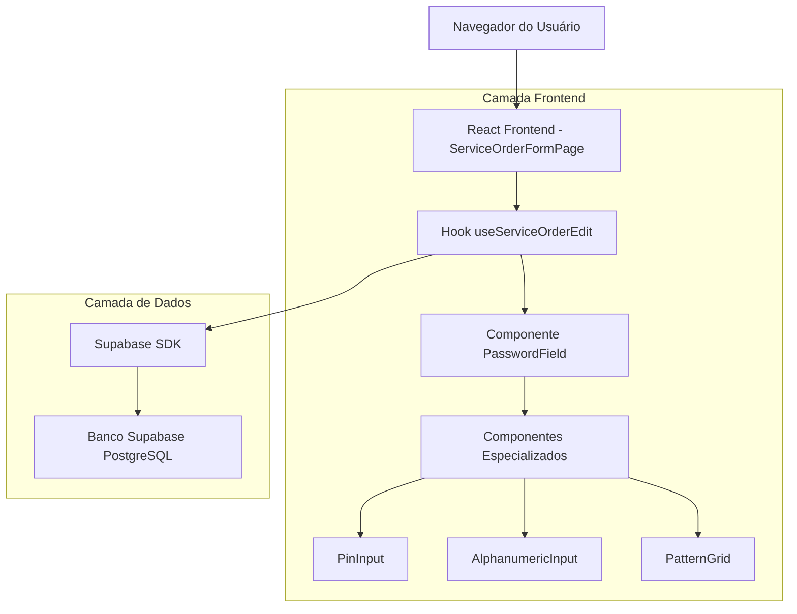
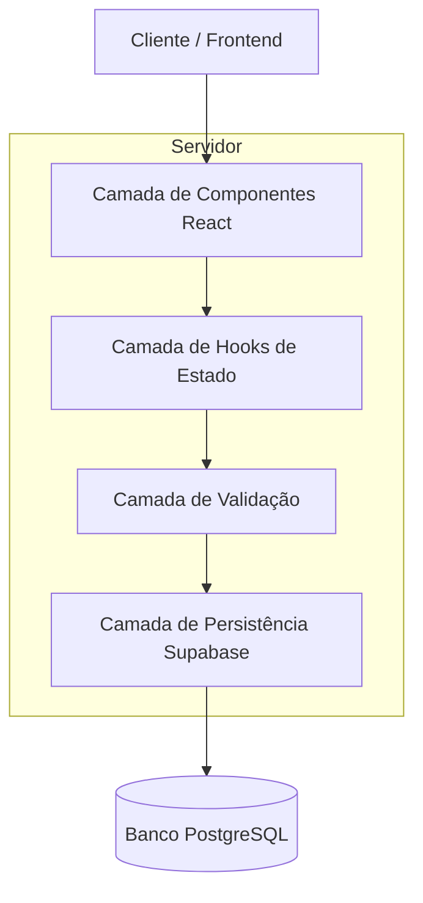
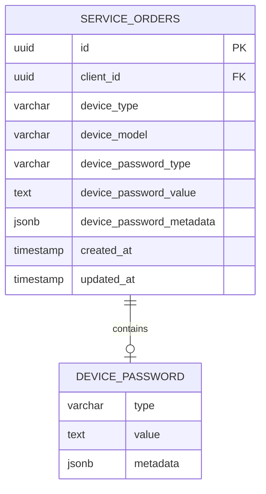

# Documento de Arquitetura Técnica - Campo de Senha em Ordens de Serviço

## 1. Design da Arquitetura



## 2. Descrição das Tecnologias

- **Frontend:** React@18 + TypeScript + TailwindCSS@3 + Vite
- **Backend:** Supabase (PostgreSQL + Auth + Real-time)
- **Validação:** React Hook Form + Zod
- **UI Components:** Shadcn/ui + Lucide React
- **Estado:** React Hooks (useState, useEffect, useCallback)

## 3. Definições de Rotas

| Rota | Propósito |
|------|-----------|
| `/service-orders/new` | Página de criação de nova ordem de serviço com campo de senha |
| `/service-orders/:id/edit` | Página de edição de ordem existente com campo de senha editável |

## 4. Definições da API

### 4.1 API Principal

**Atualização da tabela service_orders**

```sql
-- Adicionar campos de senha à tabela existente
ALTER TABLE service_orders 
ADD COLUMN device_password_type VARCHAR(20) CHECK (device_password_type IN ('pin', 'abc', 'pattern')),
ADD COLUMN device_password_value TEXT,
ADD COLUMN device_password_metadata JSONB;
```

**Estrutura dos dados de senha:**

| Campo | Tipo | Descrição |
|-------|------|-----------|
| device_password_type | VARCHAR(20) | Tipo da senha: 'pin', 'abc', 'pattern' |
| device_password_value | TEXT | Valor da senha (criptografado) |
| device_password_metadata | JSONB | Metadados adicionais (ex: grid pattern para padrão) |

**Exemplo de dados:**

```json
// PIN
{
  "device_password_type": "pin",
  "device_password_value": "1234",
  "device_password_metadata": null
}

// ABC
{
  "device_password_type": "abc", 
  "device_password_value": "senha123",
  "device_password_metadata": null
}

// PADRÃO
{
  "device_password_type": "pattern",
  "device_password_value": "1478",
  "device_password_metadata": {
    "grid_size": "3x3",
    "connections": [
      {"from": 1, "to": 4},
      {"from": 4, "to": 7}, 
      {"from": 7, "to": 8}
    ]
  }
}
```

## 5. Arquitetura do Servidor



## 6. Modelo de Dados

### 6.1 Definição do Modelo de Dados



### 6.2 Linguagem de Definição de Dados (DDL)

**Migração para adicionar campos de senha:**

```sql
-- Criar migração para campos de senha do dispositivo
-- Arquivo: 20250220000001_add_device_password_fields.sql

-- Adicionar campos de senha à tabela service_orders
ALTER TABLE service_orders 
ADD COLUMN IF NOT EXISTS device_password_type VARCHAR(20) 
    CHECK (device_password_type IN ('pin', 'abc', 'pattern')),
ADD COLUMN IF NOT EXISTS device_password_value TEXT,
ADD COLUMN IF NOT EXISTS device_password_metadata JSONB;

-- Criar índice para consultas por tipo de senha
CREATE INDEX IF NOT EXISTS idx_service_orders_password_type 
ON service_orders(device_password_type) 
WHERE device_password_type IS NOT NULL;

-- Adicionar comentários para documentação
COMMENT ON COLUMN service_orders.device_password_type IS 'Tipo de senha do dispositivo: pin, abc ou pattern';
COMMENT ON COLUMN service_orders.device_password_value IS 'Valor da senha do dispositivo (armazenado de forma segura)';
COMMENT ON COLUMN service_orders.device_password_metadata IS 'Metadados adicionais para senhas complexas como padrões';

-- Atualizar função de busca para incluir novos campos
CREATE OR REPLACE FUNCTION update_service_orders_search_vector()
RETURNS TRIGGER AS $$
BEGIN
    NEW.search_vector := to_tsvector('portuguese', 
        COALESCE(NEW.device_type, '') || ' ' ||
        COALESCE(NEW.device_model, '') || ' ' ||
        COALESCE(NEW.imei_serial, '') || ' ' ||
        COALESCE(NEW.reported_issue, '') || ' ' ||
        COALESCE(NEW.device_password_type, '')
    );
    RETURN NEW;
END;
$$ language 'plpgsql';

-- Política RLS para campos de senha (mesmas permissões da tabela)
-- Os campos herdam automaticamente as políticas RLS existentes da tabela service_orders
```

**Dados iniciais de exemplo:**

```sql
-- Exemplos de dados para testes
INSERT INTO service_orders (
    owner_id, 
    client_id, 
    device_type, 
    device_model, 
    reported_issue,
    device_password_type,
    device_password_value,
    device_password_metadata
) VALUES 
(
    auth.uid(),
    (SELECT id FROM clients WHERE name = 'Cliente Teste' LIMIT 1),
    'Smartphone',
    'iPhone 14 Pro',
    'Tela quebrada',
    'pin',
    '1234',
    NULL
),
(
    auth.uid(),
    (SELECT id FROM clients WHERE name = 'Cliente Teste' LIMIT 1),
    'Smartphone', 
    'Samsung Galaxy S23',
    'Bateria não carrega',
    'pattern',
    '1478',
    '{"grid_size": "3x3", "connections": [{"from": 1, "to": 4}, {"from": 4, "to": 7}, {"from": 7, "to": 8}]}'::jsonb
);
```

## 7. Estrutura de Componentes

### 7.1 Hierarquia de Componentes

```
ServiceOrderFormPage
├── DevicePasswordSection (novo)
│   ├── PasswordTypeSelector
│   ├── PinPasswordInput
│   ├── AlphanumericPasswordInput
│   └── PatternPasswordGrid
│       ├── PatternDot (9 instâncias)
│       ├── PatternConnection
│       └── PatternControls
```

### 7.2 Props e Interfaces TypeScript

```typescript
// Tipos para senha do dispositivo
export type DevicePasswordType = 'pin' | 'abc' | 'pattern' | null;

export interface DevicePasswordData {
  type: DevicePasswordType;
  value: string;
  metadata?: {
    grid_size?: string;
    connections?: Array<{from: number; to: number}>;
  };
}

// Props do componente principal
export interface DevicePasswordSectionProps {
  value: DevicePasswordData;
  onChange: (data: DevicePasswordData) => void;
  disabled?: boolean;
  error?: string;
}

// Props do grid de padrão
export interface PatternGridProps {
  value: string;
  onChange: (pattern: string) => void;
  disabled?: boolean;
  size?: number; // default 3 para grid 3x3
}
```

### 7.3 Validações

```typescript
// Schema de validação com Zod
export const devicePasswordSchema = z.object({
  type: z.enum(['pin', 'abc', 'pattern']).nullable(),
  value: z.string().optional(),
  metadata: z.object({
    grid_size: z.string().optional(),
    connections: z.array(z.object({
      from: z.number(),
      to: z.number()
    })).optional()
  }).optional()
}).refine((data) => {
  if (!data.type) return true; // Campo opcional
  
  switch (data.type) {
    case 'pin':
      return /^\d{4,8}$/.test(data.value || '');
    case 'abc':
      return /^[a-zA-Z0-9]{4,20}$/.test(data.value || '');
    case 'pattern':
      return /^[1-9]{4,9}$/.test(data.value || '');
    default:
      return false;
  }
}, {
  message: "Formato de senha inválido para o tipo selecionado"
});
```