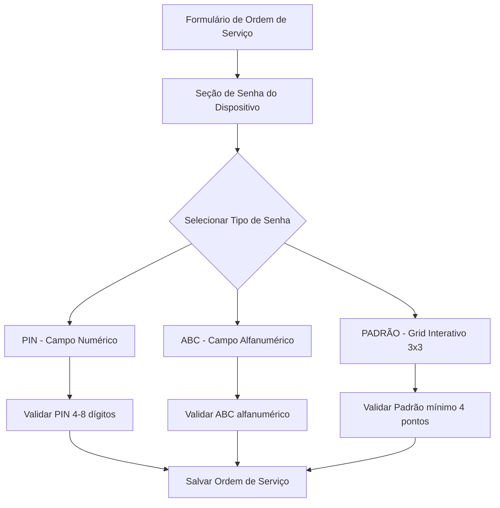

# Documento de Requisitos do Produto - Campo de Senha em Ordens de Serviço

## 1. Visão Geral do Produto

Este documento especifica a implementação de um campo de cadastro de senha nas páginas de criação e edição de ordens de serviço do sistema OneDrip. O campo permitirá registrar informações de desbloqueio de dispositivos móveis dos clientes, facilitando o processo de reparo técnico.

O objetivo é criar uma interface intuitiva que reproduza fielmente os padrões de desbloqueio móvel (PIN, Padrão e Alfanumérico), permitindo aos técnicos registrar e visualizar as credenciais de acesso dos dispositivos em manutenção.

## 2. Funcionalidades Principais

### 2.1 Papéis de Usuário

| Papel | Método de Registro | Permissões Principais |
|-------|-------------------|----------------------|
| Técnico | Login existente no sistema | Pode criar e editar ordens de serviço, incluindo campos de senha |
| Administrador | Login existente no sistema | Acesso completo a todas as funcionalidades de ordens de serviço |

### 2.2 Módulo de Funcionalidades

Nossa implementação consiste nas seguintes páginas principais:

1. **Página de Nova Ordem de Serviço** (`/service-orders/new`): formulário de criação com campo de senha integrado
2. **Página de Edição de Ordem de Serviço** (`/service-orders/uuid/edit`): formulário de edição com campo de senha editável

### 2.3 Detalhes das Páginas

| Nome da Página | Nome do Módulo | Descrição da Funcionalidade |
|----------------|----------------|----------------------------|
| Nova Ordem de Serviço | Campo de Senha do Dispositivo | Selecionar tipo de senha (PIN/PADRÃO/ABC), inserir credenciais conforme tipo selecionado, validar formato |
| Edição de Ordem de Serviço | Campo de Senha do Dispositivo | Visualizar senha existente, editar tipo e valor da senha, manter validações de formato |

## 3. Processo Principal

### Fluxo do Usuário - Técnico

1. **Criação de Nova Ordem:**
   - Acessa formulário de nova ordem de serviço
   - Preenche informações básicas do cliente e dispositivo
   - Seleciona tipo de senha do dispositivo (PIN/PADRÃO/ABC)
   - Interface se adapta dinamicamente ao tipo selecionado
   - Insere credenciais no formato apropriado
   - Salva ordem de serviço com senha registrada

2. **Edição de Ordem Existente:**
   - Acessa ordem de serviço existente
   - Visualiza tipo e valor da senha atual
   - Pode alterar tipo de senha (interface se adapta)
   - Pode editar valor da senha
   - Salva alterações

## 4. Design da Interface do Usuário

### 4.1 Estilo de Design

- **Cores Primárias:** Verde (#22c55e) para elementos ativos, Cinza (#6b7280) para elementos neutros
- **Cores Secundárias:** Vermelho (#ef4444) para validações de erro, Azul (#3b82f6) para informações
- **Estilo de Botões:** Arredondados com sombra suave, efeito hover com transição
- **Fonte:** Inter, tamanhos 14px (corpo), 16px (labels), 18px (títulos)
- **Layout:** Card-based com espaçamento consistente, design mobile-first
- **Ícones:** Lucide React, estilo outline, tamanho 16px-20px

### 4.2 Visão Geral do Design das Páginas

| Nome da Página | Nome do Módulo | Elementos da UI |
|----------------|----------------|-----------------|
| Nova/Edição Ordem | Seletor Tipo Senha | Select dropdown com ícones: 🔢 PIN, 🔤 ABC, ⚫ PADRÃO |
| Nova/Edição Ordem | Campo PIN | Input numérico, máscara visual, validação em tempo real, placeholder "0000" |
| Nova/Edição Ordem | Campo ABC | Input text, validação alfanumérica, placeholder "senha123", máximo 20 caracteres |
| Nova/Edição Ordem | Grid Padrão | Grid 3x3 interativo, pontos clicáveis verdes (#22c55e), linhas de conexão animadas, botão limpar |

### 4.3 Responsividade

O produto é mobile-first com adaptação para desktop. O grid de padrão mantém proporções em todas as telas, com touch otimizado para dispositivos móveis. Validações visuais são consistentes em todas as resoluções.

## 5. Especificações Técnicas

### 5.1 Tipos de Senha Suportados

1. **PIN (Numérico):**
   - Apenas dígitos 0-9
   - Comprimento: 4-8 caracteres
   - Validação: regex `/^\d{4,8}$/`

2. **ABC (Alfanumérico):**
   - Letras (a-z, A-Z) e números (0-9)
   - Comprimento: 4-20 caracteres
   - Validação: regex `/^[a-zA-Z0-9]{4,20}$/`

3. **PADRÃO (Grid 3x3):**
   - Grid de 9 pontos numerados 1-9
   - Mínimo 4 pontos conectados
   - Máximo 9 pontos
   - Armazenamento: sequência numérica (ex: "1478")

### 5.2 Validações de Segurança

- Campos de senha não são obrigatórios (opcional)
- Dados armazenados de forma segura no banco
- Validação client-side e server-side
- Sanitização de entrada para prevenir XSS

### 5.3 Comportamento da Interface

- **Seleção de Tipo:** Dropdown com mudança dinâmica da interface
- **Feedback Visual:** Indicadores de validação em tempo real
- **Grid Padrão:** Animações suaves, feedback tátil (vibração em mobile)
- **Persistência:** Auto-save para rascunhos, recuperação de sessão