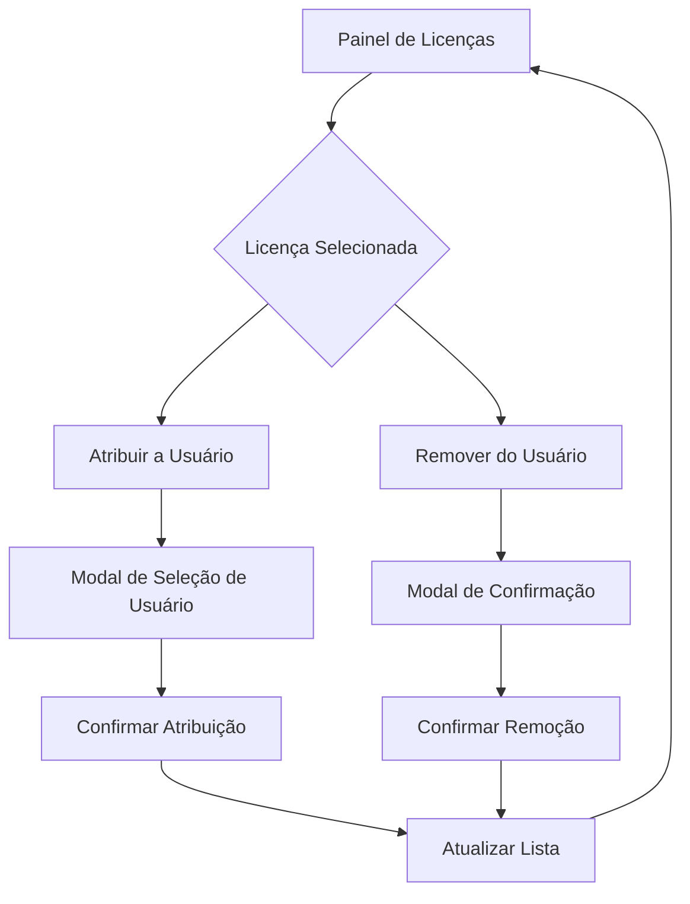

# Aprimoramento do Gerenciamento de Licenças - Painel Admin

## 1. Visão Geral do Produto

Sistema de gerenciamento de licenças aprimorado que permite aos administradores atribuir e remover licenças de usuários de forma intuitiva e eficiente através do painel administrativo.

- **Problema a resolver**: Administradores precisam de uma interface simples para gerenciar a atribuição de licenças aos usuários do sistema.
- **Usuários**: Administradores e super-administradores do sistema.
- **Valor**: Controle total sobre distribuição e revogação de licenças, melhorando a gestão de acesso e recursos.

## 2. Funcionalidades Principais

### 2.1 Papéis de Usuário

| Papel | Método de Acesso | Permissões Principais |
|-------|------------------|----------------------|
| Administrador | Login com credenciais admin | Pode atribuir e remover licenças de usuários |
| Super Administrador | Login com credenciais super admin | Acesso completo a todas as funcionalidades de licenças |

### 2.2 Módulo de Funcionalidades

Nosso sistema de gerenciamento de licenças consiste nas seguintes páginas principais:

1. **Painel de Gerenciamento de Licenças**: listagem de licenças, estatísticas, ações de atribuição e remoção.
2. **Modal de Atribuição de Licença**: seleção de usuário para atribuir licença disponível.
3. **Modal de Confirmação de Remoção**: confirmação para remover licença de usuário.

### 2.3 Detalhes das Páginas

| Nome da Página | Nome do Módulo | Descrição da Funcionalidade |
|----------------|----------------|----------------------------|
| Painel de Gerenciamento de Licenças | Listagem de Licenças | Exibir todas as licenças com status, usuário atribuído, data de expiração |
| Painel de Gerenciamento de Licenças | Ações de Licença | Botões "Atribuir a Usuário" e "Remover do Usuário" para cada licença |
| Painel de Gerenciamento de Licenças | Estatísticas | Contadores de licenças totais, ativas, expiradas, não atribuídas |
| Modal de Atribuição | Seleção de Usuário | Dropdown com lista de usuários disponíveis para atribuição |
| Modal de Atribuição | Confirmação | Botão para confirmar atribuição com feedback visual |
| Modal de Remoção | Confirmação de Remoção | Confirmação para desassociar licença do usuário atual |

## 3. Processo Principal

### Fluxo do Administrador

**Atribuir Licença a Usuário:**
1. Admin acessa Painel de Gerenciamento de Licenças
2. Identifica licença não atribuída na listagem
3. Clica em "Atribuir a Usuário"
4. Seleciona usuário no modal de atribuição
5. Confirma atribuição
6. Sistema atualiza licença e exibe feedback de sucesso

**Remover Licença de Usuário:**
1. Admin acessa Painel de Gerenciamento de Licenças
2. Identifica licença atribuída na listagem
3. Clica em "Remover do Usuário"
4. Confirma remoção no modal
5. Sistema desassocia licença e exibe feedback de sucesso

## 4. Design da Interface do Usuário

### 4.1 Estilo de Design

- **Cores primárias**: Azul (#3B82F6) para ações principais, Verde (#10B981) para sucesso
- **Cores secundárias**: Cinza (#6B7280) para texto secundário, Vermelho (#EF4444) para ações destrutivas
- **Estilo de botões**: Arredondados com sombra sutil, ícones à esquerda do texto
- **Fonte**: Inter, tamanhos 14px para texto normal, 16px para botões
- **Layout**: Cards com bordas arredondadas, espaçamento consistente de 16px
- **Ícones**: Lucide React, estilo outline, tamanho 16px

### 4.2 Visão Geral do Design das Páginas

| Nome da Página | Nome do Módulo | Elementos da UI |
|----------------|----------------|-----------------|
| Painel de Licenças | Ações de Licença | Botões "Atribuir" (azul, ícone UserPlus) e "Remover" (vermelho, ícone UserMinus) em dropdown de ações |
| Painel de Licenças | Indicadores Visuais | Badges coloridos para status (Verde: Ativa, Vermelho: Expirada, Cinza: Inativa, Azul: Não Atribuída) |
| Modal de Atribuição | Seleção de Usuário | Select dropdown com busca, exibindo nome e email do usuário |
| Modal de Atribuição | Botões de Ação | "Cancelar" (outline) e "Atribuir Licença" (azul, ícone Check) |
| Modal de Remoção | Confirmação | Texto explicativo, "Cancelar" (outline) e "Remover" (vermelho, ícone Trash2) |

### 4.3 Responsividade

- **Desktop-first**: Interface otimizada para telas grandes com tabela completa
- **Mobile-adaptive**: Cards empilhados em telas menores, botões de ação em menu hambúrguer
- **Touch-friendly**: Botões com área mínima de 44px para interação touch