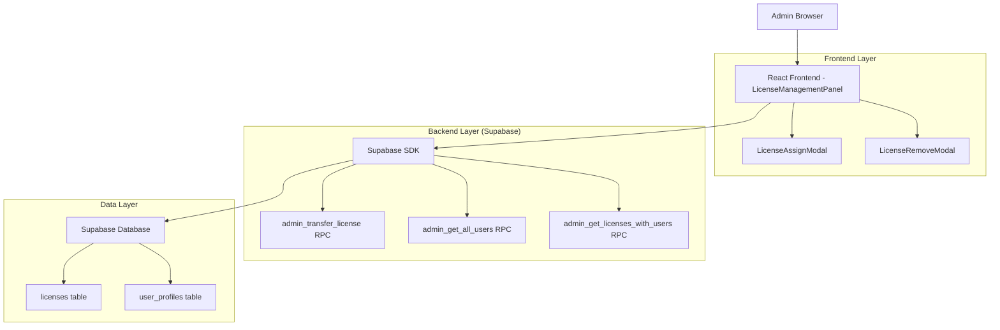
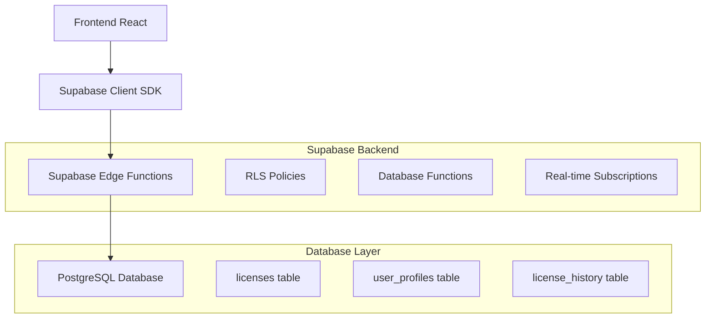
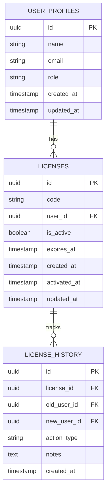

# Arquitetura Técnica - Gerenciamento de Licenças Admin

## 1. Design da Arquitetura



## 2. Descrição da Tecnologia

- Frontend: React@18 + TypeScript + TailwindCSS@3 + Vite
- Backend: Supabase (PostgreSQL + RPC Functions)
- UI Components: Shadcn/ui + Lucide React Icons
- State Management: TanStack Query (React Query)

## 3. Definições de Rotas

| Rota | Propósito |
|------|-----------|
| /admin/licenses | Painel principal de gerenciamento de licenças |
| /admin/licenses?modal=assign&license=:id | Modal de atribuição de licença (estado da URL) |
| /admin/licenses?modal=remove&license=:id | Modal de remoção de licença (estado da URL) |

## 4. Definições de API

### 4.1 APIs Principais

**Atribuir licença a usuário**
```
RPC: admin_transfer_license
```

Parâmetros:
| Nome do Parâmetro | Tipo | Obrigatório | Descrição |
|-------------------|------|-------------|-----------|
| p_license_id | uuid | true | ID da licença a ser transferida |
| p_new_user_id | uuid | true | ID do usuário que receberá a licença |
| p_notes | text | false | Notas sobre a transferência |

Resposta:
| Nome do Parâmetro | Tipo | Descrição |
|-------------------|------|-----------|
| success | boolean | Status da operação |
| message | string | Mensagem de retorno |

Exemplo de chamada:
```typescript
const { data, error } = await supabase.rpc('admin_transfer_license', {
  p_license_id: 'uuid-da-licenca',
  p_new_user_id: 'uuid-do-usuario',
  p_notes: 'Atribuição via painel admin'
});
```

**Remover licença de usuário**
```
RPC: admin_transfer_license (com user_id null)
```

Parâmetros:
| Nome do Parâmetro | Tipo | Obrigatório | Descrição |
|-------------------|------|-------------|-----------|
| p_license_id | uuid | true | ID da licença a ser removida |
| p_new_user_id | uuid | true | null para remover atribuição |
| p_notes | text | false | Notas sobre a remoção |

**Buscar usuários disponíveis**
```
RPC: admin_get_all_users
```

Resposta:
| Nome do Parâmetro | Tipo | Descrição |
|-------------------|------|-----------|
| id | uuid | ID do usuário |
| name | string | Nome do usuário |
| email | string | Email do usuário |
| role | string | Papel do usuário |

## 5. Arquitetura do Servidor



## 6. Modelo de Dados

### 6.1 Definição do Modelo de Dados



### 6.2 Linguagem de Definição de Dados

**Função para Atribuir/Remover Licença (já existe)**
```sql
-- Função admin_transfer_license já implementada
-- Localizada em: supabase/migrations/20250120000000_license_management_functions.sql

-- Exemplo de uso para atribuir licença
SELECT admin_transfer_license(
    'uuid-da-licenca'::uuid,
    'uuid-do-usuario'::uuid,
    'Atribuição via painel admin'
);

-- Exemplo de uso para remover licença (user_id = null)
SELECT admin_transfer_license(
    'uuid-da-licenca'::uuid,
    null::uuid,
    'Remoção via painel admin'
);
```

**Função para Buscar Usuários (já existe)**
```sql
-- Função admin_get_all_users já implementada
-- Retorna lista de usuários para seleção no modal

SELECT * FROM admin_get_all_users();
```

**Permissões de Acesso**
```sql
-- Permissões já configuradas para funções admin
GRANT EXECUTE ON FUNCTION admin_transfer_license TO authenticated;
GRANT EXECUTE ON FUNCTION admin_get_all_users TO authenticated;

-- RLS policies aplicadas para verificar se usuário é admin
```

**Índices para Performance**
```sql
-- Índices já existentes para otimização
CREATE INDEX IF NOT EXISTS idx_licenses_user_id ON licenses(user_id);
CREATE INDEX IF NOT EXISTS idx_licenses_is_active ON licenses(is_active);
CREATE INDEX IF NOT EXISTS idx_licenses_expires_at ON licenses(expires_at);
```