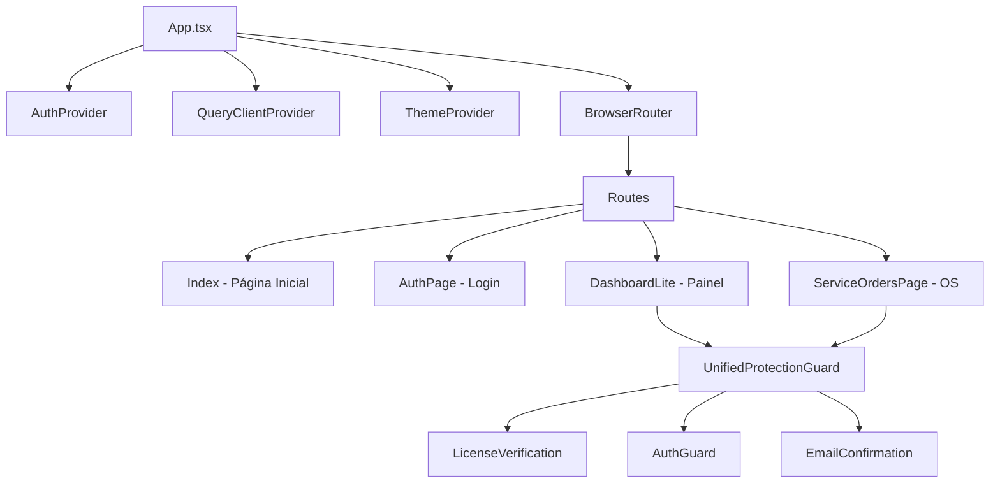
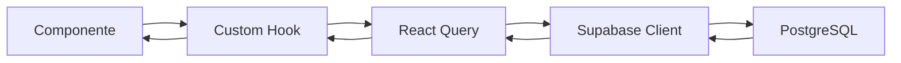
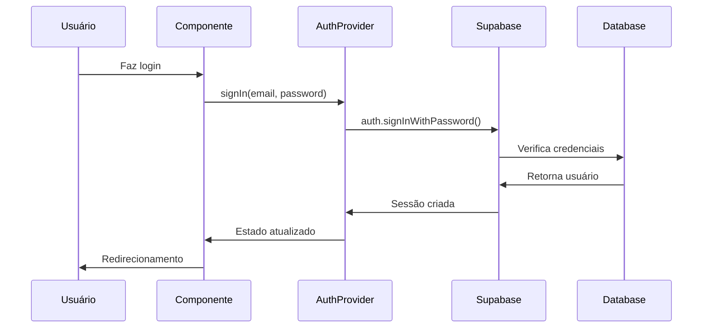

# Arquitetura e Estrutura do Projeto OneDrip

## 1. Visão Geral do Projeto

O OneDrip é uma aplicação web moderna desenvolvida em React + TypeScript que funciona como um sistema de gestão para oficinas de assistência técnica. A aplicação utiliza Supabase como backend-as-a-service, oferecendo funcionalidades completas de autenticação, banco de dados PostgreSQL e armazenamento de arquivos.

### Tecnologias Principais
- **Frontend**: React 18 + TypeScript + Vite
- **Styling**: TailwindCSS + Radix UI
- **Backend**: Supabase (PostgreSQL + Auth + Storage)
- **State Management**: React Query (TanStack Query)
- **Routing**: React Router DOM
- **Build Tool**: Vite

## 2. Estrutura de Diretórios

### Estrutura Raiz
```
onedripcopya/
├── src/                    # Código fonte principal
├── public/                 # Arquivos estáticos
├── supabase/              # Configurações e migrações do Supabase
├── backend/               # Servidor Node.js auxiliar
├── .trae/documents/       # Documentação técnica
└── scripts/               # Scripts SQL e utilitários
```

### Estrutura do Diretório `src/`
```
src/
├── @types/                # Definições de tipos TypeScript globais
├── components/            # Componentes React reutilizáveis
│   ├── ui/               # Componentes de interface base (Radix UI)
│   ├── auth/             # Componentes de autenticação
│   ├── dashboard/        # Componentes do painel principal
│   ├── service-orders/   # Componentes de ordens de serviço
│   ├── admin/            # Componentes administrativos
│   └── guards/           # Componentes de proteção de rotas
├── hooks/                 # Custom hooks React
├── pages/                 # Páginas da aplicação
├── integrations/          # Integrações com serviços externos
│   └── supabase/         # Cliente e tipos do Supabase
├── utils/                 # Funções utilitárias
├── types/                 # Definições de tipos específicos
├── config/                # Configurações da aplicação
├── contexts/              # Contextos React
├── services/              # Serviços de API e lógica de negócio
└── styles/                # Estilos CSS customizados
```

## 3. Arquitetura de Componentes

### Hierarquia de Componentes



### Componentes Principais

#### 1. **App.tsx**
- Componente raiz da aplicação
- Configura providers globais (Auth, Query, Theme)
- Define roteamento principal
- Gerencia modais globais (AcceptTermsModal)

#### 2. **AuthProvider (useAuth.tsx)**
- Gerencia estado de autenticação global
- Integração com Supabase Auth
- Persistência de sessão
- Gerenciamento de perfil do usuário

#### 3. **UnifiedProtectionGuard**
- Componente de proteção unificada
- Verifica autenticação, licença e confirmação de email
- Redireciona usuários não autorizados

#### 4. **SmartNavigation**
- Sistema de navegação inteligente
- Cache de rotas visitadas
- Otimizações de performance

## 4. Fluxo de Dados

### Gerenciamento de Estado



#### Padrões de Estado:
1. **Estado Local**: useState para estado de componente
2. **Estado Global**: Context API para autenticação e tema
3. **Estado do Servidor**: React Query para cache e sincronização
4. **Persistência**: Supabase para dados permanentes

### Fluxo de Autenticação



## 5. Sistema de Roteamento

### Configuração de Rotas

O sistema utiliza `routeConfig.ts` para centralizar configurações:

```typescript
// Tipos de rotas
export const ROUTE_CONFIG = {
  publicRoutes: ['/', '/auth', '/signup', '/plans'],
  authRequiredRoutes: ['/dashboard', '/service-orders'],
  licenseRequiredRoutes: ['/dashboard', '/service-orders'],
  emailConfirmationRequiredRoutes: ['/dashboard']
};
```

### Proteção de Rotas

1. **Rotas Públicas**: Acessíveis sem autenticação
2. **Rotas Autenticadas**: Requerem login
3. **Rotas com Licença**: Requerem licença válida
4. **Rotas com Email Confirmado**: Requerem verificação de email

## 6. Hooks Customizados

### Hooks Principais

#### **useAuth**
- Gerencia autenticação global
- Fornece métodos de login/logout
- Verifica permissões de usuário

#### **useBudgetData**
- Gerencia dados de orçamentos
- Cache inteligente com React Query
- Operações CRUD otimizadas

#### **useSecureServiceOrders**
- Gerencia ordens de serviço
- Implementa segurança RLS
- Validações de permissão

#### **useLicense**
- Verifica status de licença
- Cache de verificação
- Renovação automática

### Padrão de Hooks

```typescript
// Estrutura padrão de um hook
export const useCustomHook = () => {
  // 1. Estado local
  const [state, setState] = useState();
  
  // 2. Contextos
  const { user } = useAuth();
  
  // 3. React Query
  const { data, isLoading } = useQuery({
    queryKey: ['key'],
    queryFn: fetchFunction
  });
  
  // 4. Efeitos
  useEffect(() => {
    // Lógica de efeito
  }, [dependencies]);
  
  // 5. Retorno
  return {
    data,
    isLoading,
    actions: { create, update, delete }
  };
};
```

## 7. Integração com Supabase

### Cliente Supabase

```typescript
// src/integrations/supabase/client.ts
export const supabase = createClient<Database>(
  SUPABASE_URL, 
  SUPABASE_PUBLISHABLE_KEY,
  {
    auth: {
      storage: localStorage,
      persistSession: true,
      autoRefreshToken: true,
    }
  }
);
```

### Padrões de Uso

1. **Queries**: Sempre através de React Query
2. **Mutations**: Com invalidação de cache
3. **Real-time**: Subscriptions para atualizações
4. **RLS**: Row Level Security para segurança

## 8. Sistema de Componentes UI

### Base: Radix UI + TailwindCSS

```
components/ui/
├── button.tsx          # Componente de botão
├── input.tsx           # Campos de entrada
├── dialog.tsx          # Modais e diálogos
├── toast.tsx           # Notificações
├── table.tsx           # Tabelas
└── form.tsx            # Formulários
```

### Padrão de Componente

```typescript
// Estrutura padrão de componente UI
interface ComponentProps {
  variant?: 'default' | 'secondary';
  size?: 'sm' | 'md' | 'lg';
  className?: string;
  children: React.ReactNode;
}

export const Component = ({ 
  variant = 'default',
  size = 'md',
  className,
  children,
  ...props 
}: ComponentProps) => {
  return (
    <div 
      className={cn(
        baseStyles,
        variants[variant],
        sizes[size],
        className
      )}
      {...props}
    >
      {children}
    </div>
  );
};
```

## 9. Gerenciamento de Performance

### Otimizações Implementadas

1. **Code Splitting**: Lazy loading de rotas
2. **React Query**: Cache inteligente de dados
3. **Memoização**: React.memo e useMemo
4. **Bundle Optimization**: Vite com tree-shaking
5. **Image Optimization**: Lazy loading de imagens

### Monitoramento

- **Error Boundary**: Captura de erros React
- **Performance Monitoring**: Métricas de carregamento
- **User Analytics**: Tracking de uso

## 10. Segurança

### Implementações de Segurança

1. **Row Level Security (RLS)**: No Supabase
2. **Content Security Policy (CSP)**: Headers de segurança
3. **Input Sanitization**: Validação de entrada
4. **Secure Storage**: Armazenamento seguro de tokens
5. **Rate Limiting**: Limitação de requisições

### Validação de Dados

```typescript
// Exemplo com Zod
const schema = z.object({
  email: z.string().email(),
  password: z.string().min(8)
});

const validateInput = (data: unknown) => {
  return schema.safeParse(data);
};
```

## 11. Deployment e Build

### Configuração de Build

```typescript
// vite.config.ts
export default defineConfig({
  plugins: [react()],
  build: {
    target: 'esnext',
    minify: 'terser',
    sourcemap: false,
    rollupOptions: {
      output: {
        manualChunks: {
          vendor: ['react', 'react-dom'],
          supabase: ['@supabase/supabase-js']
        }
      }
    }
  }
});
```

### Ambientes

- **Development**: `npm run dev`
- **Production**: `npm run build`
- **Preview**: `npm run preview`

## 12. Padrões de Desenvolvimento

### Convenções de Código

1. **Naming**: camelCase para variáveis, PascalCase para componentes
2. **File Structure**: Um componente por arquivo
3. **Imports**: Absolute imports com alias `@/`
4. **Types**: Interfaces para props, types para unions

### Estrutura de Arquivo

```typescript
// 1. Imports externos
import React from 'react';
import { useState } from 'react';

// 2. Imports internos
import { useAuth } from '@/hooks/useAuth';
import { Button } from '@/components/ui/button';

// 3. Types e interfaces
interface Props {
  title: string;
}

// 4. Componente
export const Component = ({ title }: Props) => {
  // Lógica do componente
  return <div>{title}</div>;
};

// 5. Export default (se necessário)
export default Component;
```

Esta arquitetura garante escalabilidade, manutenibilidade e performance, seguindo as melhores práticas do ecossistema React e TypeScript.