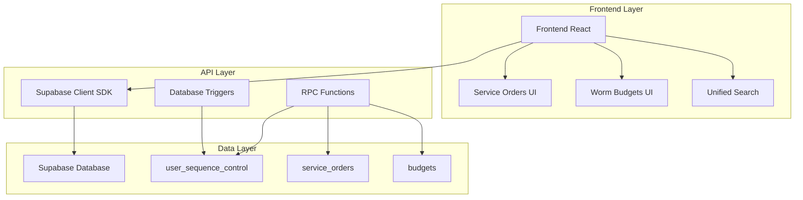
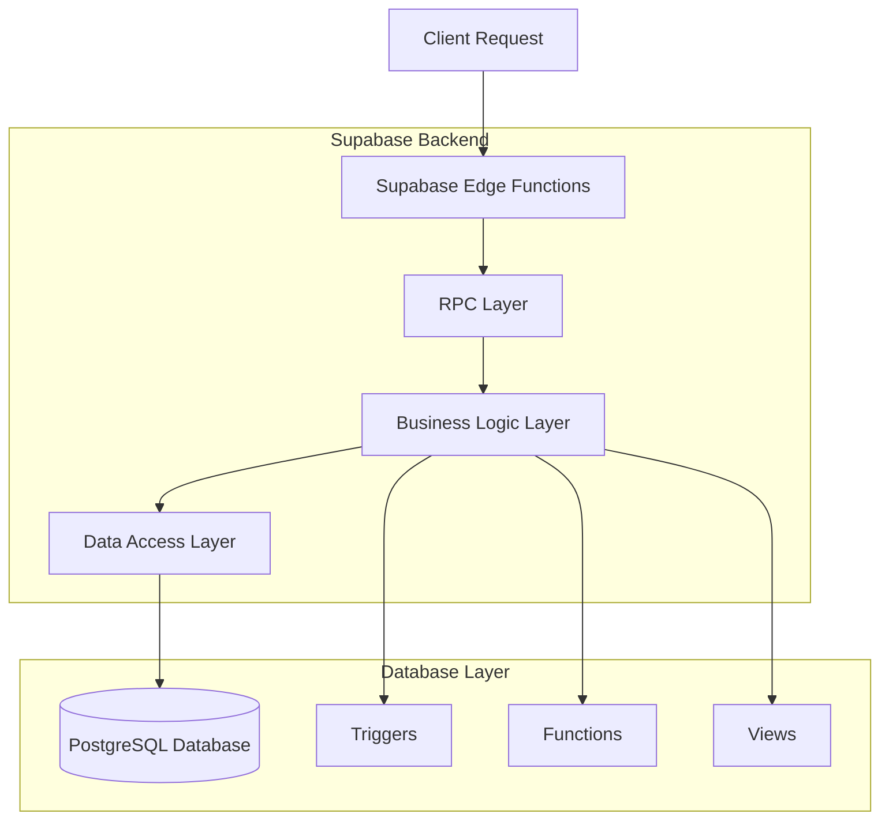
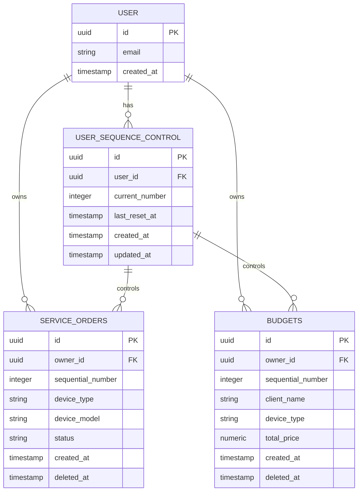

# Arquitetura Técnica - Sistema de Numeração Sequencial Unificado

## 1. Arquitetura do Sistema



## 2. Descrição das Tecnologias

- **Frontend**: React@18 + TypeScript + TailwindCSS + Vite
- **Backend**: Supabase (PostgreSQL + Auth + RPC)
- **Estado**: React Query (TanStack Query)
- **UI Components**: Shadcn/ui + Lucide React

## 3. Definições de Rotas

| Rota | Propósito | Numeração |
|------|-----------|----------|
| /service-orders | Gestão de ordens de serviço | OS: 0001-9999 por usuário |
| /service-orders/:id | Detalhes da ordem de serviço | Exibe formatted_id |
| /worm | Sistema de orçamentos | OS: 0001-9999 por usuário (compartilhado) |
| /worm/:id | Detalhes do orçamento | Exibe formatted_id |
| /search | Busca unificada | Busca por ID sequencial |

## 4. Definições de API

### 4.1 Core RPC Functions

#### Geração de Número Sequencial
```
RPC: generate_user_sequential_number(p_user_id UUID)
```

Request:
| Param Name | Param Type | isRequired | Description |
|------------|------------|------------|-------------|
| p_user_id | UUID | true | ID do usuário |

Response:
| Param Name | Param Type | Description |
|------------|------------|-------------|
| result | INTEGER | Próximo número sequencial (1-9999) |

Example:
```sql
SELECT generate_user_sequential_number('123e4567-e89b-12d3-a456-426614174000');
-- Returns: 1
```

#### Busca Unificada
```
RPC: search_by_sequential_id(p_user_id UUID, p_search_term TEXT)
```

Request:
| Param Name | Param Type | isRequired | Description |
|------------|------------|------------|-------------|
| p_user_id | UUID | true | ID do usuário |
| p_search_term | TEXT | true | Termo de busca |

Response:
| Param Name | Param Type | Description |
|------------|------------|-------------|
| item_type | TEXT | Tipo do item ('service_order' ou 'budget') |
| id | UUID | ID único do registro |
| formatted_id | TEXT | ID formatado (ex: "OS: 0001") |
| title | TEXT | Título descritivo |
| created_at | TIMESTAMPTZ | Data de criação |

Example:
```json
{
  "item_type": "service_order",
  "id": "123e4567-e89b-12d3-a456-426614174000",
  "formatted_id": "OS: 0001",
  "title": "iPhone 12 - Tela quebrada",
  "created_at": "2025-01-23T10:30:00Z"
}
```

#### Service Orders com Numeração
```
RPC: get_service_orders_with_sequence(p_limit INTEGER, p_offset INTEGER)
```

Request:
| Param Name | Param Type | isRequired | Description |
|------------|------------|------------|-------------|
| p_limit | INTEGER | false | Limite de registros (default: 50) |
| p_offset | INTEGER | false | Offset para paginação (default: 0) |

Response:
| Param Name | Param Type | Description |
|------------|------------|-------------|
| id | UUID | ID único |
| formatted_id | TEXT | ID formatado |
| device_type | VARCHAR | Tipo do dispositivo |
| device_model | VARCHAR | Modelo do dispositivo |
| status | VARCHAR | Status da ordem |
| created_at | TIMESTAMPTZ | Data de criação |

#### Worm Budgets com Numeração
```
RPC: get_worm_budgets_with_sequence(p_user_id UUID, p_limit INTEGER, p_offset INTEGER)
```

Request:
| Param Name | Param Type | isRequired | Description |
|------------|------------|------------|-------------|
| p_user_id | UUID | true | ID do usuário |
| p_limit | INTEGER | false | Limite de registros |
| p_offset | INTEGER | false | Offset para paginação |

Response:
| Param Name | Param Type | Description |
|------------|------------|-------------|
| id | UUID | ID único |
| formatted_id | TEXT | ID formatado |
| client_name | TEXT | Nome do cliente |
| device_type | TEXT | Tipo do dispositivo |
| total_price | NUMERIC | Preço total |
| created_at | TIMESTAMPTZ | Data de criação |

### 4.2 Funções Administrativas

#### Reset de Sequência (Admin)
```
RPC: admin_reset_user_sequence(p_user_id UUID, p_admin_id UUID)
```

Request:
| Param Name | Param Type | isRequired | Description |
|------------|------------|------------|-------------|
| p_user_id | UUID | true | ID do usuário a resetar |
| p_admin_id | UUID | true | ID do administrador |

Response:
| Param Name | Param Type | Description |
|------------|------------|-------------|
| success | BOOLEAN | Status da operação |

#### Validação de Integridade
```
RPC: validate_sequence_integrity()
```

Response:
| Param Name | Param Type | Description |
|------------|------------|-------------|
| user_id | UUID | ID do usuário com problema |
| issue_type | TEXT | Tipo do problema |
| description | TEXT | Descrição do reparo |

## 5. Arquitetura do Servidor



## 6. Modelo de Dados

### 6.1 Diagrama de Entidades



### 6.2 DDL (Data Definition Language)

#### Tabela de Controle de Sequência
```sql
-- Criar tabela de controle de sequência por usuário
CREATE TABLE user_sequence_control (
  id UUID PRIMARY KEY DEFAULT gen_random_uuid(),
  user_id UUID NOT NULL REFERENCES auth.users(id) ON DELETE CASCADE,
  current_number INTEGER NOT NULL DEFAULT 0 CHECK (current_number >= 0 AND current_number <= 9999),
  last_reset_at TIMESTAMP WITH TIME ZONE DEFAULT NOW(),
  created_at TIMESTAMP WITH TIME ZONE DEFAULT NOW(),
  updated_at TIMESTAMP WITH TIME ZONE DEFAULT NOW(),
  UNIQUE(user_id)
);

-- Índices para performance
CREATE INDEX idx_user_sequence_control_user_id ON user_sequence_control(user_id);
CREATE INDEX idx_user_sequence_control_current_number ON user_sequence_control(current_number);

-- Comentários
COMMENT ON TABLE user_sequence_control IS 'Controla numeração sequencial por usuário (0001-9999)';
COMMENT ON COLUMN user_sequence_control.current_number IS 'Número atual da sequência (0-9999)';
COMMENT ON COLUMN user_sequence_control.last_reset_at IS 'Última vez que a sequência foi resetada';
```

#### Modificações em Service Orders
```sql
-- Adicionar coluna de numeração sequencial por usuário
ALTER TABLE service_orders 
ADD COLUMN IF NOT EXISTS sequential_number INTEGER;

-- Índice único por usuário
CREATE UNIQUE INDEX IF NOT EXISTS idx_service_orders_user_sequential 
ON service_orders(owner_id, sequential_number) 
WHERE sequential_number IS NOT NULL AND deleted_at IS NULL;

-- Comentário
COMMENT ON COLUMN service_orders.sequential_number IS 'Número sequencial por usuário (1-9999)';
```

#### Modificações em Budgets
```sql
-- Adicionar coluna de numeração sequencial
ALTER TABLE budgets 
ADD COLUMN IF NOT EXISTS sequential_number INTEGER;

-- Índice único por usuário
CREATE UNIQUE INDEX IF NOT EXISTS idx_budgets_user_sequential 
ON budgets(owner_id, sequential_number) 
WHERE sequential_number IS NOT NULL AND deleted_at IS NULL;

-- Comentário
COMMENT ON COLUMN budgets.sequential_number IS 'Número sequencial por usuário (1-9999)';
```

#### Funções de Controle
```sql
-- Função para gerar próximo número sequencial
CREATE OR REPLACE FUNCTION generate_user_sequential_number(p_user_id UUID)
RETURNS INTEGER AS $$
DECLARE
  v_current_number INTEGER;
  v_new_number INTEGER;
BEGIN
  -- Lock advisory para evitar concorrência
  PERFORM pg_advisory_lock(hashtext(p_user_id::text));
  
  -- Inserir registro se não existir
  INSERT INTO user_sequence_control (user_id, current_number)
  VALUES (p_user_id, 0)
  ON CONFLICT (user_id) DO NOTHING;
  
  -- Obter número atual
  SELECT current_number INTO v_current_number 
  FROM user_sequence_control 
  WHERE user_id = p_user_id;
  
  -- Calcular próximo número
  v_new_number := v_current_number + 1;
  
  -- Reset automático após 9999
  IF v_new_number > 9999 THEN
    v_new_number := 1;
    UPDATE user_sequence_control 
    SET current_number = v_new_number, 
        last_reset_at = NOW(),
        updated_at = NOW()
    WHERE user_id = p_user_id;
  ELSE
    UPDATE user_sequence_control 
    SET current_number = v_new_number,
        updated_at = NOW()
    WHERE user_id = p_user_id;
  END IF;
  
  -- Liberar lock
  PERFORM pg_advisory_unlock(hashtext(p_user_id::text));
  
  RETURN v_new_number;
END;
$$ LANGUAGE plpgsql SECURITY DEFINER;

-- Função para formatação
CREATE OR REPLACE FUNCTION format_user_sequence_id(seq_number INTEGER)
RETURNS TEXT AS $$
BEGIN
  RETURN 'OS: ' || LPAD(seq_number::TEXT, 4, '0');
END;
$$ LANGUAGE plpgsql IMMUTABLE;

-- Triggers para atribuição automática
CREATE OR REPLACE FUNCTION assign_user_sequential_number_service_orders()
RETURNS TRIGGER AS $$
BEGIN
  IF NEW.sequential_number IS NULL THEN
    NEW.sequential_number := generate_user_sequential_number(NEW.owner_id);
  END IF;
  RETURN NEW;
END;
$$ LANGUAGE plpgsql;

CREATE TRIGGER trigger_assign_user_sequential_service_orders
  BEFORE INSERT ON service_orders
  FOR EACH ROW
  EXECUTE FUNCTION assign_user_sequential_number_service_orders();

CREATE OR REPLACE FUNCTION assign_user_sequential_number_budgets()
RETURNS TRIGGER AS $$
BEGIN
  IF NEW.sequential_number IS NULL THEN
    NEW.sequential_number := generate_user_sequential_number(NEW.owner_id);
  END IF;
  RETURN NEW;
END;
$$ LANGUAGE plpgsql;

CREATE TRIGGER trigger_assign_user_sequential_budgets
  BEFORE INSERT ON budgets
  FOR EACH ROW
  EXECUTE FUNCTION assign_user_sequential_number_budgets();
```

#### Permissões e Segurança
```sql
-- Permissões para usuários autenticados
GRANT SELECT ON user_sequence_control TO authenticated;
GRANT EXECUTE ON FUNCTION generate_user_sequential_number(UUID) TO authenticated;
GRANT EXECUTE ON FUNCTION format_user_sequence_id(INTEGER) TO authenticated;

-- RLS (Row Level Security)
ALTER TABLE user_sequence_control ENABLE ROW LEVEL SECURITY;

CREATE POLICY "Users can view own sequence control" ON user_sequence_control
  FOR SELECT USING (user_id = auth.uid());

CREATE POLICY "Users can update own sequence control" ON user_sequence_control
  FOR UPDATE USING (user_id = auth.uid());

-- Política para admins
CREATE POLICY "Admins can view all sequence controls" ON user_sequence_control
  FOR ALL USING (public.is_current_user_admin());
```

#### Views de Monitoramento
```sql
-- View para status das sequências
CREATE OR REPLACE VIEW v_user_sequence_status AS
SELECT 
  usc.user_id,
  up.name as user_name,
  up.email as user_email,
  usc.current_number,
  usc.last_reset_at,
  (9999 - usc.current_number) as remaining_numbers,
  CASE 
    WHEN usc.current_number > 9000 THEN 'CRITICAL'
    WHEN usc.current_number > 8000 THEN 'WARNING'
    WHEN usc.current_number > 6000 THEN 'ATTENTION'
    ELSE 'OK'
  END as status,
  (
    SELECT COUNT(*) FROM service_orders 
    WHERE owner_id = usc.user_id AND deleted_at IS NULL
  ) as total_service_orders,
  (
    SELECT COUNT(*) FROM budgets 
    WHERE owner_id = usc.user_id AND deleted_at IS NULL
  ) as total_budgets,
  usc.created_at,
  usc.updated_at
FROM user_sequence_control usc
LEFT JOIN user_profiles up ON up.id = usc.user_id
ORDER BY usc.current_number DESC;

-- Permissões para a view
GRANT SELECT ON v_user_sequence_status TO authenticated;

-- RLS para a view
CREATE POLICY "Users can view own sequence status" ON v_user_sequence_status
  FOR SELECT USING (user_id = auth.uid());

CREATE POLICY "Admins can view all sequence status" ON v_user_sequence_status
  FOR SELECT USING (public.is_current_user_admin());
```

#### Dados Iniciais
```sql
-- Inserir configurações padrão se necessário
INSERT INTO user_sequence_control (user_id, current_number)
SELECT DISTINCT owner_id, 0
FROM (
  SELECT owner_id FROM service_orders WHERE deleted_at IS NULL
  UNION
  SELECT owner_id FROM budgets WHERE deleted_at IS NULL
) existing_users
WHERE NOT EXISTS (
  SELECT 1 FROM user_sequence_control 
  WHERE user_id = existing_users.owner_id
)
ON CONFLICT (user_id) DO NOTHING;
```

## 7. Considerações de Performance

### 7.1 Índices Otimizados
- `idx_user_sequence_control_user_id`: Busca rápida por usuário
- `idx_service_orders_user_sequential`: Evita duplicatas em service orders
- `idx_budgets_user_sequential`: Evita duplicatas em budgets

### 7.2 Locks Advisory
- Uso de `pg_advisory_lock()` para evitar condições de corrida
- Lock baseado no hash do user_id para isolamento por usuário

### 7.3 Otimizações de Query
- Views materializadas para relatórios administrativos
- Índices parciais para registros não deletados
- Paginação eficiente nas funções RPC

## 8. Monitoramento e Alertas

### 8.1 Métricas Importantes
- Número de sequências próximas ao limite (>8000)
- Frequência de resets automáticos
- Performance das funções de geração
- Conflitos de concorrência

### 8.2 Logs de Auditoria
- Todas as operações administrativas
- Resets de sequência
- Conflitos detectados
- Performance degradada

## 9. Backup e Recuperação

### 9.1 Estratégia de Backup
- Backup completo da tabela `user_sequence_control`
- Backup incremental dos campos `sequential_number`
- Validação de integridade pós-backup

### 9.2 Procedimentos de Recuperação
- Script de validação de integridade
- Reconstrução de sequências a partir de dados existentes
- Verificação de consistência entre tabelas

## 10. Escalabilidade

### 10.1 Limites Atuais
- 9999 registros por usuário antes do reset
- Suporte a milhares de usuários simultâneos
- Performance otimizada para até 100k registros por usuário

### 10.2 Planos de Expansão
- Possibilidade de aumentar limite para 99999
- Implementação de arquivamento automático
- Particionamento de tabelas por período