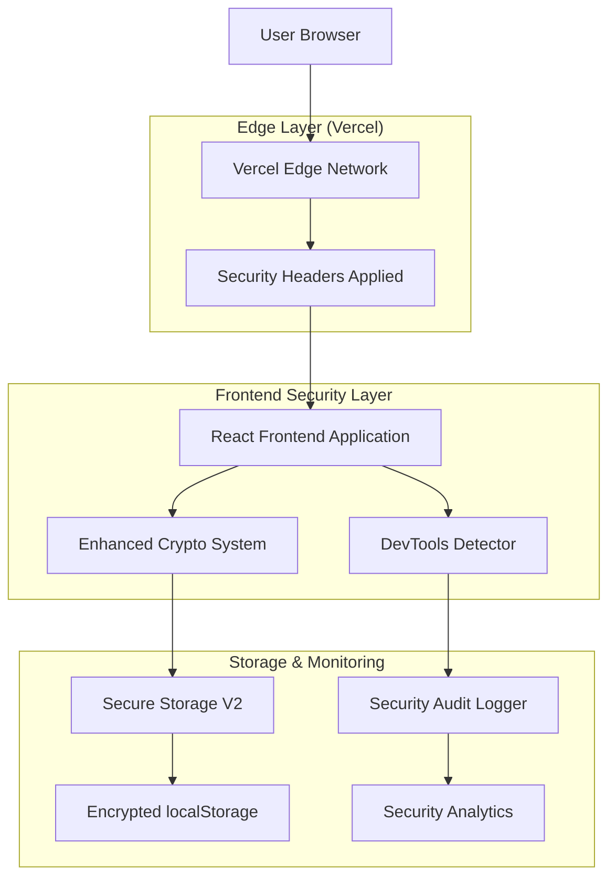
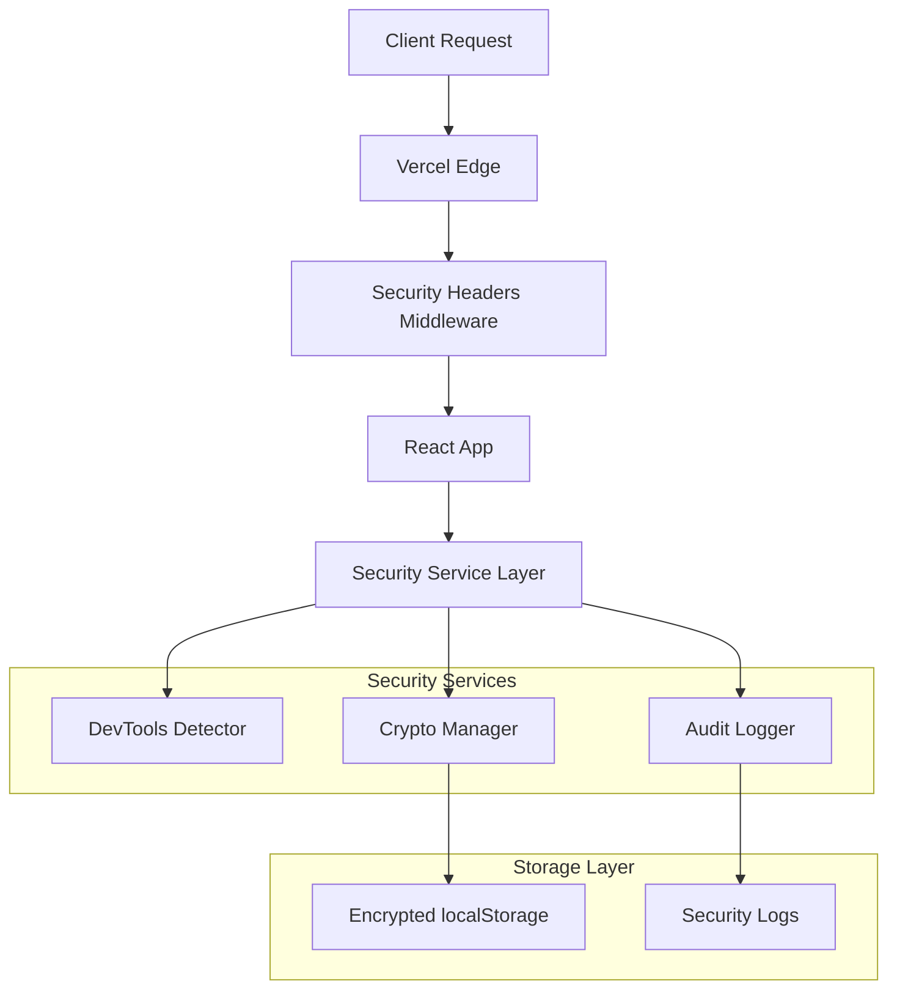
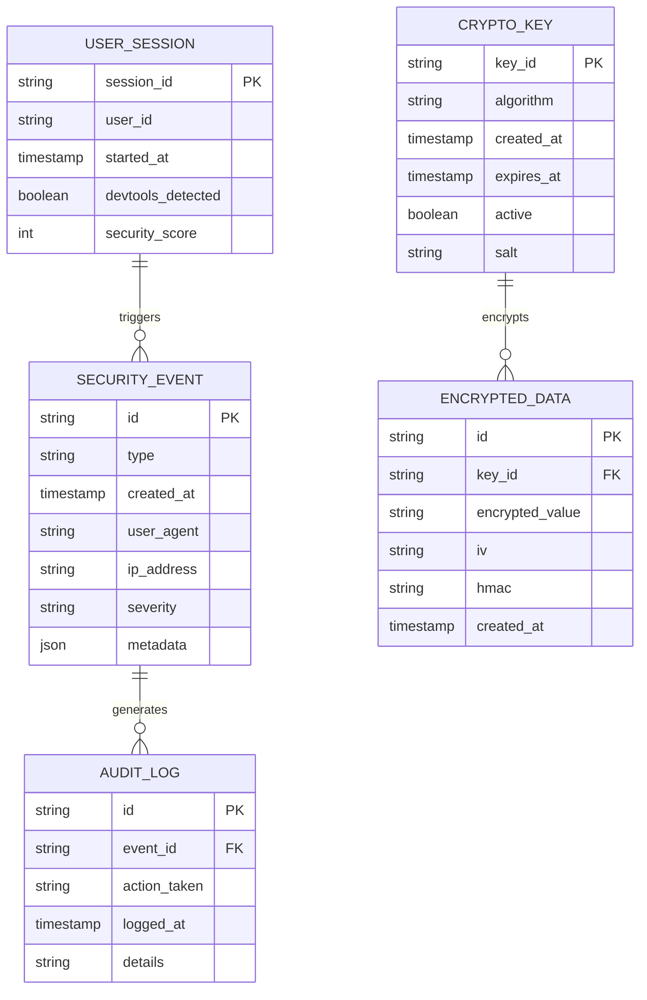

# Arquitetura Técnica - Melhorias de Segurança OneDrip

## 1. Architecture design



## 2. Technology Description

* Frontend: React\@18 + TypeScript + Vite

* Security: Web Crypto API + Custom DevTools Detection

* Storage: Enhanced AES-256-GCM + PBKDF2

* Monitoring: Custom Security Audit System

* Infrastructure: Vercel Edge Functions + Security Headers

## 3. Route definitions

| Route  | Security Features                             |
| ------ | --------------------------------------------- |
| /\*    | CSP headers, HSTS, DevTools detection ativa   |
| /admin | Detecção reforçada, logging avançado          |
| /auth  | Criptografia máxima, validação de integridade |

## 4. API definitions

### 4.1 Security Headers API

**Vercel Headers Configuration**

```json
{
  "headers": [
    {
      "source": "/(.*)",
      "headers": [
        {
          "key": "Content-Security-Policy",
          "value": "default-src 'self'; script-src 'self' 'unsafe-inline' 'unsafe-eval'; style-src 'self' 'unsafe-inline'; img-src 'self' data: https:; connect-src 'self' https://oghjlypdnmqecaavekyr.supabase.co"
        }
      ]
    }
  ]
}
```

### 4.2 DevTools Detection API

**Detection Events**

```typescript
interface DevToolsEvent {
  type: 'console_opened' | 'inspector_opened' | 'debugger_attached';
  timestamp: number;
  userAgent: string;
  screenResolution: string;
  suspiciousActivity: boolean;
}
```

**Detection Response**

```typescript
interface SecurityResponse {
  blocked: boolean;
  action: 'log' | 'warn' | 'block' | 'redirect';
  message: string;
  severity: 'low' | 'medium' | 'high' | 'critical';
}
```

### 4.3 Enhanced Crypto API

**Encryption Request**

```typescript
interface EncryptionRequest {
  data: any;
  context: string;
  options?: {
    algorithm: 'AES-256-GCM';
    keyDerivation: 'PBKDF2';
    iterations: number;
    saltLength: number;
  };
}
```

**Encryption Response**

```typescript
interface EncryptionResponse {
  encryptedData: string;
  iv: string;
  salt: string;
  hmac: string;
  keyId: string;
  timestamp: number;
}
```

## 5. Server architecture diagram



## 6. Data model

### 6.1 Data model definition



### 6.2 Data Definition Language

**Security Events Storage (localStorage)**

```typescript
// Estrutura para eventos de segurança
interface SecurityEventStore {
  events: SecurityEvent[];
  lastCleanup: number;
  maxEvents: number;
}

// Configuração de criptografia
interface CryptoConfig {
  algorithm: 'AES-256-GCM';
  keyDerivation: 'PBKDF2';
  iterations: 100000;
  saltLength: 32;
  ivLength: 12;
  tagLength: 16;
}

// Chaves de criptografia
interface CryptoKeyStore {
  keys: Map<string, CryptoKeyData>;
  activeKeyId: string;
  rotationInterval: number;
  lastRotation: number;
}

interface CryptoKeyData {
  keyId: string;
  key: CryptoKey;
  salt: Uint8Array;
  createdAt: number;
  expiresAt: number;
  usage: number;
}
```

**Enhanced Security Headers (vercel.json)**

```json
{
  "headers": [
    {
      "source": "/(.*)",
      "headers": [
        {
          "key": "Content-Security-Policy",
          "value": "default-src 'self'; script-src 'self' 'unsafe-inline' 'unsafe-eval' https://challenges.cloudflare.com; style-src 'self' 'unsafe-inline' https://fonts.googleapis.com; font-src 'self' https://fonts.gstatic.com; img-src 'self' data: https: blob:; connect-src 'self' https://oghjlypdnmqecaavekyr.supabase.co https://api.hcaptcha.com; frame-src 'self' https://hcaptcha.com https://assets.hcaptcha.com; worker-src 'self' blob:; manifest-src 'self'; base-uri 'self'; form-action 'self'; upgrade-insecure-requests"
        },
        {
          "key": "Strict-Transport-Security",
          "value": "max-age=63072000; includeSubDomains; preload"
        },
        {
          "key": "X-Frame-Options",
          "value": "DENY"
        },
        {
          "key": "X-Content-Type-Options",
          "value": "nosniff"
        },
        {
          "key": "X-XSS-Protection",
          "value": "1; mode=block"
        },
        {
          "key": "Referrer-Policy",
          "value": "strict-origin-when-cross-origin"
        },
        {
          "key": "Permissions-Policy",
          "value": "camera=(), microphone=(), geolocation=(), payment=(), usb=(), magnetometer=(), gyroscope=(), accelerometer=()"
        },
        {
          "key": "Cross-Origin-Embedder-Policy",
          "value": "require-corp"
        },
        {
          "key": "Cross-Origin-Opener-Policy",
          "value": "same-origin"
        },
        {
          "key": "Cross-Origin-Resource-Policy",
          "value": "same-origin"
        }
      ]
    }
  ]
}
```

**DevTools Detection Implementation**

```typescript
// Implementação do detector de DevTools
class DevToolsDetector {
  private isDetectionActive = true;
  private detectionInterval: number = 500;
  private thresholds = {
    heightDiff: 160,
    widthDiff: 160,
    consoleCheck: true
  };

  startDetection(): void {
    setInterval(() => {
      this.checkDevTools();
    }, this.detectionInterval);
  }

  private checkDevTools(): void {
    const heightDiff = window.outerHeight - window.innerHeight;
    const widthDiff = window.outerWidth - window.innerWidth;
    
    if (heightDiff > this.thresholds.heightDiff || 
        widthDiff > this.thresholds.widthDiff) {
      this.handleDetection('dimension_change');
    }
    
    if (this.thresholds.consoleCheck) {
      this.checkConsole();
    }
  }
}
```

**Enhanced Crypto Implementation**

```typescript
// Sistema de criptografia aprimorado
class SecureStorageV2 {
  private algorithm = 'AES-256-GCM';
  private keyDerivation = 'PBKDF2';
  private iterations = 100000;

  async encrypt(data: any, context: string): Promise<EncryptedData> {
    const key = await this.deriveKey(context);
    const iv = crypto.getRandomValues(new Uint8Array(12));
    const encodedData = new TextEncoder().encode(JSON.stringify(data));
    
    const encrypted = await crypto.subtle.encrypt(
      { name: this.algorithm, iv },
      key,
      encodedData
    );
    
    const hmac = await this.generateHMAC(encrypted, key);
    
    return {
      data: Array.from(new Uint8Array(encrypted)),
      iv: Array.from(iv),
      hmac: Array.from(new Uint8Array(hmac)),
      timestamp: Date.now()
    };
  }
}
```

