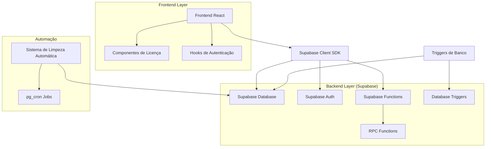
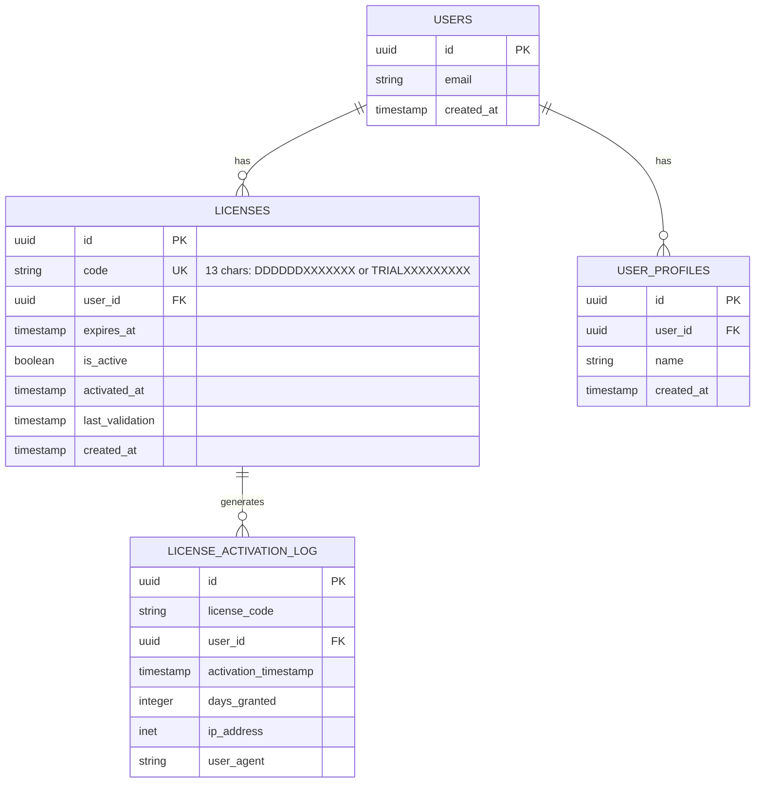
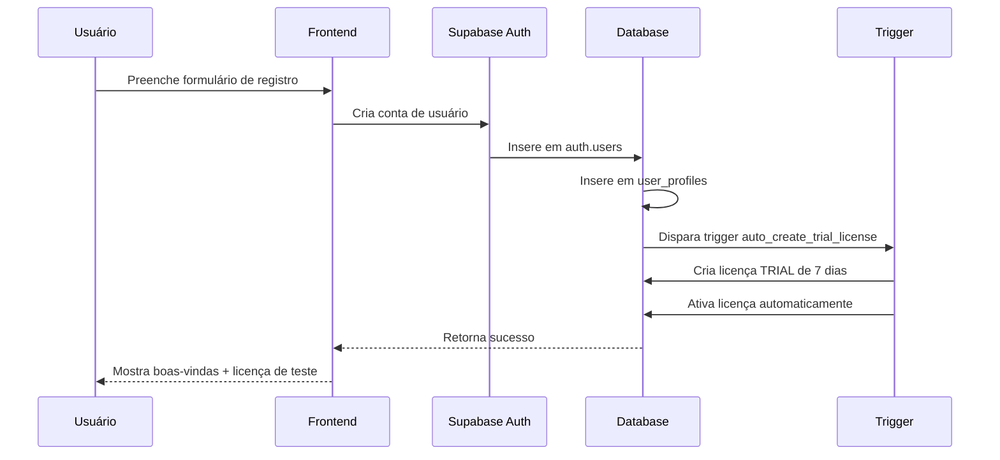
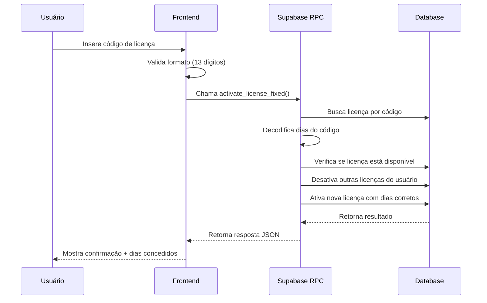
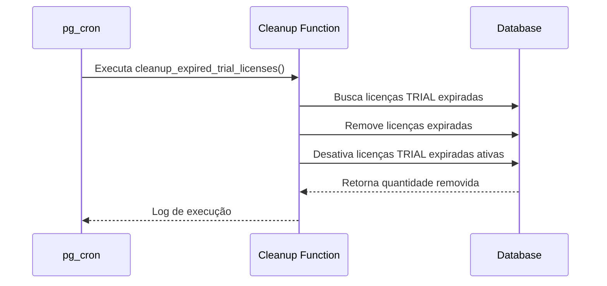

# Arquitetura Técnica - Sistema de Licenças Melhorado

## 1. Arquitetura de Sistema



## 2. Descrição das Tecnologias

- **Frontend**: React@18 + TypeScript + Tailwind CSS + Vite
- **Backend**: Supabase (PostgreSQL + Auth + RPC Functions)
- **Automação**: pg_cron para limpeza automática
- **Validação**: Funções PL/pgSQL para regras de negócio

## 3. Definições de Rotas

| Rota | Propósito |
|------|-----------|
| `/dashboard` | Painel principal com status da licença |
| `/license/activate` | Página de ativação de licenças |
| `/admin/licenses` | Gerenciamento de licenças (admin) |
| `/profile` | Perfil do usuário com informações de licença |
| `/signup` | Registro com criação automática de licença teste |

## 4. Definições de API

### 4.1 Funções RPC Core

#### Ativação de Licença
```typescript
// RPC: activate_license_fixed
interface ActivateLicenseRequest {
  p_license_code: string;
  p_user_id: string;
}

interface ActivateLicenseResponse {
  success: boolean;
  message?: string;
  error?: string;
  expires_at?: string;
  days_granted?: number;
}
```

#### Criação de Licença de Teste
```typescript
// RPC: create_trial_license
interface CreateTrialLicenseRequest {
  p_user_id: string;
}

interface CreateTrialLicenseResponse {
  success: boolean;
  license_id?: string;
  code?: string;
  expires_at?: string;
  message?: string;
  error?: string;
}
```

#### Criação de Licenças com Dias (Admin)
```typescript
// RPC: admin_create_license_with_days
interface CreateLicenseWithDaysRequest {
  p_days: number;
  p_quantity?: number;
}

interface CreateLicenseWithDaysResponse {
  success: boolean;
  codes?: string[];
  quantity?: number;
  days_per_license?: number;
  message?: string;
}
```

#### Decodificação de Dias da Licença
```typescript
// RPC: decode_license_days
interface DecodeLicenseDaysRequest {
  p_license_code: string;
}

type DecodeLicenseDaysResponse = number | null;
```

#### Limpeza de Licenças Expiradas
```typescript
// RPC: cleanup_expired_trial_licenses
type CleanupExpiredTrialLicensesResponse = number; // quantidade removida
```

#### Estatísticas de Licenças
```typescript
// RPC: get_license_statistics
interface LicenseStatistics {
  total_licenses: number;
  active_licenses: number;
  trial_licenses: number;
  expired_licenses: number;
  licenses_by_duration: Record<string, number>;
}
```

### 4.2 Hooks React Personalizados

#### useLicenseActivation
```typescript
interface UseLicenseActivationReturn {
  activateLicense: (code: string) => Promise<ActivateLicenseResponse>;
  isLoading: boolean;
  error: string | null;
}

const useLicenseActivation = (): UseLicenseActivationReturn;
```

#### useLicenseStatus
```typescript
interface LicenseStatus {
  hasActiveLicense: boolean;
  isTrialLicense: boolean;
  expiresAt: string | null;
  daysRemaining: number | null;
  licenseCode: string | null;
}

interface UseLicenseStatusReturn {
  licenseStatus: LicenseStatus | null;
  isLoading: boolean;
  refetch: () => Promise<void>;
}

const useLicenseStatus = (): UseLicenseStatusReturn;
```

#### useTrialLicense
```typescript
interface UseTrialLicenseReturn {
  createTrialLicense: () => Promise<CreateTrialLicenseResponse>;
  isCreating: boolean;
  error: string | null;
}

const useTrialLicense = (): UseTrialLicenseReturn;
```

## 5. Arquitetura de Banco de Dados

### 5.1 Diagrama de Entidades



### 5.2 Definições DDL

#### Tabela de Licenças Atualizada
```sql
-- Tabela principal de licenças
CREATE TABLE IF NOT EXISTS public.licenses (
    id UUID NOT NULL DEFAULT gen_random_uuid() PRIMARY KEY,
    code TEXT UNIQUE NOT NULL CHECK (LENGTH(code) = 13),
    user_id UUID REFERENCES auth.users(id) ON DELETE SET NULL,
    expires_at TIMESTAMP WITH TIME ZONE,
    created_at TIMESTAMP WITH TIME ZONE NOT NULL DEFAULT NOW(),
    is_active BOOLEAN NOT NULL DEFAULT FALSE,
    activated_at TIMESTAMP WITH TIME ZONE,
    last_validation TIMESTAMP WITH TIME ZONE
);

-- Índices para performance
CREATE INDEX IF NOT EXISTS idx_licenses_code ON public.licenses(code);
CREATE INDEX IF NOT EXISTS idx_licenses_user_id ON public.licenses(user_id);
CREATE INDEX IF NOT EXISTS idx_licenses_is_active ON public.licenses(is_active);
CREATE INDEX IF NOT EXISTS idx_licenses_expires_at ON public.licenses(expires_at);
CREATE INDEX IF NOT EXISTS idx_licenses_trial ON public.licenses(code) WHERE code LIKE 'TRIAL%';

-- Tabela de log de ativações
CREATE TABLE IF NOT EXISTS public.license_activation_log (
    id UUID DEFAULT gen_random_uuid() PRIMARY KEY,
    license_code TEXT NOT NULL,
    user_id UUID NOT NULL REFERENCES auth.users(id),
    activation_timestamp TIMESTAMP WITH TIME ZONE DEFAULT NOW(),
    days_granted INTEGER,
    ip_address INET,
    user_agent TEXT
);

-- Índices para auditoria
CREATE INDEX IF NOT EXISTS idx_activation_log_user_id ON public.license_activation_log(user_id);
CREATE INDEX IF NOT EXISTS idx_activation_log_timestamp ON public.license_activation_log(activation_timestamp DESC);
```

#### Permissões Supabase
```sql
-- Permissões para usuários autenticados
GRANT SELECT ON public.licenses TO authenticated;
GRANT INSERT ON public.licenses TO authenticated;
GRANT UPDATE ON public.licenses TO authenticated;

-- Permissões para usuários anônimos (apenas leitura limitada)
GRANT SELECT ON public.licenses TO anon;

-- RLS (Row Level Security)
ALTER TABLE public.licenses ENABLE ROW LEVEL SECURITY;

-- Política: usuários só veem suas próprias licenças
CREATE POLICY "Users can view own licenses" ON public.licenses
    FOR SELECT USING (auth.uid() = user_id);

-- Política: usuários podem ativar licenças não utilizadas
CREATE POLICY "Users can activate unused licenses" ON public.licenses
    FOR UPDATE USING (user_id IS NULL OR user_id = auth.uid());

-- Política: admins podem ver todas as licenças
CREATE POLICY "Admins can view all licenses" ON public.licenses
    FOR ALL USING (public.is_current_user_admin());
```

#### Triggers Automáticos
```sql
-- Trigger para criação automática de licença de teste
CREATE OR REPLACE FUNCTION public.auto_create_trial_license()
RETURNS TRIGGER
LANGUAGE plpgsql
SECURITY DEFINER
AS $$
BEGIN
    -- Criar licença de teste para novo usuário
    PERFORM public.create_trial_license(NEW.id);
    RETURN NEW;
END;
$$;

CREATE TRIGGER trigger_auto_trial_license
    AFTER INSERT ON public.user_profiles
    FOR EACH ROW
    EXECUTE FUNCTION public.auto_create_trial_license();

-- Trigger para log de ativações
CREATE OR REPLACE FUNCTION public.log_license_activation()
RETURNS TRIGGER
LANGUAGE plpgsql
SECURITY DEFINER
AS $$
BEGIN
    -- Log apenas quando licença é ativada
    IF OLD.is_active = FALSE AND NEW.is_active = TRUE THEN
        INSERT INTO public.license_activation_log (
            license_code,
            user_id,
            days_granted
        ) VALUES (
            NEW.code,
            NEW.user_id,
            public.decode_license_days(NEW.code)
        );
    END IF;
    
    RETURN NEW;
END;
$$;

CREATE TRIGGER trigger_log_license_activation
    AFTER UPDATE ON public.licenses
    FOR EACH ROW
    EXECUTE FUNCTION public.log_license_activation();
```

#### Automação com pg_cron
```sql
-- Configurar limpeza automática diária
SELECT cron.schedule(
    'cleanup-expired-trials',
    '0 2 * * *', -- Todo dia às 02:00
    'SELECT public.cleanup_expired_trial_licenses();'
);

-- Configurar atualização de status de licenças
SELECT cron.schedule(
    'update-license-status',
    '*/30 * * * *', -- A cada 30 minutos
    'UPDATE public.licenses SET is_active = FALSE WHERE expires_at < NOW() AND is_active = TRUE;'
);
```

## 6. Componentes Frontend

### 6.1 Estrutura de Componentes

```
src/
├── components/
│   ├── License/
│   │   ├── LicenseActivationForm.tsx
│   │   ├── LicenseStatusCard.tsx
│   │   ├── TrialLicenseBanner.tsx
│   │   └── AdminLicenseManager.tsx
│   ├── Auth/
│   │   ├── SignUpForm.tsx (com licença de teste)
│   │   └── LoginForm.tsx
│   └── Common/
│       ├── LoadingSpinner.tsx
│       └── ErrorMessage.tsx
├── hooks/
│   ├── useLicenseActivation.ts
│   ├── useLicenseStatus.ts
│   ├── useTrialLicense.ts
│   └── useAuth.ts
├── types/
│   ├── license.types.ts
│   └── auth.types.ts
└── utils/
    ├── licenseValidation.ts
    └── supabaseClient.ts
```

### 6.2 Tipos TypeScript

```typescript
// types/license.types.ts
export interface License {
  id: string;
  code: string;
  user_id: string | null;
  expires_at: string | null;
  created_at: string;
  is_active: boolean;
  activated_at: string | null;
  last_validation: string | null;
}

export interface LicenseActivationResult {
  success: boolean;
  message?: string;
  error?: string;
  expires_at?: string;
  days_granted?: number;
}

export interface TrialLicenseInfo {
  isTrialLicense: boolean;
  daysRemaining: number | null;
  expiresAt: string | null;
}

export interface AdminLicenseCreation {
  days: number;
  quantity: number;
}
```

## 7. Fluxos de Processo

### 7.1 Fluxo de Registro com Licença de Teste



### 7.2 Fluxo de Ativação de Licença



### 7.3 Fluxo de Limpeza Automática



## 8. Considerações de Performance

### 8.1 Otimizações Implementadas

- **Índices estratégicos** para consultas frequentes
- **Particionamento** por tipo de licença (TRIAL vs normal)
- **Limpeza automática** para evitar acúmulo de dados
- **Cache de status** no frontend para reduzir consultas

### 8.2 Monitoramento

```sql
-- View para monitoramento de performance
CREATE VIEW public.license_performance_metrics AS
SELECT 
    DATE_TRUNC('day', created_at) as date,
    COUNT(*) as total_created,
    COUNT(*) FILTER (WHERE code LIKE 'TRIAL%') as trial_created,
    COUNT(*) FILTER (WHERE is_active = TRUE) as active_licenses,
    AVG(EXTRACT(EPOCH FROM (activated_at - created_at))/3600) as avg_activation_hours
FROM public.licenses
WHERE created_at >= NOW() - INTERVAL '30 days'
GROUP BY DATE_TRUNC('day', created_at)
ORDER BY date DESC;
```

## 9. Segurança e Auditoria

### 9.1 Medidas de Segurança

- **Row Level Security (RLS)** para isolamento de dados
- **Validação de entrada** em todas as funções
- **Log de auditoria** para ativações
- **Rate limiting** para criação de licenças
- **Verificação de permissões** administrativas

### 9.2 Compliance

- **LGPD**: Dados de licença vinculados ao usuário
- **Auditoria**: Log completo de ativações
- **Retenção**: Limpeza automática de dados expirados
- **Anonimização**: Possibilidade de desvincular licenças

## 10. Deployment e Manutenção

### 10.1 Scripts de Migração

```sql
-- Script de migração segura
BEGIN;

-- 1. Criar novas funções
\i migrations/001_new_license_functions.sql

-- 2. Migrar dados existentes
\i migrations/002_migrate_existing_licenses.sql

-- 3. Criar triggers
\i migrations/003_create_triggers.sql

-- 4. Configurar automação
\i migrations/004_setup_automation.sql

-- 5. Atualizar permissões
\i migrations/005_update_permissions.sql

COMMIT;
```

### 10.2 Rollback Plan

```sql
-- Script de rollback
BEGIN;

-- 1. Desabilitar triggers
DROP TRIGGER IF EXISTS trigger_auto_trial_license ON public.user_profiles;

-- 2. Remover automação
SELECT cron.unschedule('cleanup-expired-trials');

-- 3. Restaurar funções antigas
\i rollback/restore_old_functions.sql

COMMIT;
```

Esta arquitetura técnica fornece uma base sólida para implementar todas as melhorias solicitadas no sistema de licenças, mantendo compatibilidade, performance e segurança.