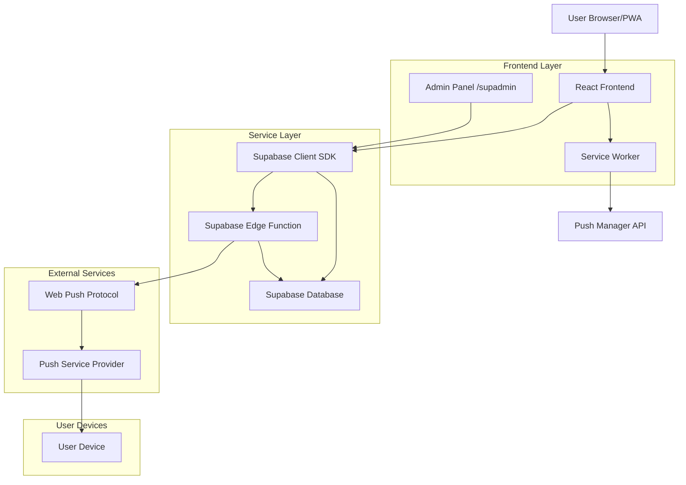
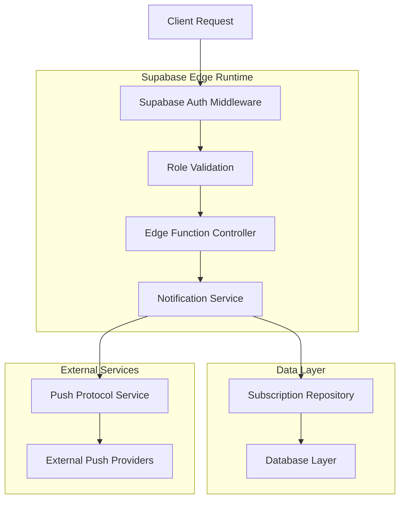
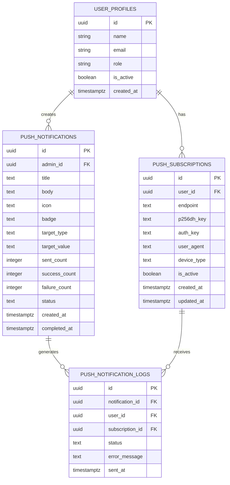
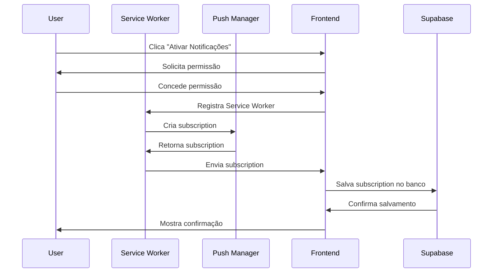
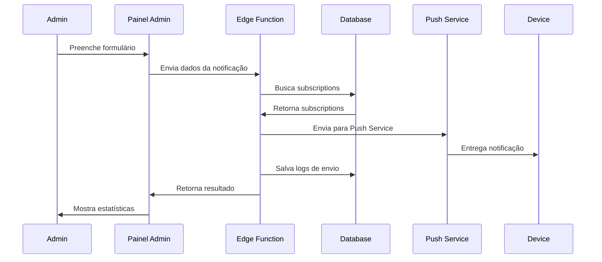

# Arquitetura Técnica - Sistema de Notificações Push OneDrip

## 1. Design da Arquitetura



## 2. Descrição da Tecnologia

### Frontend
- **React@18** + TypeScript + Vite
- **Shadcn UI** + Tailwind CSS para componentes
- **Service Worker** para interceptação de push events
- **Push Manager API** para gerenciamento de subscriptions
- **Zustand** para estado global (opcional)

### Backend
- **Supabase** como BaaS principal
- **Supabase Edge Functions** para lógica de envio
- **PostgreSQL** (Supabase) para persistência
- **Row Level Security (RLS)** para segurança

### Protocolos e APIs
- **Web Push Protocol** para entrega de notificações
- **VAPID** (Voluntary Application Server Identification) para autenticação
- **Push Service Providers:** FCM (Chrome), Mozilla Push (Firefox), WNS (Edge)

## 3. Definições de Rotas

| Rota | Propósito |
|------|-----------|
| `/` | Página principal com configurações de notificação |
| `/supadmin` | Painel administrativo principal |
| `/supadmin/notifications` | Gerenciador de notificações push |
| `/settings/notifications` | Configurações de notificação do usuário |

## 4. Definições de API

### 4.1. Edge Function - Send Push Notification

**Endpoint:** `supabase.functions.invoke('send-push-notification')`

**Método:** POST

**Headers:**
```typescript
{
  'Authorization': 'Bearer <supabase_jwt_token>',
  'Content-Type': 'application/json'
}
```

**Request Body:**
| Parâmetro | Tipo | Obrigatório | Descrição |
|-----------|------|-------------|-----------|
| title | string | true | Título da notificação (max 50 chars) |
| body | string | true | Corpo da mensagem (max 200 chars) |
| target_type | enum | true | Tipo de alvo: 'all', 'user', 'role' |
| target_value | string | false | ID do usuário ou nome da role |
| icon | string | false | URL do ícone (default: /icons/icon-192x192.png) |
| badge | string | false | URL do badge (default: /icons/icon-96x96.png) |

**Response:**
```typescript
{
  success: boolean;
  notification_id: string;
  sent_count: number;
  success_count: number;
  failure_count: number;
  error?: string;
}
```

**Exemplo de Request:**
```json
{
  "title": "Nova Ordem de Serviço",
  "body": "Você tem uma nova ordem de serviço aguardando aprovação",
  "target_type": "role",
  "target_value": "admin",
  "icon": "/icons/icon-192x192.png"
}
```

### 4.2. Subscription Management

**Endpoint:** Tabela `push_subscriptions` via Supabase Client

**Operações:**
- **CREATE/UPDATE:** Registrar nova subscription
- **DELETE:** Remover subscription (soft delete via is_active)
- **SELECT:** Listar subscriptions do usuário

## 5. Diagrama de Arquitetura do Servidor



## 6. Modelo de Dados

### 6.1. Diagrama de Entidades



### 6.2. DDL (Data Definition Language)

```sql
-- Tabela de subscriptions de push
CREATE TABLE IF NOT EXISTS public.push_subscriptions (
  id UUID PRIMARY KEY DEFAULT gen_random_uuid(),
  user_id UUID NOT NULL REFERENCES auth.users(id) ON DELETE CASCADE,
  endpoint TEXT NOT NULL,
  p256dh_key TEXT NOT NULL,
  auth_key TEXT NOT NULL,
  user_agent TEXT,
  device_type TEXT CHECK (device_type IN ('desktop', 'mobile', 'tablet')),
  is_active BOOLEAN DEFAULT true,
  created_at TIMESTAMPTZ DEFAULT NOW(),
  updated_at TIMESTAMPTZ DEFAULT NOW(),
  
  UNIQUE(user_id, endpoint)
);

-- Tabela de notificações enviadas
CREATE TABLE IF NOT EXISTS public.push_notifications (
  id UUID PRIMARY KEY DEFAULT gen_random_uuid(),
  admin_id UUID NOT NULL REFERENCES auth.users(id),
  title TEXT NOT NULL CHECK (length(title) <= 50),
  body TEXT NOT NULL CHECK (length(body) <= 200),
  icon TEXT DEFAULT '/icons/icon-192x192.png',
  badge TEXT DEFAULT '/icons/icon-96x96.png',
  target_type TEXT NOT NULL CHECK (target_type IN ('all', 'user', 'role')),
  target_value TEXT,
  sent_count INTEGER DEFAULT 0,
  success_count INTEGER DEFAULT 0,
  failure_count INTEGER DEFAULT 0,
  status TEXT DEFAULT 'pending' CHECK (status IN ('pending', 'sending', 'completed', 'failed')),
  created_at TIMESTAMPTZ DEFAULT NOW(),
  completed_at TIMESTAMPTZ
);

-- Tabela de logs detalhados
CREATE TABLE IF NOT EXISTS public.push_notification_logs (
  id UUID PRIMARY KEY DEFAULT gen_random_uuid(),
  notification_id UUID NOT NULL REFERENCES public.push_notifications(id) ON DELETE CASCADE,
  user_id UUID NOT NULL REFERENCES auth.users(id),
  subscription_id UUID REFERENCES public.push_subscriptions(id),
  status TEXT NOT NULL CHECK (status IN ('success', 'failed')),
  error_message TEXT,
  sent_at TIMESTAMPTZ DEFAULT NOW()
);

-- Índices para performance
CREATE INDEX IF NOT EXISTS idx_push_subscriptions_user_id ON public.push_subscriptions(user_id);
CREATE INDEX IF NOT EXISTS idx_push_subscriptions_active ON public.push_subscriptions(is_active) WHERE is_active = true;
CREATE INDEX IF NOT EXISTS idx_push_notifications_admin_id ON public.push_notifications(admin_id);
CREATE INDEX IF NOT EXISTS idx_push_notifications_created_at ON public.push_notifications(created_at DESC);
CREATE INDEX IF NOT EXISTS idx_push_notification_logs_notification_id ON public.push_notification_logs(notification_id);

-- Trigger para updated_at
CREATE OR REPLACE FUNCTION update_updated_at_column()
RETURNS TRIGGER AS $$
BEGIN
    NEW.updated_at = NOW();
    RETURN NEW;
END;
$$ language 'plpgsql';

CREATE TRIGGER update_push_subscriptions_updated_at 
    BEFORE UPDATE ON public.push_subscriptions 
    FOR EACH ROW EXECUTE FUNCTION update_updated_at_column();

-- RLS Policies
ALTER TABLE public.push_subscriptions ENABLE ROW LEVEL SECURITY;
ALTER TABLE public.push_notifications ENABLE ROW LEVEL SECURITY;
ALTER TABLE public.push_notification_logs ENABLE ROW LEVEL SECURITY;

-- Policies para push_subscriptions
CREATE POLICY "Users can manage their own subscriptions" ON public.push_subscriptions
  FOR ALL USING (auth.uid() = user_id);

CREATE POLICY "Admins can view all subscriptions" ON public.push_subscriptions
  FOR SELECT USING (
    EXISTS (
      SELECT 1 FROM public.user_profiles 
      WHERE id = auth.uid() AND role = 'admin'
    )
  );

-- Policies para push_notifications
CREATE POLICY "Admins can manage notifications" ON public.push_notifications
  FOR ALL USING (
    EXISTS (
      SELECT 1 FROM public.user_profiles 
      WHERE id = auth.uid() AND role = 'admin'
    )
  );

-- Policies para push_notification_logs
CREATE POLICY "Admins can view notification logs" ON public.push_notification_logs
  FOR SELECT USING (
    EXISTS (
      SELECT 1 FROM public.user_profiles 
      WHERE id = auth.uid() AND role = 'admin'
    )
  );

-- Dados iniciais (opcional)
-- Inserir configurações padrão se necessário
INSERT INTO public.site_settings (key, value, description) VALUES
('push_notifications_enabled', 'true', 'Habilitar sistema de notificações push'),
('push_default_icon', '/icons/icon-192x192.png', 'Ícone padrão para notificações'),
('push_default_badge', '/icons/icon-96x96.png', 'Badge padrão para notificações')
ON CONFLICT (key) DO NOTHING;
```

## 7. Fluxo de Dados

### 7.1. Fluxo de Registro de Subscription



### 7.2. Fluxo de Envio de Notificação



## 8. Considerações de Segurança

### 8.1. Autenticação e Autorização
- **JWT Tokens:** Validação via Supabase Auth
- **Role-based Access:** Apenas admins podem enviar notificações
- **RLS Policies:** Isolamento de dados por usuário/role

### 8.2. Validação de Dados
- **Input Sanitization:** Validação de títulos e mensagens
- **Rate Limiting:** Prevenção de spam de notificações
- **VAPID Keys:** Autenticação segura com push services

### 8.3. Privacidade
- **Opt-in:** Usuários devem explicitamente ativar notificações
- **Soft Delete:** Subscriptions desativadas, não removidas
- **Audit Trail:** Log completo de todas as notificações enviadas

## 9. Monitoramento e Métricas

### 9.1. Métricas de Performance
- Taxa de entrega de notificações
- Tempo de resposta da Edge Function
- Taxa de erro por dispositivo/navegador

### 9.2. Métricas de Negócio
- Taxa de opt-in de notificações
- Engajamento por tipo de notificação
- Conversão de notificações em ações

### 9.3. Alertas
- Falhas na Edge Function
- Taxa de erro > 10%
- Subscriptions expiradas em massa

## 10. Escalabilidade

### 10.1. Limitações Atuais
- **Edge Function:** ~1000 notificações por execução
- **Database:** Limitado pelo plano Supabase
- **Push Services:** Rate limits por provider

### 10.2. Estratégias de Escala
- **Batch Processing:** Processar notificações em lotes
- **Queue System:** Implementar fila para grandes volumes
- **Caching:** Cache de subscriptions ativas
- **Database Sharding:** Particionar por região/usuário

---

*Esta arquitetura foi projetada para integrar-se perfeitamente com a infraestrutura existente do OneDrip, aproveitando os recursos do Supabase e mantendo a simplicidade de manutenção.*