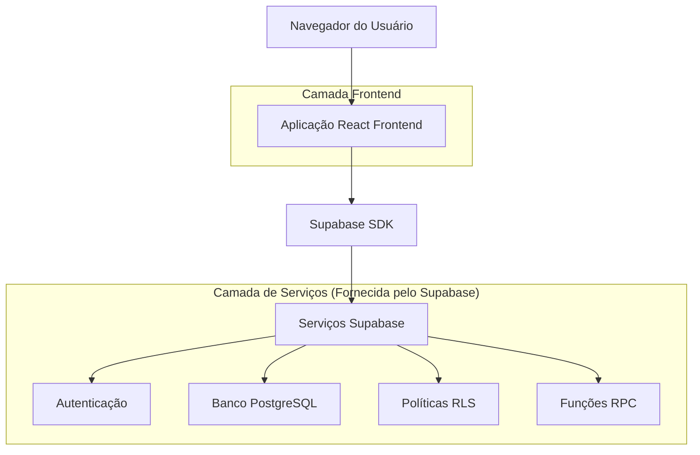
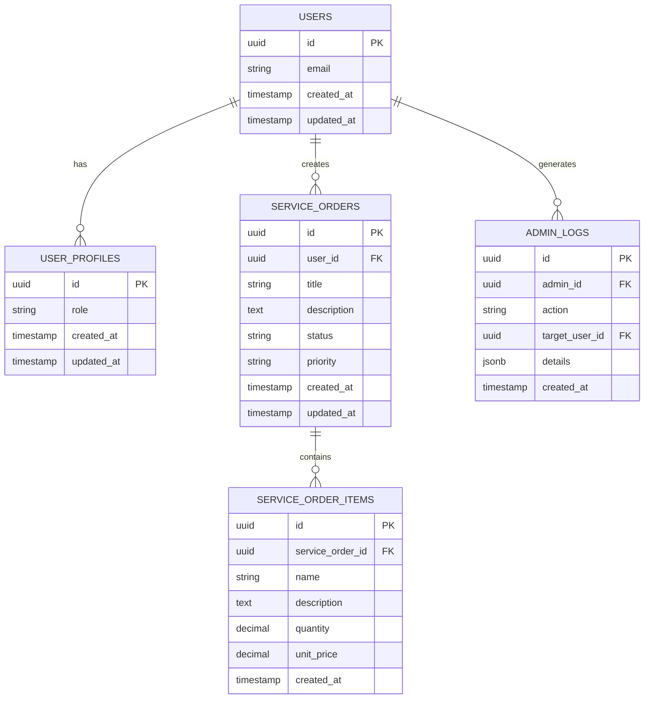

# Arquitetura Técnica Pós-Remoção VIP - OneDrip

## 1. Design da Arquitetura



## 2. Descrição das Tecnologias

- **Frontend**: React@18 + TypeScript + TailwindCSS@3 + Vite
- **Backend**: Supabase (PostgreSQL + Auth + RLS)
- **Autenticação**: Supabase Auth
- **Banco de Dados**: PostgreSQL (via Supabase)
- **Estado**: React Context + Hooks customizados

## 3. Definições de Rotas

| Rota | Propósito |
|------|----------|
| / | Página inicial, dashboard principal com visão geral |
| /login | Página de login, autenticação de usuários |
| /register | Página de registro, criação de novas contas |
| /service-orders | Lista de ordens de serviço (acesso total para todos) |
| /service-orders/new | Formulário de criação de nova ordem de serviço |
| /service-orders/:id | Detalhes de uma ordem de serviço específica |
| /service-orders/:id/edit | Edição de ordem de serviço existente |
| /settings | Configurações do usuário e preferências |
| /admin | Painel administrativo (apenas para admins) |
| /admin/users | Gerenciamento de usuários (sem funcionalidades VIP) |
| /admin/logs | Logs do sistema e auditoria |
| /help | Documentação e ajuda (atualizada sem referências VIP) |

## 4. Definições de API

### 4.1 APIs Principais do Supabase

**Autenticação de usuários**
```typescript
// Login
const { data, error } = await supabase.auth.signInWithPassword({
  email: string,
  password: string
})

// Registro
const { data, error } = await supabase.auth.signUp({
  email: string,
  password: string
})
```

**Gerenciamento de Ordens de Serviço**
```typescript
// Buscar ordens do usuário (sem restrição VIP)
const { data, error } = await supabase
  .from('service_orders')
  .select('*')
  .eq('user_id', userId)

// Criar nova ordem
const { data, error } = await supabase
  .from('service_orders')
  .insert({
    user_id: string,
    title: string,
    description: string,
    status: string,
    priority: string
  })
```

**Gerenciamento de Perfis**
```typescript
// Buscar perfil do usuário
const { data, error } = await supabase
  .from('user_profiles')
  .select('id, role, created_at, updated_at')
  .eq('id', userId)
  .single()

// Atualizar perfil
const { data, error } = await supabase
  .from('user_profiles')
  .update({ role: 'admin' })
  .eq('id', userId)
```

### 4.2 Funções RPC Simplificadas

**Verificação de Admin**
```sql
CREATE OR REPLACE FUNCTION public.is_current_user_admin()
RETURNS boolean
LANGUAGE plpgsql
SECURITY DEFINER
AS $$
BEGIN
  RETURN EXISTS (
    SELECT 1 FROM user_profiles 
    WHERE id = auth.uid() AND role = 'admin'
  );
END;
$$;
```

**Buscar todos os usuários (apenas para admins)**
```sql
CREATE OR REPLACE FUNCTION public.admin_get_all_users()
RETURNS TABLE(
  id UUID,
  email TEXT,
  role TEXT,
  created_at TIMESTAMPTZ,
  updated_at TIMESTAMPTZ
)
LANGUAGE plpgsql
SECURITY DEFINER
AS $$
BEGIN
  -- Verificar se o usuário atual é admin
  IF NOT public.is_current_user_admin() THEN
    RAISE EXCEPTION 'Access denied. Admin privileges required.';
  END IF;
  
  RETURN QUERY
  SELECT 
    u.id,
    u.email::TEXT,
    COALESCE(up.role, 'user')::TEXT,
    u.created_at,
    COALESCE(up.updated_at, u.created_at)
  FROM auth.users u
  LEFT JOIN user_profiles up ON u.id = up.id
  ORDER BY u.created_at DESC;
END;
$$;
```

## 5. Modelo de Dados

### 5.1 Definição do Modelo de Dados



### 5.2 Linguagem de Definição de Dados

**Tabela de Perfis de Usuário (Simplificada)**
```sql
-- Criar tabela user_profiles (sem campo VIP)
CREATE TABLE user_profiles (
    id UUID PRIMARY KEY REFERENCES auth.users(id) ON DELETE CASCADE,
    role VARCHAR(20) DEFAULT 'user' CHECK (role IN ('user', 'admin')),
    created_at TIMESTAMP WITH TIME ZONE DEFAULT NOW(),
    updated_at TIMESTAMP WITH TIME ZONE DEFAULT NOW()
);

-- Índices
CREATE INDEX idx_user_profiles_role ON user_profiles(role);
CREATE INDEX idx_user_profiles_created_at ON user_profiles(created_at DESC);
```

**Tabela de Ordens de Serviço**
```sql
-- Criar tabela service_orders
CREATE TABLE service_orders (
    id UUID PRIMARY KEY DEFAULT gen_random_uuid(),
    user_id UUID NOT NULL REFERENCES auth.users(id) ON DELETE CASCADE,
    title VARCHAR(255) NOT NULL,
    description TEXT,
    status VARCHAR(50) DEFAULT 'pending' CHECK (status IN ('pending', 'in_progress', 'completed', 'cancelled')),
    priority VARCHAR(20) DEFAULT 'medium' CHECK (priority IN ('low', 'medium', 'high', 'urgent')),
    created_at TIMESTAMP WITH TIME ZONE DEFAULT NOW(),
    updated_at TIMESTAMP WITH TIME ZONE DEFAULT NOW()
);

-- Índices
CREATE INDEX idx_service_orders_user_id ON service_orders(user_id);
CREATE INDEX idx_service_orders_status ON service_orders(status);
CREATE INDEX idx_service_orders_created_at ON service_orders(created_at DESC);
```

**Tabela de Itens de Ordem de Serviço**
```sql
-- Criar tabela service_order_items
CREATE TABLE service_order_items (
    id UUID PRIMARY KEY DEFAULT gen_random_uuid(),
    service_order_id UUID NOT NULL REFERENCES service_orders(id) ON DELETE CASCADE,
    name VARCHAR(255) NOT NULL,
    description TEXT,
    quantity DECIMAL(10,2) DEFAULT 1.00,
    unit_price DECIMAL(10,2) DEFAULT 0.00,
    created_at TIMESTAMP WITH TIME ZONE DEFAULT NOW()
);

-- Índices
CREATE INDEX idx_service_order_items_order_id ON service_order_items(service_order_id);
```

**Tabela de Logs Administrativos**
```sql
-- Criar tabela admin_logs
CREATE TABLE admin_logs (
    id UUID PRIMARY KEY DEFAULT gen_random_uuid(),
    admin_id UUID NOT NULL REFERENCES auth.users(id),
    action VARCHAR(100) NOT NULL,
    target_user_id UUID REFERENCES auth.users(id),
    details JSONB,
    created_at TIMESTAMP WITH TIME ZONE DEFAULT NOW()
);

-- Índices
CREATE INDEX idx_admin_logs_admin_id ON admin_logs(admin_id);
CREATE INDEX idx_admin_logs_action ON admin_logs(action);
CREATE INDEX idx_admin_logs_created_at ON admin_logs(created_at DESC);
```

**Políticas RLS Simplificadas**
```sql
-- Habilitar RLS
ALTER TABLE user_profiles ENABLE ROW LEVEL SECURITY;
ALTER TABLE service_orders ENABLE ROW LEVEL SECURITY;
ALTER TABLE service_order_items ENABLE ROW LEVEL SECURITY;
ALTER TABLE admin_logs ENABLE ROW LEVEL SECURITY;

-- Políticas para user_profiles
CREATE POLICY "Users can view own profile" ON user_profiles
    FOR SELECT USING (auth.uid() = id);

CREATE POLICY "Users can update own profile" ON user_profiles
    FOR UPDATE USING (auth.uid() = id);

CREATE POLICY "Admins can view all profiles" ON user_profiles
    FOR ALL USING (
        EXISTS (
            SELECT 1 FROM user_profiles 
            WHERE id = auth.uid() AND role = 'admin'
        )
    );

-- Políticas para service_orders (SEM RESTRIÇÕES VIP)
CREATE POLICY "Users can manage own service orders" ON service_orders
    FOR ALL USING (auth.uid() = user_id);

CREATE POLICY "Admins can view all service orders" ON service_orders
    FOR SELECT USING (
        EXISTS (
            SELECT 1 FROM user_profiles 
            WHERE id = auth.uid() AND role = 'admin'
        )
    );

-- Políticas para service_order_items
CREATE POLICY "Users can manage items of own orders" ON service_order_items
    FOR ALL USING (
        EXISTS (
            SELECT 1 FROM service_orders 
            WHERE id = service_order_id AND user_id = auth.uid()
        )
    );

-- Políticas para admin_logs
CREATE POLICY "Admins can view all logs" ON admin_logs
    FOR SELECT USING (
        EXISTS (
            SELECT 1 FROM user_profiles 
            WHERE id = auth.uid() AND role = 'admin'
        )
    );

CREATE POLICY "Admins can create logs" ON admin_logs
    FOR INSERT WITH CHECK (
        EXISTS (
            SELECT 1 FROM user_profiles 
            WHERE id = auth.uid() AND role = 'admin'
        )
    );
```

**Permissões para Usuários Autenticados**
```sql
-- Conceder permissões básicas para usuários autenticados
GRANT SELECT ON user_profiles TO authenticated;
GRANT UPDATE ON user_profiles TO authenticated;
GRANT ALL ON service_orders TO authenticated;
GRANT ALL ON service_order_items TO authenticated;
GRANT SELECT ON admin_logs TO authenticated;
GRANT INSERT ON admin_logs TO authenticated;

-- Conceder permissões para usuários anônimos (apenas leitura limitada)
GRANT SELECT ON user_profiles TO anon;
```

**Dados Iniciais**
```sql
-- Inserir dados de exemplo (opcional)
INSERT INTO user_profiles (id, role) 
SELECT id, 'user' FROM auth.users 
WHERE id NOT IN (SELECT id FROM user_profiles);

-- Exemplo de ordem de serviço
INSERT INTO service_orders (user_id, title, description, status, priority)
VALUES (
    (SELECT id FROM auth.users LIMIT 1),
    'Exemplo de Ordem de Serviço',
    'Esta é uma ordem de serviço de exemplo para demonstração',
    'pending',
    'medium'
);
```

## 6. Estrutura de Componentes Frontend

### 6.1 Hierarquia de Componentes

```
src/
├── components/
│   ├── auth/
│   │   ├── LoginForm.tsx
│   │   ├── RegisterForm.tsx
│   │   └── AuthGuard.tsx
│   ├── service-orders/
│   │   ├── ServiceOrderList.tsx
│   │   ├── ServiceOrderForm.tsx
│   │   ├── ServiceOrderDetails.tsx
│   │   └── ServiceOrderSettings.tsx (simplificado)
│   ├── admin/
│   │   ├── AdminPanelModern.tsx (sem VIP)
│   │   ├── UserManagement.tsx (simplificado)
│   │   └── AdminLogs.tsx
│   ├── common/
│   │   ├── Layout.tsx
│   │   ├── Navigation.tsx
│   │   └── LoadingSpinner.tsx
│   └── ui/
│       ├── Button.tsx
│       ├── Input.tsx
│       └── Card.tsx
├── hooks/
│   ├── useAuth.ts
│   ├── useServiceOrders.ts (simplificado)
│   └── useAdmin.ts
├── pages/
│   ├── HomePage.tsx
│   ├── LoginPage.tsx
│   ├── ServiceOrdersPage.tsx
│   ├── ServiceOrderFormPage.tsx
│   ├── ServiceOrderDetailsPage.tsx
│   ├── SettingsPage.tsx
│   └── AdminPage.tsx
├── types/
│   ├── auth.ts
│   ├── serviceOrders.ts
│   └── admin.ts
└── utils/
    ├── supabase.ts
    ├── constants.ts
    └── helpers.ts
```

### 6.2 Hooks Customizados Simplificados

**useAuth.ts**
```typescript
export const useAuth = () => {
  const [user, setUser] = useState(null);
  const [loading, setLoading] = useState(true);
  
  // Verificação simples de autenticação (sem VIP)
  const isAuthenticated = !!user;
  const isAdmin = user?.role === 'admin';
  
  return {
    user,
    loading,
    isAuthenticated,
    isAdmin,
    signIn,
    signUp,
    signOut
  };
};
```

**useServiceOrders.ts**
```typescript
export const useServiceOrders = () => {
  // Acesso total para todos os usuários autenticados
  const fetchServiceOrders = async () => {
    const { data, error } = await supabase
      .from('service_orders')
      .select('*')
      .order('created_at', { ascending: false });
    
    return { data, error };
  };
  
  return {
    fetchServiceOrders,
    createServiceOrder,
    updateServiceOrder,
    deleteServiceOrder
  };
};
```

## 7. Benefícios da Arquitetura Simplificada

### 7.1 Vantagens Técnicas
- **Menos Complexidade**: Remoção de lógica condicional VIP
- **Melhor Performance**: Menos verificações e consultas
- **Código Mais Limpo**: Estrutura mais simples e maintível
- **Facilidade de Teste**: Menos cenários para testar

### 7.2 Vantagens para Desenvolvimento
- **Desenvolvimento Mais Rápido**: Menos verificações para implementar
- **Menos Bugs**: Redução de pontos de falha
- **Manutenção Simplificada**: Código mais direto e compreensível
- **Onboarding Facilitado**: Arquitetura mais fácil de entender

### 7.3 Vantagens para Usuários
- **Acesso Imediato**: Sem barreiras ou restrições
- **Experiência Consistente**: Funcionalidades sempre disponíveis
- **Interface Mais Limpa**: Sem prompts de upgrade ou limitações

## 8. Considerações de Segurança

### 8.1 Autenticação e Autorização
- **Supabase Auth**: Gerenciamento seguro de autenticação
- **RLS Policies**: Controle de acesso a nível de linha
- **Role-Based Access**: Distinção clara entre usuário e admin

### 8.2 Proteção de Dados
- **Políticas Restritivas**: Usuários só acessam seus próprios dados
- **Admin Logs**: Auditoria de todas as ações administrativas
- **Validação de Entrada**: Sanitização de dados no frontend e backend

### 8.3 Monitoramento
- **Logs de Acesso**: Registro de todas as operações importantes
- **Alertas de Segurança**: Monitoramento de atividades suspeitas
- **Backup Regular**: Proteção contra perda de dados

Esta arquitetura simplificada mantém toda a funcionalidade essencial enquanto remove a complexidade desnecessária do sistema VIP, resultando em um sistema mais robusto, maintível e user-friendly.