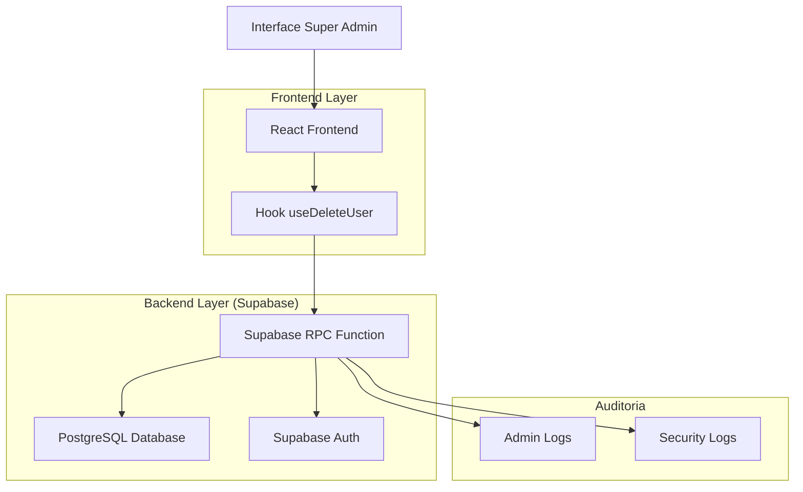
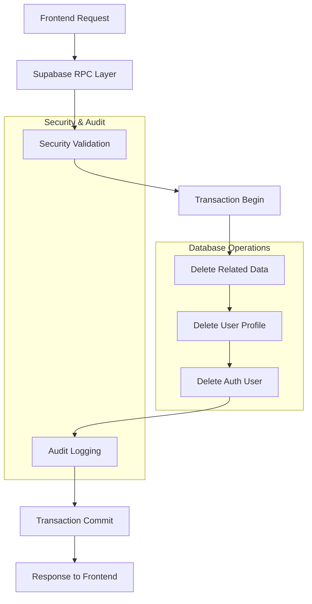
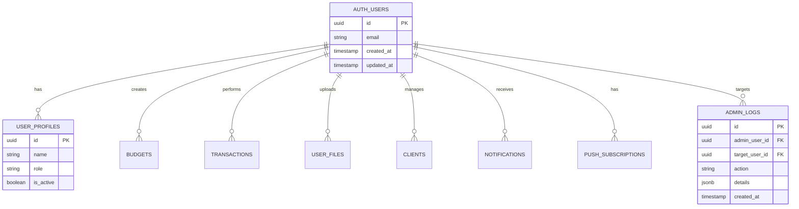

# Arquitetura Técnica - Exclusão Completa de Usuários

## 1. Design da Arquitetura



## 2. Descrição da Tecnologia

- Frontend: React@18 + TypeScript + TailwindCSS + Vite
- Backend: Supabase (PostgreSQL + Auth + RPC Functions)
- Estado: TanStack Query para cache e mutações
- UI: Shadcn/ui + Lucide React para ícones

## 3. Definições de Rotas

| Rota | Propósito |
|------|-----------|
| /supadmin/users | Painel principal de gerenciamento de usuários |
| /supadmin/audit | Página de logs de auditoria (opcional) |

## 4. Definições de API

### 4.1 API Principal

**Exclusão completa de usuário**
```
RPC admin_delete_user_completely_enhanced
```

Parâmetros:
| Nome do Parâmetro | Tipo | Obrigatório | Descrição |
|-------------------|------|-------------|-----------|
| p_user_id | UUID | true | ID do usuário a ser excluído |
| p_confirmation_code | TEXT | true | Email do usuário para confirmação |
| p_delete_auth_user | BOOLEAN | false | Se deve excluir do Supabase Auth (padrão: true) |

Resposta:
| Nome do Parâmetro | Tipo | Descrição |
|-------------------|------|-----------|
| success | boolean | Status da operação |
| message | string | Mensagem de resultado |
| deleted_data | object | Detalhes dos dados excluídos |

Exemplo de Resposta:
```json
{
  "success": true,
  "message": "Usuário excluído completamente do sistema",
  "deleted_data": {
    "user_profile": true,
    "budgets": 5,
    "transactions": 12,
    "files": 3,
    "clients": 2,
    "notifications": 8,
    "push_subscriptions": 1,
    "total_tables_affected": 15
  }
}
```

## 5. Arquitetura do Servidor



## 6. Modelo de Dados

### 6.1 Definição do Modelo de Dados



### 6.2 Linguagem de Definição de Dados

**Função de Exclusão Completa Aprimorada**
```sql
-- Função principal de exclusão completa
CREATE OR REPLACE FUNCTION admin_delete_user_completely_enhanced(
    p_user_id UUID,
    p_confirmation_code TEXT,
    p_delete_auth_user BOOLEAN DEFAULT true
)
RETURNS JSON
LANGUAGE plpgsql
SECURITY DEFINER
AS $$
DECLARE
    v_admin_id UUID;
    v_user_email TEXT;
    v_deleted_data JSONB := '{}';
    v_tables_affected INTEGER := 0;
BEGIN
    -- Verificações de segurança
    IF NOT public.is_current_user_admin() THEN
        RAISE EXCEPTION 'Acesso negado: apenas administradores podem excluir usuários';
    END IF;
    
    v_admin_id := auth.uid();
    
    -- Verificar se usuário existe e obter email
    SELECT email INTO v_user_email 
    FROM auth.users 
    WHERE id = p_user_id;
    
    IF v_user_email IS NULL THEN
        RAISE EXCEPTION 'Usuário não encontrado';
    END IF;
    
    -- Verificar confirmação
    IF v_user_email != p_confirmation_code THEN
        RAISE EXCEPTION 'Código de confirmação inválido';
    END IF;
    
    -- Iniciar transação para exclusão atômica
    BEGIN
        -- Excluir de todas as tabelas relacionadas
        -- [Implementação detalhada das exclusões]
        
        -- Excluir do auth se solicitado
        IF p_delete_auth_user THEN
            PERFORM auth.admin_delete_user(p_user_id);
        END IF;
        
        -- Registrar auditoria
        INSERT INTO admin_logs (
            admin_user_id, action, target_user_id, details,
            action_type, target_table, created_at
        ) VALUES (
            v_admin_id, 'DELETE_USER_COMPLETELY_ENHANCED', p_user_id,
            v_deleted_data, 'DELETE_USER_COMPLETE', 'multiple_tables', NOW()
        );
        
    EXCEPTION
        WHEN OTHERS THEN
            RAISE EXCEPTION 'Erro na exclusão: %', SQLERRM;
    END;
    
    RETURN json_build_object(
        'success', true,
        'message', 'Usuário excluído completamente do sistema',
        'deleted_data', v_deleted_data
    );
END;
$$;

-- Índices para performance
CREATE INDEX IF NOT EXISTS idx_admin_logs_target_user_id ON admin_logs(target_user_id);
CREATE INDEX IF NOT EXISTS idx_admin_logs_action_type ON admin_logs(action_type);
CREATE INDEX IF NOT EXISTS idx_admin_logs_created_at ON admin_logs(created_at DESC);

-- Permissões
GRANT EXECUTE ON FUNCTION admin_delete_user_completely_enhanced TO authenticated;

-- Dados iniciais de exemplo
INSERT INTO admin_logs (admin_user_id, action, details, action_type, target_table)
SELECT 
    id, 'SYSTEM_INIT_DELETE_FUNCTION',
    '{"message": "Função de exclusão completa inicializada", "version": "2.0"}'::jsonb,
    'SYSTEM_INIT', 'admin_logs'
FROM auth.users 
WHERE email LIKE '%admin%' 
LIMIT 1;
```