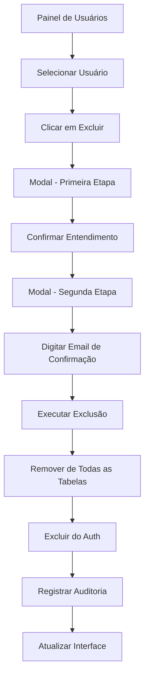

# Requisitos para Exclusão Completa de Usuários

## 1. Visão Geral do Produto

Sistema de exclusão completa de usuários no painel de super administração que remove permanentemente todos os dados do usuário do sistema, garantindo que o email seja totalmente liberado para novo cadastro e que o usuário possa se autenticar novamente como um registro completamente novo.

- O sistema deve tratar o usuário excluído como se nunca tivesse existido no sistema
- Todos os processos de autenticação devem funcionar normalmente para o email após a exclusão
- A funcionalidade deve ser segura, auditável e irreversível

## 2. Funcionalidades Principais

### 2.1 Papéis de Usuário

| Papel | Método de Acesso | Permissões Principais |
|-------|------------------|----------------------|
| Super Admin | Autenticação com role admin | Pode excluir qualquer usuário do sistema |
| Admin Regular | Autenticação com role admin | Pode excluir usuários não-admin |

### 2.2 Módulos de Funcionalidade

O sistema de exclusão completa consiste nas seguintes páginas principais:

1. **Painel de Usuários**: listagem de usuários, filtros, busca e ações de gerenciamento
2. **Modal de Confirmação**: processo de confirmação em duas etapas para exclusão
3. **Página de Auditoria**: logs detalhados de todas as exclusões realizadas

### 2.3 Detalhes das Páginas

| Nome da Página | Nome do Módulo | Descrição da Funcionalidade |
|----------------|----------------|----------------------------|
| Painel de Usuários | Lista de Usuários | Exibir todos os usuários com informações detalhadas, filtros por role/status, busca por nome/email, botão de exclusão |
| Painel de Usuários | Botão de Exclusão | Iniciar processo de exclusão com validações de segurança |
| Modal de Confirmação | Primeira Etapa | Exibir dados do usuário, avisos sobre irreversibilidade, checkbox de confirmação |
| Modal de Confirmação | Segunda Etapa | Campo de confirmação por email, opções de exclusão, botão final de confirmação |
| Modal de Confirmação | Status da Operação | Indicadores visuais de progresso, sucesso ou erro |
| Página de Auditoria | Logs de Exclusão | Histórico completo de exclusões com detalhes dos dados removidos |

## 3. Processo Principal

### Fluxo de Exclusão de Usuário

O administrador acessa o painel de usuários, seleciona um usuário para exclusão, passa por um processo de confirmação em duas etapas e executa a exclusão completa. O sistema remove todos os dados relacionados ao usuário de forma atômica e registra a operação nos logs de auditoria.

## 4. Design da Interface

### 4.1 Estilo de Design

- **Cores Primárias**: Vermelho (#dc2626) para ações destrutivas, Amarelo (#f59e0b) para avisos
- **Estilo de Botões**: Botões arredondados com estados hover e disabled
- **Fontes**: Inter, tamanhos 14px para texto normal, 16px para títulos
- **Layout**: Cards com bordas coloridas, modais centralizados, layout responsivo
- **Ícones**: Lucide React com ícones de alerta, lixeira e confirmação

### 4.2 Visão Geral do Design das Páginas

| Nome da Página | Nome do Módulo | Elementos da UI |
|----------------|----------------|-----------------|
| Painel de Usuários | Lista de Usuários | Cards com informações do usuário, badges de status, botões de ação com ícones |
| Modal de Confirmação | Primeira Etapa | Card vermelho com dados do usuário, avisos em amarelo e vermelho, checkbox de confirmação |
| Modal de Confirmação | Segunda Etapa | Campo de input para email, checkbox para exclusão do auth, indicadores de status |
| Página de Auditoria | Logs de Exclusão | Tabela com filtros, badges de status, detalhes expandíveis |

### 4.3 Responsividade

O sistema é desktop-first com adaptação para mobile, incluindo otimização para interação touch em dispositivos móveis. Os modais se ajustam automaticamente ao tamanho