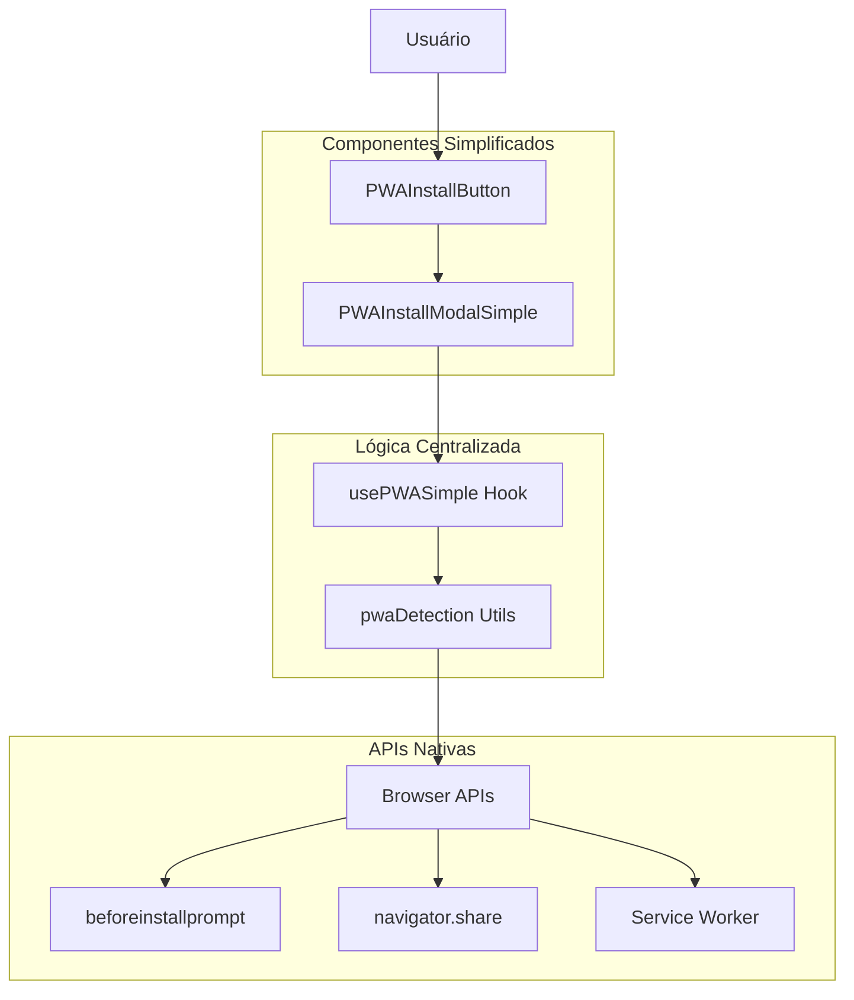

# Especificações Técnicas - Sistema PWA Simplificado

## 1. Arquitetura Técnica

### 1.1 Diagrama de Arquitetura



### 1.2 Stack Tecnológico

- **Frontend**: React 18 + TypeScript
- **Styling**: Tailwind CSS + shadcn/ui
- **State Management**: React Hooks (useState, useEffect)
- **PWA APIs**: Service Worker, Web App Manifest
- **Build Tool**: Vite

## 2. Definições de Tipos

### 2.1 Interfaces Principais

```typescript
// Estado simplificado do PWA
interface SimplePWAState {
  isInstalled: boolean;
  isInstalling: boolean;
  platform: PWAPlatform;
  canInstall: boolean;
  installMethod: InstallMethod;
}

// Plataformas suportadas
type PWAPlatform = 'android' | 'ios' | 'desktop' | 'other';

// Métodos de instalação
type InstallMethod = 
  | 'native-pwa'           // PWA nativo (Android/Desktop Chrome)
  | 'ios-add-to-home'      // iOS Safari - Adicionar à tela
  | 'manual-instructions'  // Instruções manuais
  | 'not-supported';       // Não suportado

// Ações disponíveis
interface PWASimpleActions {
  installApp: () => Promise<InstallResult>;
  getInstallInstructions: () => InstallInstructions | null;
  resetInstallState: () => void;
}

// Resultado da instalação
interface InstallResult {
  success: boolean;
  method: InstallMethod;
  message: string;
  requiresInstructions: boolean;
}

// Instruções de instalação
interface InstallInstructions {
  platform: PWAPlatform;
  title: string;
  steps: string[];
  icon: string;
}
```

### 2.2 Props dos Componentes

```typescript
// PWAInstallButton
interface PWAInstallButtonProps {
  variant?: 'default' | 'outline' | 'ghost';
  size?: 'sm' | 'md' | 'lg';
  className?: string;
  children?: React.ReactNode;
}

// PWAInstallModalSimple
interface PWAInstallModalSimpleProps {
  open: boolean;
  onOpenChange: (open: boolean) => void;
  onInstallComplete?: (result: InstallResult) => void;
}
```

## 3. Implementação do Hook Principal

### 3.1 usePWASimple Hook

```typescript
import { useState, useEffect, useCallback } from 'react';
import { detectPlatform, detectInstallMethod } from '@/utils/pwaDetection';
import { useToast } from '@/hooks/useToast';

export const usePWASimple = (): SimplePWAState & PWASimpleActions => {
  const { showSuccess, showError, showInfo } = useToast();
  
  const [state, setState] = useState<SimplePWAState>({
    isInstalled: false,
    isInstalling: false,
    platform: 'other',
    canInstall: false,
    installMethod: 'not-supported'
  });

  const [installPrompt, setInstallPrompt] = useState<any>(null);

  // Inicialização do estado
  useEffect(() => {
    const platform = detectPlatform();
    const installMethod = detectInstallMethod(platform);
    const isInstalled = checkIfInstalled();
    
    setState(prev => ({
      ...prev,
      platform,
      installMethod,
      isInstalled,
      canInstall: installMethod !== 'not-supported' && !isInstalled
    }));
  }, []);

  // Event listeners para PWA
  useEffect(() => {
    const handleBeforeInstallPrompt = (e: Event) => {
      e.preventDefault();
      setInstallPrompt(e);
      setState(prev => ({ 
        ...prev, 
        canInstall: true,
        installMethod: 'native-pwa'
      }));
    };

    const handleAppInstalled = () => {
      setState(prev => ({
        ...prev,
        isInstalled: true,
        canInstall: false,
        isInstalling: false
      }));
      setInstallPrompt(null);
      showSuccess({
        title: 'App Instalado!',
        description: 'One Drip foi instalado com sucesso.'
      });
    };

    window.addEventListener('beforeinstallprompt', handleBeforeInstallPrompt);
    window.addEventListener('appinstalled', handleAppInstalled);

    return () => {
      window.removeEventListener('beforeinstallprompt', handleBeforeInstallPrompt);
      window.removeEventListener('appinstalled', handleAppInstalled);
    };
  }, [showSuccess]);

  // Função principal de instalação
  const installApp = useCallback(async (): Promise<InstallResult> => {
    if (state.isInstalled) {
      return {
        success: false,
        method: state.installMethod,
        message: 'App já está instalado',
        requiresInstructions: false
      };
    }

    setState(prev => ({ ...prev, isInstalling: true }));

    try {
      switch (state.installMethod) {
        case 'native-pwa':
          return await handleNativePWAInstall();
        
        case 'ios-add-to-home':
          return handleIOSInstall();
        
        case 'manual-instructions':
          return handleManualInstall();
        
        default:
          return {
            success: false,
            method: state.installMethod,
            message: 'Instalação não suportada neste dispositivo',
            requiresInstructions: false
          };
      }
    } finally {
      setState(prev => ({ ...prev, isInstalling: false }));
    }
  }, [state, installPrompt]);

  // Instalação PWA nativa
  const handleNativePWAInstall = async (): Promise<InstallResult> => {
    if (!installPrompt) {
      return {
        success: false,
        method: 'native-pwa',
        message: 'Prompt de instalação não disponível',
        requiresInstructions: true
      };
    }

    try {
      await installPrompt.prompt();
      const { outcome } = await installPrompt.userChoice;
      
      if (outcome === 'accepted') {
        return {
          success: true,
          method: 'native-pwa',
          message: 'Instalação iniciada com sucesso',
          requiresInstructions: false
        };
      } else {
        return {
          success: false,
          method: 'native-pwa',
          message: 'Instalação cancelada pelo usuário',
          requiresInstructions: false
        };
      }
    } catch (error) {
      console.error('Erro na instalação PWA:', error);
      return {
        success: false,
        method: 'native-pwa',
        message: 'Erro durante a instalação',
        requiresInstructions: true
      };
    }
  };

  // Instalação iOS
  const handleIOSInstall = (): InstallResult => {
    showInfo({
      title: 'Instalar no iOS',
      description: 'Toque no ícone de compartilhar e selecione "Adicionar à Tela Inicial"',
      duration: 8000
    });

    return {
      success: true,
      method: 'ios-add-to-home',
      message: 'Instruções exibidas',
      requiresInstructions: true
    };
  };

  // Instalação manual
  const handleManualInstall = (): InstallResult => {
    return {
      success: true,
      method: 'manual-instructions',
      message: 'Instruções de instalação manual',
      requiresInstructions: true
    };
  };

  // Obter instruções de instalação
  const getInstallInstructions = useCallback((): InstallInstructions | null => {
    switch (state.platform) {
      case 'ios':
        return {
          platform: 'ios',
          title: 'Instalar no iOS',
          steps: [
            'Toque no ícone de compartilhar (□↗)',
            'Role para baixo e toque em "Adicionar à Tela Inicial"',
            'Toque em "Adicionar"'
          ],
          icon: 'share'
        };

      case 'android':
        return {
          platform: 'android',
          title: 'Instalar no Android',
          steps: [
            'Toque nos 3 pontos (⋮) no menu do Chrome',
            'Selecione "Adicionar à tela inicial"',
            'Confirme tocando em "Adicionar"'
          ],
          icon: 'smartphone'
        };

      case 'desktop':
        return {
          platform: 'desktop',
          title: 'Instalar no Desktop',
          steps: [
            'Clique no ícone de instalação na barra de endereços',
            'Ou clique nos 3 pontos (⋮) e selecione "Instalar One Drip"',
            'Confirme a instalação'
          ],
          icon: 'monitor'
        };

      default:
        return null;
    }
  }, [state.platform]);

  // Reset do estado de instalação
  const resetInstallState = useCallback(() => {
    setInstallPrompt(null);
    setState(prev => ({
      ...prev,
      canInstall: false,
      isInstalling: false
    }));
  }, []);

  return {
    ...state,
    installApp,
    getInstallInstructions,
    resetInstallState
  };
};

// Função auxiliar para verificar se está instalado
const checkIfInstalled = (): boolean => {
  const isStandalone = window.matchMedia('(display-mode: standalone)').matches;
  const isIOSStandalone = (window.navigator as any).standalone;
  return isStandalone || isIOSStandalone;
};
```

## 4. Utilitários de Detecção

### 4.1 pwaDetection.ts

```typescript
// Detectar plataforma do dispositivo
export const detectPlatform = (): PWAPlatform => {
  const userAgent = navigator.userAgent.toLowerCase();
  
  // iOS
  if (/ipad|iphone|ipod/.test(userAgent)) {
    return 'ios';
  }
  
  // Android
  if (/android/.test(userAgent)) {
    return 'android';
  }
  
  // Desktop
  if (!/mobile|tablet/.test(userAgent)) {
    return 'desktop';
  }
  
  return 'other';
};

// Detectar método de instalação baseado na plataforma
export const detectInstallMethod = (platform: PWAPlatform): InstallMethod => {
  switch (platform) {
    case 'android':
      // Android Chrome suporta PWA nativo
      if (isChrome()) {
        return 'native-pwa';
      }
      return 'manual-instructions';
    
    case 'ios':
      // iOS apenas via Safari com "Adicionar à Tela Inicial"
      if (isSafari()) {
        return 'ios-add-to-home';
      }
      return 'not-supported';
    
    case 'desktop':
      // Desktop Chrome/Edge suportam PWA nativo
      if (isChrome() || isEdge()) {
        return 'native-pwa';
      }
      return 'manual-instructions';
    
    default:
      return 'not-supported';
  }
};

// Detectar navegadores específicos
export const isChrome = (): boolean => {
  return /chrome/.test(navigator.userAgent.toLowerCase()) && 
         !/edg/.test(navigator.userAgent.toLowerCase());
};

export const isSafari = (): boolean => {
  return /safari/.test(navigator.userAgent.toLowerCase()) && 
         !/chrome/.test(navigator.userAgent.toLowerCase());
};

export const isEdge = (): boolean => {
  return /edg/.test(navigator.userAgent.toLowerCase());
};

// Verificar se o dispositivo suporta PWA
export const supportsPWA = (): boolean => {
  return 'serviceWorker' in navigator && 'PushManager' in window;
};

// Verificar se está em modo standalone
export const isStandalone = (): boolean => {
  return window.matchMedia('(display-mode: standalone)').matches ||
         (window.navigator as any).standalone;
};
```

## 5. Componentes Simplificados

### 5.1 PWAInstallButton

```typescript
import React, { useState } from 'react';
import { Button } from '@/components/ui/button';
import { Download, Smartphone, CheckCircle, Loader2 } from 'lucide-react';
import { usePWASimple } from '@/hooks/usePWASimple';
import { PWAInstallModalSimple } from './PWAInstallModalSimple';
import { cn } from '@/lib/utils';

export const PWAInstallButton: React.FC<PWAInstallButtonProps> = ({
  variant = 'default',
  size = 'sm',
  className,
  children
}) => {
  const [showModal, setShowModal] = useState(false);
  const { isInstalled, isInstalling, canInstall, platform } = usePWASimple();

  const getButtonIcon = () => {
    if (isInstalling) return <Loader2 className="h-4 w-4 animate-spin" />;
    if (isInstalled) return <CheckCircle className="h-4 w-4" />;
    if (platform === 'android' || platform === 'ios') return <Smartphone className="h-4 w-4" />;
    return <Download className="h-4 w-4" />;
  };

  const getButtonText = () => {
    if (isInstalling) return 'Instalando...';
    if (isInstalled) return 'App Instalado';
    return children || 'Baixar App';
  };

  const getButtonVariant = () => {
    if (isInstalled) return 'secondary';
    return variant;
  };

  return (
    <>
      <Button
        onClick={() => setShowModal(true)}
        variant={getButtonVariant()}
        size={size}
        disabled={isInstalling}
        className={cn(
          "flex items-center gap-2 transition-all duration-200",
          canInstall && !isInstalled && "bg-gradient-to-r from-blue-600 to-purple-600 hover:from-blue-700 hover:to-purple-700 text-white border-0",
          isInstalled && "bg-green-50 text-green-700 border-green-200",
          className
        )}
      >
        {getButtonIcon()}
        <span className="font-medium">{getButtonText()}</span>
      </Button>
      
      <PWAInstallModalSimple 
        open={showModal} 
        onOpenChange={setShowModal}
      />
    </>
  );
};
```

### 5.2 PWAInstallModalSimple

```typescript
import React, { useState } from 'react';
import { Dialog, DialogContent, DialogHeader, DialogTitle } from '@/components/ui/dialog';
import { Button } from '@/components/ui/button';
import { Badge } from '@/components/ui/badge';
import { 
  Download, 
  Smartphone, 
  Monitor, 
  CheckCircle,
  Loader2,
  Share,
  ChevronDown,
  ChevronUp
} from 'lucide-react';
import { usePWASimple } from '@/hooks/usePWASimple';
import { cn } from '@/lib/utils';

export const PWAInstallModalSimple: React.FC<PWAInstallModalSimpleProps> = ({
  open,
  onOpenChange,
  onInstallComplete
}) => {
  const [showInstructions, setShowInstructions] = useState(false);
  const { 
    isInstalled, 
    isInstalling, 
    platform, 
    canInstall,
    installApp,
    getInstallInstructions
  } = usePWASimple();

  const handleInstall = async () => {
    const result = await installApp();
    
    if (result.requiresInstructions) {
      setShowInstructions(true);
    }
    
    if (!result.requiresInstructions && result.success) {
      // Fechar modal após instalação bem-sucedida
      setTimeout(() => onOpenChange(false), 1500);
    }
    
    onInstallComplete?.(result);
  };

  const getDeviceIcon = () => {
    switch (platform) {
      case 'android':
      case 'ios':
        return <Smartphone className="h-5 w-5" />;
      case 'desktop':
        return <Monitor className="h-5 w-5" />;
      default:
        return <Download className="h-5 w-5" />;
    }
  };

  const getPlatformBadge = () => {
    switch (platform) {
      case 'ios':
        return <Badge variant="secondary" className="bg-blue-100 text-blue-700">iOS</Badge>;
      case 'android':
        return <Badge variant="secondary" className="bg-green-100 text-green-700">Android</Badge>;
      case 'desktop':
        return <Badge variant="secondary" className="bg-purple-100 text-purple-700">Desktop</Badge>;
      default:
        return <Badge variant="secondary" className="bg-gray-100 text-gray-700">Web</Badge>;
    }
  };

  const instructions = getInstallInstructions();

  return (
    <Dialog open={open} onOpenChange={onOpenChange}>
      <DialogContent className="max-w-md w-full mx-4">
        <DialogHeader>
          <DialogTitle className="flex items-center gap-2">
            {getDeviceIcon()}
            Instalar One Drip
            {getPlatformBadge()}
          </DialogTitle>
        </DialogHeader>
        
        <div className="space-y-4">
          {/* Status atual */}
          <div className="flex items-center gap-2 p-3 bg-muted/50 rounded-lg">
            {isInstalled ? (
              <>
                <CheckCircle className="h-4 w-4 text-green-600" />
                <span className="text-sm font-medium">App já está instalado</span>
              </>
            ) : (
              <>
                <Download className="h-4 w-4 text-blue-600" />
                <span className="text-sm font-medium">
                  {canInstall ? 'Pronto para instalar' : 'Instalação disponível'}
                </span>
              </>
            )}
          </div>

          {/* Botão principal de instalação */}
          {!isInstalled && (
            <Button
              onClick={handleInstall}
              disabled={isInstalling}
              className="w-full h-12 text-base font-medium"
            >
              {isInstalling ? (
                <>
                  <Loader2 className="h-4 w-4 mr-2 animate-spin" />
                  Instalando...
                </>
              ) : (
                <>
                  <Download className="h-4 w-4 mr-2" />
                  Baixar App
                </>
              )}
            </Button>
          )}

          {/* Instruções (quando necessário) */}
          {instructions && showInstructions && (
            <div className="border rounded-lg p-4 space-y-3">
              <div className="flex items-center gap-2">
                <Share className="h-4 w-4 text-blue-600" />
                <span className="font-medium text-sm">{instructions.title}</span>
              </div>
              <ol className="text-sm space-y-1 ml-6 text-muted-foreground">
                {instructions.steps.map((step, index) => (
                  <li key={index}>{step}</li>
                ))}
              </ol>
            </div>
          )}

          {/* Toggle para mostrar/esconder instruções */}
          {instructions && !showInstructions && (
            <Button
              onClick={() => setShowInstructions(true)}
              variant="outline"
              className="w-full justify-between"
            >
              <span>Ver instruções de instalação</span>
              <ChevronDown className="h-4 w-4" />
            </Button>
          )}

          {/* Benefícios */}
          <div className="p-3 bg-black rounded-lg">
            <h4 className="font-medium text-sm mb-2 text-white">Benefícios do App:</h4>
            <ul className="text-xs space-y-1 text-white">
              <li className="flex items-center gap-2">
                <CheckCircle className="h-3 w-3 text-green-400" />
                Acesso offline aos seus dados
              </li>
              <li className="flex items-center gap-2">
                <CheckCircle className="h-3 w-3 text-green-400" />
                Carregamento mais rápido
              </li>
              <li className="flex items-center gap-2">
                <CheckCircle className="h-3 w-3 text-green-400" />
                Ícone na tela inicial
              </li>
            </ul>
          </div>
        </div>
      </DialogContent>
    </Dialog>
  );
};
```

## 6. Configuração do Manifest

### 6.1 manifest.json Otimizado

```json
{
  "name": "One Drip",
  "short_name": "One Drip",
  "description": "Sistema completo para assistência técnica",
  "start_url": "/",
  "display": "standalone",
  "background_color": "#ffffff",
  "theme_color": "#000000",
  "orientation": "portrait-primary",
  "scope": "/",
  "categories": ["business", "productivity"],
  "icons": [
    {
      "src": "/icons/icon-192x192.png",
      "sizes": "192x192",
      "type": "image/png",
      "purpose": "any maskable"
    },
    {
      "src": "/icons/icon-512x512.png",
      "sizes": "512x512",
      "type": "image/png",
      "purpose": "any maskable"
    }
  ],
  "shortcuts": [
    {
      "name": "Novo Orçamento",
      "url": "/new-budget",
      "icons": [{"src": "/icons/icon-96x96.png", "sizes": "96x96"}]
    }
  ]
}
```

## 7. Testes e Validação

### 7.1 Cenários de Teste

```typescript
// Testes unitários para usePWASimple
describe('usePWASimple', () => {
  test('detecta plataforma Android corretamente', () => {
    // Mock user agent
    Object.defineProperty(navigator, 'userAgent', {
      value: 'Mozilla/5.0 (Linux; Android 10) Chrome/91.0',
      configurable: true
    });
    
    const { platform } = renderHook(() => usePWASimple()).result.current;
    expect(platform).toBe('android');
  });

  test('instala PWA nativo quando disponível', async () => {
    const mockPrompt = {
      prompt: jest.fn().mockResolvedValue(undefined),
      userChoice: Promise.resolve({ outcome: 'accepted' })
    };
    
    // Simular evento beforeinstallprompt
    window.dispatchEvent(new CustomEvent('beforeinstallprompt', { detail: mockPrompt }));
    
    const { installApp } = renderHook(() => usePWASimple()).result.current;
    const result = await installApp();
    
    expect(result.success).toBe(true);
    expect(result.method).toBe('native-pwa');
  });
});
```

### 7.2 Testes de Integração

```typescript
// Testes E2E com Playwright
test('fluxo completo de instalação PWA', async ({ page }) => {
  await page.goto('/');
  
  // Clicar no botão de instalação
  await page.click('[data-testid="pwa-install-button"]');
  
  // Verificar se modal abriu
  await expect(page.locator('[data-testid="pwa-install-modal"]')).toBeVisible();
  
  // Clicar em "Baixar App"
  await page.click('[data-testid="install-app-button"]');
  
  // Verificar feedback de sucesso
  await expect(page.locator('.toast-success')).toBeVisible();
});
```

## 8. Métricas e Monitoramento

### 8.1 Analytics de Instalação

```typescript
// Tracking de eventos de instalação
const trackInstallEvent = (method: InstallMethod, success: boolean) => {
  // Google Analytics
  gtag('event', 'pwa_install_attempt', {
    method,
    success,
    platform: detectPlatform()
  });
  
  // Analytics customizado
  analytics.track('PWA Install', {
    method,
    success,
    platform: detectPlatform(),
    timestamp: new Date().toISOString()
  });
};
```

### 8.2 Métricas de Performance

```typescript
// Monitoramento de performance
const measureInstallTime = () => {
  const startTime = performance.now();
  
  return {
    end: () => {
      const duration = performance.now() - startTime;
      analytics.track('PWA Install Duration', { duration });
    }
  };
};
```

## 9. Deployment e Configuração

### 9.1 Service Worker Simplificado

```javascript
// sw.js - Service Worker básico
const CACHE_NAME = 'one-drip-v1';
const urlsToCache = [
  '/',
  '/static/js/bundle.js',
  '/static/css/main.css',
  '/manifest.json'
];

self.addEventListener('install', (event) => {
  event.waitUntil(
    caches.open(CACHE_NAME)
      .then((cache) => cache.addAll(urlsToCache))
  );
});

self.addEventListener('fetch', (event) => {
  event.respondWith(
    caches.match(event.request)
      .then((response) => response || fetch(event.request))
  );
});
```

### 9.2 Configuração Vite

```typescript
// vite.config.ts
import { defineConfig } from 'vite';
import { VitePWA } from 'vite-plugin-pwa';

export default defineConfig({
  plugins: [
    VitePWA({
      registerType: 'autoUpdate',
      workbox: {
        globPatterns: ['**/*.{js,css,html,ico,png,svg}']
      },
      manifest: {
        name: 'One Drip',
        short_name: 'One Drip',
        description: 'Sistema para assistência técnica',
        theme_color: '#000000',
        icons: [
          {
            src: 'icons/icon-192x192.png',
            sizes: '192x192',
            type: 'image/png'
          }
        ]
      }
    })
  ]
});
```

Esta especificação técnica fornece todos os detalhes necessários para implementar o sistema PWA simplificado, mantendo a funcionalidade essencial enquanto reduz drasticamente a complexidade da interface e do código.