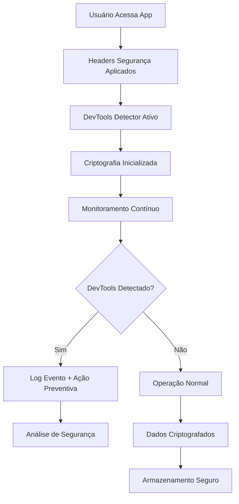

# Melhorias de Segurança - OneDrip

## 1. Product Overview
Este documento especifica três melhorias críticas de segurança para o projeto OneDrip: implementação de headers de segurança avançados no Vercel, sistema robusto de detecção de ferramentas do desenvolvedor, e aprimoramento da criptografia do localStorage. Essas melhorias visam fortalecer a proteção contra ataques web modernos, prevenir engenharia reversa e garantir a integridade dos dados armazenados localmente.

## 2. Core Features

### 2.1 User Roles
| Role | Acesso | Core Permissions |
|------|--------|------------------|
| Usuário Final | Aplicação web | Navegação protegida por headers de segurança |
| Desenvolvedor | Ambiente de desenvolvimento | Acesso limitado em produção com detecção ativa |
| Administrador | Painel admin | Monitoramento de tentativas de acesso não autorizado |

### 2.2 Feature Module
As melhorias de segurança consistem nos seguintes módulos principais:
1. **Headers de Segurança Vercel**: CSP avançado, HSTS melhorado, proteção contra clickjacking
2. **Detecção de DevTools**: Monitoramento ativo, logging de segurança, ações preventivas
3. **Criptografia Avançada**: AES-256-GCM, rotação de chaves, validação de integridade

### 2.3 Page Details
| Módulo | Componente | Descrição da Funcionalidade |
|--------|------------|------------------------------|
| Headers Vercel | vercel.json | Configurar CSP rigoroso, HSTS com preload, headers anti-fingerprinting |
| DevTools Detection | DevToolsDetector.tsx | Detectar abertura de console, inspeção de elementos, debugging |
| Security Logger | SecurityAuditLogger.ts | Registrar tentativas suspeitas, alertas em tempo real |
| Crypto Enhanced | SecureStorageV2.ts | Implementar AES-256-GCM, PBKDF2, validação HMAC |
| Key Management | CryptoKeyManager.ts | Rotação automática de chaves, derivação segura |

## 3. Core Process

### Fluxo de Segurança Principal
1. **Carregamento da Aplicação**: Headers de segurança aplicados automaticamente pelo Vercel
2. **Inicialização**: Ativação do detector de DevTools e sistema de criptografia
3. **Monitoramento Contínuo**: Detecção ativa de tentativas de debugging
4. **Armazenamento Seguro**: Criptografia automática de dados sensíveis
5. **Auditoria**: Logging contínuo de eventos de segurança

## 4. User Interface Design

### 4.1 Design Style
- **Cores**: Indicadores discretos de segurança (verde: seguro, amarelo: alerta, vermelho: bloqueado)
- **Notificações**: Toast messages minimalistas para eventos de segurança
- **Ícones**: Símbolos de escudo e cadeado para elementos de segurança
- **Animações**: Transições suaves para indicadores de status de segurança

### 4.2 Page Design Overview
| Componente | Elemento UI | Especificações |
|------------|-------------|----------------|
| Security Status | Indicador discreto | Ícone de escudo no canto superior direito, cor verde/amarelo/vermelho |
| DevTools Alert | Modal de aviso | Fundo semi-transparente, texto claro sobre detecção |
| Crypto Status | Badge de status | Indicador pequeno mostrando status da criptografia |

### 4.3 Responsiveness
- **Desktop-first**: Detecção otimizada para ambientes desktop onde DevTools são mais comuns
- **Mobile-adaptive**: Alertas adaptados para dispositivos móveis
- **Touch-optimized**: Interfaces de segurança acessíveis via touch quando necessário