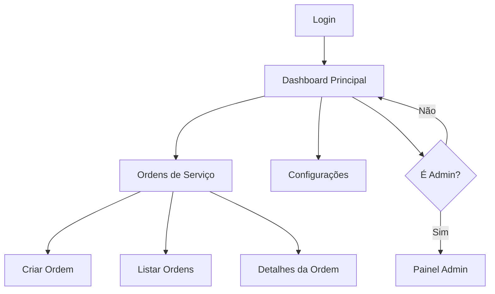

# Plano de Remoção do Sistema VIP/Beta - OneDrip

## 1. Visão Geral do Projeto

Este documento apresenta um plano detalhado para remover completamente o sistema VIP/Beta do projeto OneDrip, permitindo que todos os usuários tenham acesso total às funcionalidades de service-orders sem qualquer restrição.

- **Objetivo Principal**: Democratizar o acesso às funcionalidades de ordens de serviço, removendo barreiras de acesso VIP
- **Impacto**: Todos os usuários terão acesso completo às funcionalidades anteriormente restritas
- **Benefício**: Simplificação da arquitetura e melhoria da experiência do usuário

## 2. Funcionalidades Principais

### 2.1 Papéis de Usuário (após remoção do VIP)

| Papel | Método de Registro | Permissões Principais |
|-------|-------------------|----------------------|
| Usuário Regular | Registro por email | Acesso completo a todas as funcionalidades de service-orders |
| Administrador | Promoção via script SQL | Gerenciamento do sistema + todas as funcionalidades de usuário |

### 2.2 Módulos de Funcionalidade

Nosso sistema após a remoção VIP consistirá nas seguintes páginas principais:
1. **Página Inicial**: navegação principal, visão geral do sistema
2. **Ordens de Serviço**: criação, edição, visualização e gerenciamento completo de ordens
3. **Configurações**: configurações pessoais e do sistema
4. **Painel Administrativo**: gerenciamento do sistema (apenas para admins)

### 2.3 Detalhes das Páginas

| Nome da Página | Nome do Módulo | Descrição da Funcionalidade |
|----------------|----------------|-----------------------------|
| Página Inicial | Dashboard Principal | Exibir visão geral, estatísticas e navegação principal |
| Ordens de Serviço | Formulário de Criação | Criar novas ordens de serviço com todos os campos disponíveis |
| Ordens de Serviço | Lista de Ordens | Visualizar, filtrar e gerenciar todas as ordens de serviço |
| Ordens de Serviço | Detalhes da Ordem | Visualizar detalhes completos, editar e excluir ordens |
| Configurações | Configurações de Usuário | Gerenciar preferências pessoais e configurações do sistema |
| Painel Admin | Gerenciamento de Sistema | Administrar usuários, logs e configurações globais (sem VIP) |

## 3. Processo Principal

**Fluxo do Usuário Regular:**
1. Usuário faz login no sistema
2. Acessa diretamente as funcionalidades de service-orders
3. Cria, edita e gerencia ordens sem restrições
4. Acessa configurações e personaliza sua experiência

**Fluxo do Administrador:**
1. Admin faz login no sistema
2. Acessa todas as funcionalidades de usuário regular
3. Acessa painel administrativo simplificado (sem gerenciamento VIP)
4. Gerencia usuários e configurações do sistema



## 4. Design da Interface do Usuário

### 4.1 Estilo de Design

- **Cores Primárias**: Azul (#3B82F6) e Verde (#10B981)
- **Cores Secundárias**: Cinza (#6B7280) e Branco (#FFFFFF)
- **Estilo de Botões**: Arredondados com sombra sutil
- **Fonte**: Inter, tamanhos 14px-24px
- **Estilo de Layout**: Design baseado em cards, navegação superior
- **Ícones**: Heroicons ou Lucide React para consistência

### 4.2 Visão Geral do Design das Páginas

| Nome da Página | Nome do Módulo | Elementos da UI |
|----------------|----------------|----------------|
| Dashboard | Seção Principal | Cards de estatísticas, navegação limpa, acesso direto às ordens |
| Ordens de Serviço | Formulário | Layout responsivo, campos organizados, validação em tempo real |
| Lista de Ordens | Tabela de Dados | Tabela responsiva, filtros avançados, paginação |
| Configurações | Painel de Config | Seções organizadas, switches e inputs estilizados |

### 4.3 Responsividade

O sistema será mobile-first com adaptação completa para desktop, incluindo otimização para interação touch em dispositivos móveis.

## 5. Análise do Sistema Atual VIP/Beta

### 5.1 Componentes Identificados para Remoção

**Frontend Components:**
- `VipUserManagement.tsx` - Gerenciamento de usuários VIP no admin
- `ServiceOrderSettings.tsx` - Verificações de acesso VIP
- `useSecureServiceOrders.ts` - Hook de proteção VIP
- Verificações `hasVipAccess` em múltiplos componentes

**Backend/Database:**
- Campo `service_orders_vip_enabled` na tabela `user_profiles`
- Políticas RLS que verificam status VIP
- Migrações SQL com restrições VIP
- Funções RPC relacionadas ao sistema VIP

**Páginas Afetadas:**
- `ServiceOrderFormPage.tsx`
- `ServiceOrderDetailsPage.tsx`
- `AdminPanelModern.tsx`
- Páginas de ajuda com explicações VIP

### 5.2 Impacto da Remoção

- **Positivo**: Simplificação da arquitetura, melhor UX, código mais limpo
- **Considerações**: Necessidade de migração cuidadosa do banco de dados
- **Riscos**: Possível perda temporária de funcionalidade durante a migração

## 6. Lista de Arquivos e Componentes para Modificação

### 6.1 Arquivos Frontend (React/TypeScript)

```
src/components/admin/VipUserManagement.tsx - REMOVER COMPLETAMENTE
src/components/service-orders/ServiceOrderSettings.tsx - REMOVER VERIFICAÇÕES VIP
src/hooks/useSecureServiceOrders.ts - SIMPLIFICAR OU REMOVER
src/pages/ServiceOrderFormPage.tsx - REMOVER VERIFICAÇÕES hasVipAccess
src/pages/ServiceOrderDetailsPage.tsx - REMOVER VERIFICAÇÕES hasVipAccess
src/components/admin/AdminPanelModern.tsx - REMOVER REFERÊNCIAS VIP
src/pages/help/ - ATUALIZAR DOCUMENTAÇÃO
```

### 6.2 Arquivos Backend/Database

```
supabase/migrations/ - CRIAR NOVA MIGRAÇÃO PARA REMOVER CAMPO VIP
supabase/functions/ - ATUALIZAR FUNÇÕES RPC
scripts/grant_admin_access.sql - MANTER (não relacionado ao VIP)
```

### 6.3 Políticas e Configurações

```
supabase/policies/ - ATUALIZAR POLÍTICAS RLS
supabase/seed.sql - REMOVER DADOS VIP DE TESTE
```

## 7. Plano de Migração do Banco de Dados

### 7.1 Etapas da Migração

**Etapa 1: Backup e Preparação**
```sql
-- Backup dos dados atuais
CREATE TABLE user_profiles_backup AS SELECT * FROM user_profiles;
```

**Etapa 2: Remoção do Campo VIP**
```sql
-- Remover campo service_orders_vip_enabled
ALTER TABLE user_profiles DROP COLUMN IF EXISTS service_orders_vip_enabled;
```

**Etapa 3: Atualização das Políticas RLS**
```sql
-- Remover políticas que verificam VIP
DROP POLICY IF EXISTS "service_orders_vip_policy" ON service_orders;

-- Criar políticas simplificadas
CREATE POLICY "service_orders_authenticated_policy" ON service_orders
    FOR ALL USING (auth.role() = 'authenticated');
```

**Etapa 4: Limpeza de Funções**
```sql
-- Remover funções relacionadas ao VIP
DROP FUNCTION IF EXISTS check_vip_access();
DROP FUNCTION IF EXISTS get_user_vip_status();
```

### 7.2 Script de Migração Completo

```sql
-- Migration: Remove VIP System
-- Date: Janeiro 2025
-- Description: Remove completely the VIP/Beta system

BEGIN;

-- 1. Backup current state
CREATE TABLE IF NOT EXISTS user_profiles_pre_vip_removal AS 
SELECT * FROM user_profiles;

-- 2. Remove VIP column
ALTER TABLE user_profiles DROP COLUMN IF EXISTS service_orders_vip_enabled;

-- 3. Update RLS policies
DROP POLICY IF EXISTS "Users can view own service orders with VIP check" ON service_orders;
DROP POLICY IF EXISTS "Users can create service orders with VIP check" ON service_orders;
DROP POLICY IF EXISTS "Users can update own service orders with VIP check" ON service_orders;

-- 4. Create simplified policies
CREATE POLICY "Users can manage own service orders" ON service_orders
    FOR ALL USING (auth.uid() = user_id);

-- 5. Grant permissions to authenticated users
GRANT ALL ON service_orders TO authenticated;
GRANT ALL ON service_order_items TO authenticated;

-- 6. Remove VIP-related functions
DROP FUNCTION IF EXISTS public.check_user_vip_access(UUID);
DROP FUNCTION IF EXISTS public.get_vip_users();

-- 7. Update admin functions (remove VIP references)
-- Note: Keep admin functions but remove VIP-specific logic

COMMIT;
```

## 8. Remoção do Gerenciamento VIP do Painel Admin

### 8.1 Componentes a Remover

- **VipUserManagement.tsx**: Componente completo de gerenciamento VIP
- **Referências no AdminPanelModern**: Links e navegação para VIP
- **Funções RPC**: `admin_get_vip_users`, `admin_toggle_vip_status`

### 8.2 Simplificação do Painel Admin

**Antes (com VIP):**
- Gerenciamento de Usuários VIP
- Toggle de status VIP individual
- Ativação em massa de VIP
- Relatórios de uso VIP

**Depois (sem VIP):**
- Gerenciamento simples de usuários
- Promoção/rebaixamento de admin
- Logs de atividade
- Estatísticas gerais do sistema

## 9. Atualização das Políticas RLS

### 9.1 Políticas Atuais (com VIP)

```sql
-- Política atual que verifica VIP
CREATE POLICY "service_orders_vip_access" ON service_orders
    FOR SELECT USING (
        auth.uid() = user_id AND 
        (SELECT service_orders_vip_enabled FROM user_profiles WHERE id = auth.uid()) = true
    );
```

### 9.2 Políticas Simplificadas (sem VIP)

```sql
-- Nova política simplificada
CREATE POLICY "service_orders_full_access" ON service_orders
    FOR ALL USING (auth.uid() = user_id);

-- Política para admins
CREATE POLICY "service_orders_admin_access" ON service_orders
    FOR ALL USING (
        EXISTS (
            SELECT 1 FROM user_profiles 
            WHERE id = auth.uid() AND role = 'admin'
        )
    );
```

## 10. Modificação dos Componentes Frontend

### 10.1 ServiceOrderSettings.tsx

**Antes:**
```typescript
const hasVipAccess = user?.service_orders_vip_enabled;
if (!hasVipAccess) {
    return <VipUpgradePrompt />;
}
```

**Depois:**
```typescript
// Remover completamente as verificações VIP
// Permitir acesso direto às configurações
```

### 10.2 useSecureServiceOrders.ts

**Antes:**
```typescript
const checkVipAccess = () => {
    return user?.service_orders_vip_enabled === true;
};
```

**Depois:**
```typescript
// Simplificar para verificar apenas autenticação
const checkAccess = () => {
    return !!user;
};
```

### 10.3 Páginas de Service Orders

**Modificações necessárias:**
- Remover todas as verificações `hasVipAccess`
- Remover componentes de upgrade VIP
- Simplificar lógica de navegação
- Atualizar mensagens de erro

## 11. Cronograma de Implementação

### 11.1 Fase 1: Preparação (1-2 dias)

**Dia 1:**
- [ ] Backup completo do banco de dados
- [ ] Análise detalhada de dependências
- [ ] Criação de branch específico para remoção VIP
- [ ] Documentação do estado atual

**Dia 2:**
- [ ] Preparação dos scripts de migração
- [ ] Testes em ambiente de desenvolvimento
- [ ] Validação das políticas RLS

### 11.2 Fase 2: Implementação Backend (2-3 dias)

**Dia 3:**
- [ ] Execução da migração do banco de dados
- [ ] Remoção das políticas VIP
- [ ] Criação das novas políticas simplificadas
- [ ] Teste das funções RPC atualizadas

**Dia 4-5:**
- [ ] Atualização das funções admin
- [ ] Remoção de funções VIP obsoletas
- [ ] Testes de integridade do banco
- [ ] Validação das permissões

### 11.3 Fase 3: Implementação Frontend (3-4 dias)

**Dia 6-7:**
- [ ] Remoção do componente VipUserManagement
- [ ] Atualização do AdminPanelModern
- [ ] Modificação das páginas de service orders
- [ ] Atualização dos hooks e utilitários

**Dia 8-9:**
- [ ] Remoção das verificações VIP em todos os componentes
- [ ] Atualização das rotas e navegação
- [ ] Testes de interface do usuário
- [ ] Atualização da documentação de ajuda

### 11.4 Fase 4: Testes e Validação (2-3 dias)

**Dia 10-11:**
- [ ] Testes funcionais completos
- [ ] Testes de regressão
- [ ] Validação da experiência do usuário
- [ ] Testes de performance

**Dia 12:**
- [ ] Testes de aceitação
- [ ] Preparação para deploy
- [ ] Documentação final

### 11.5 Fase 5: Deploy e Monitoramento (1-2 dias)

**Dia 13:**
- [ ] Deploy em ambiente de staging
- [ ] Testes finais em staging
- [ ] Deploy em produção
- [ ] Monitoramento inicial

**Dia 14:**
- [ ] Monitoramento contínuo
- [ ] Correção de issues menores
- [ ] Comunicação aos usuários
- [ ] Documentação de lições aprendidas

## 12. Riscos e Mitigações

### 12.1 Riscos Identificados

| Risco | Probabilidade | Impacto | Mitigação |
|-------|---------------|---------|----------|
| Perda de dados durante migração | Baixa | Alto | Backup completo + testes em dev |
| Quebra de funcionalidades | Média | Médio | Testes extensivos + rollback plan |
| Problemas de permissão | Média | Alto | Validação cuidadosa das políticas RLS |
| Resistência dos usuários | Baixa | Baixo | Comunicação clara dos benefícios |

### 12.2 Plano de Rollback

**Em caso de problemas críticos:**
1. Restaurar backup do banco de dados
2. Reverter deploy do frontend
3. Reativar políticas VIP temporariamente
4. Investigar e corrigir problemas
5. Replanejar implementação

## 13. Benefícios Esperados

### 13.1 Para os Usuários
- **Acesso Completo**: Todos os usuários terão acesso total às funcionalidades
- **Experiência Simplificada**: Remoção de barreiras e prompts de upgrade
- **Maior Satisfação**: Eliminação de frustrações relacionadas a restrições

### 13.2 Para o Sistema
- **Código Mais Limpo**: Remoção de lógica complexa de verificação VIP
- **Manutenção Simplificada**: Menos componentes para manter
- **Performance Melhorada**: Menos verificações e consultas ao banco
- **Arquitetura Simplificada**: Redução da complexidade geral do sistema

### 13.3 Para a Equipe de Desenvolvimento
- **Desenvolvimento Mais Rápido**: Menos verificações para implementar
- **Menos Bugs**: Redução de pontos de falha relacionados ao VIP
- **Foco no Core**: Concentração nas funcionalidades principais

## 14. Conclusão

A remoção do sistema VIP/Beta representa uma evolução natural do projeto OneDrip, democratizando o acesso às funcionalidades e simplificando significativamente a arquitetura do sistema. Com um planejamento cuidadoso e execução em fases, esta mudança resultará em uma experiência melhor para todos os usuários e um sistema mais maintível para a equipe de desenvolvimento.

O cronograma de 14 dias permite uma implementação segura e bem testada, com múltiplas camadas de validação e um plano de rollback robusto para mitigar riscos.