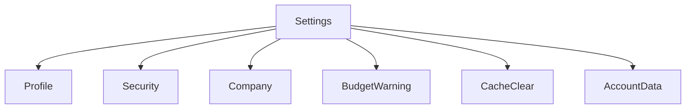

## 1. Product Overview
Redesign completo da rota **/settings** no estilo **iOS Settings** com **glassmorphism**.
Foco em navegação por lista + subpáginas, usando o componente **SettingsLite** para consistência visual e de interação.

## 2. Core Features

### 2.1 User Roles
Não há distinção de papéis no escopo deste redesign.

### 2.2 Feature Module
O redesign consiste nas seguintes páginas:
1. **Settings**: navegação por seções, busca local, cartões/linhas SettingsLite.
2. **Profile**: visualização/edição de dados básicos do perfil.
3. **Security**: ações de segurança da conta e preferências críticas.
4. **Company**: dados e preferências da empresa (quando aplicável).
5. **BudgetWarning**: configuração/visualização de avisos de orçamento.
6. **CacheClear**: limpeza de cache local com confirmação.
7. **AccountData**: ações de dados da conta (exportar/excluir) com avisos.

### 2.3 Page Details
| Page Name | Module Name | Feature description |
|---|---|---|
| Settings | Header + Search | Exibir título e campo de busca para filtrar itens por nome/descrição. |
| Settings | Seções (SettingsLiteGroup) | Agrupar itens por categorias; manter ordem e espaçamento tipo iOS. |
| Settings | Itens (SettingsLiteRow) | Navegar para subpáginas; suportar ícone, título, descrição, valor à direita, chevron, toggle/ação. |
| Settings | Estados | Mostrar loading/empty (sem resultados) e desabilitado quando item não aplicável. |
| Profile | Formulário | Editar e salvar dados de perfil; validar campos; exibir feedback de sucesso/erro. |
| Security | Ações críticas | Executar ações de segurança com confirmação quando destrutivas; exibir status atual quando aplicável. |
| Company | Formulário | Visualizar/editar dados da empresa; salvar alterações com feedback. |
| BudgetWarning | Preferências | Configurar limites/avisos (ex.: ativar/desativar, nível/limiar) e visualizar estado atual. |
| CacheClear | Confirmação | Explicar impacto; confirmar e executar limpeza; exibir resultado. |
| AccountData | Exportar/Excluir | Permitir exportar dados e solicitar exclusão com confirmação forte e mensagens de risco. |

## 3. Core Process
Fluxo principal (qualquer usuário):
1) Abrir **/settings** → usar busca ou navegar por seções.
2) Selecionar um item (SettingsLite) → abrir subpágina correspondente.
3) Alterar configurações/ações → confirmar quando necessário → ver feedback e retornar.

