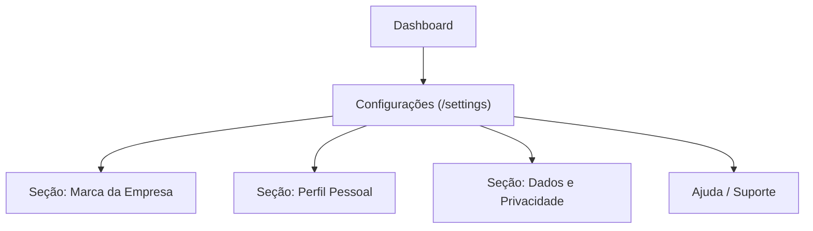

## 1. Product Overview
Redesign da página **/settings** para se comportar e “parecer” uma aba de configurações.
O foco é aumentar escaneabilidade, clareza de seções e navegação interna simples.

## 2. Core Features

### 2.1 User Roles
| Role | Registration Method | Core Permissions |
|------|---------------------|------------------|
| Usuário autenticado | Login (Supabase Auth) | Acessar /settings e atualizar preferências e dados pessoais |

### 2.2 Feature Module
1. **Configurações**: navegação interna por seções (estilo aba), edição de perfil, marca da empresa, dados/privacidade e atalhos de suporte.

### 2.3 Page Details
| Page Name | Module Name | Feature description |
|-----------|-------------|---------------------|
| Configurações (/settings) | Layout “aba de configurações” | Organizar o conteúdo em seções empilhadas com títulos claros e densidade adequada (sem hero/marketing), mantendo consistência visual com o restante do app. |
| Configurações (/settings) | Navegação interna simples | Navegar entre seções via menu lateral (desktop) e seletor/aba (mobile), com destaque da seção ativa e rolagem/âncoras para o conteúdo correspondente. |
| Configurações (/settings) | Seção “Marca da Empresa” | Exibir e permitir configurar identidade visual e informações da empresa (via componente existente). |
| Configurações (/settings) | Seção “Perfil Pessoal” | Exibir e permitir atualizar nome; exibir e-mail, função e licença; permitir ações: redefinir senha, atualizar e-mail, suporte, sair e reset do app. |
| Configurações (/settings) | Seção “Dados e Privacidade” | Exibir e permitir gerenciar dados e privacidade/LGPD (via componente existente). |
| Configurações (/settings) | Ajuda e atalhos | Disponibilizar links para central de ajuda, suporte e chat com Drippy como bloco secundário (sem competir com as configurações). |

## 3. Core Process
Fluxo do usuário autenticado:
1) Abrir **/settings** a partir do dashboard/menus.
2) Selecionar a seção desejada na navegação interna.
3) Ajustar configurações na seção (ex.: salvar nome no perfil).
4) (Opcional) Acessar ajuda/suporte.

