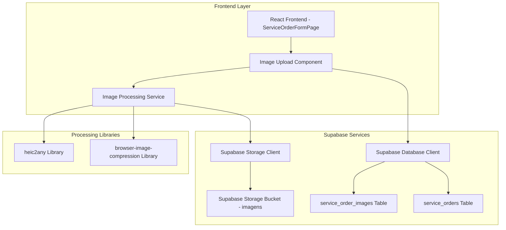
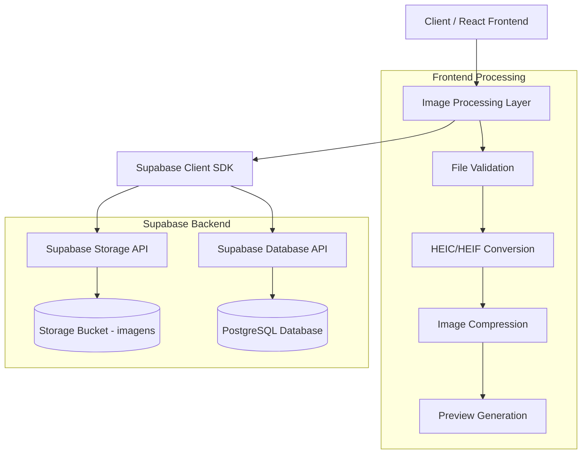
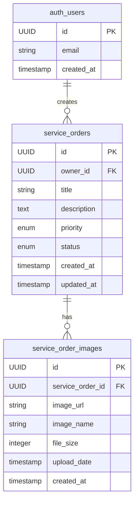

# Arquitetura Técnica - Sistema de Upload de Imagens para Ordens de Serviço

## 1. Architecture design



## 2. Technology Description

- **Frontend**: React@18 + TypeScript + Tailwind CSS + Vite
- **Image Processing**: heic2any@1.0.4 + browser-image-compression@2.0.2
- **Backend**: Supabase (Database + Storage)
- **State Management**: React Query + React Hooks
- **UI Components**: Shadcn/ui + Lucide Icons

## 3. Route definitions

| Route | Purpose |
|-------|---------|
| /service-orders/new | Página de criação de nova ordem de serviço com upload de imagens |
| /service-orders/:id/edit | Página de edição de ordem existente (visualização de imagens anexadas) |
| /service-orders/:id | Página de detalhes da ordem (visualização de imagens) |

## 4. API definitions

### 4.1 Core API

**Upload de Imagem para Supabase Storage**
```typescript
POST /storage/v1/object/imagens/uploads/{userId}/{timestamp}-{filename}
```

Request:
| Param Name | Param Type | isRequired | Description |
|------------|------------|------------|-------------|
| file | File/Blob | true | Arquivo de imagem processado |
| userId | string | true | ID do usuário autenticado |
| timestamp | number | true | Timestamp Unix para nome único |

Response:
| Param Name | Param Type | Description |
|------------|------------|-------------|
| path | string | Caminho do arquivo no storage |
| id | string | ID único do arquivo |
| fullPath | string | Caminho completo do arquivo |

**Salvar Referência da Imagem no Banco**
```typescript
POST /rest/v1/service_order_images
```

Request:
| Param Name | Param Type | isRequired | Description |
|------------|------------|------------|-------------|
| service_order_id | UUID | true | ID da ordem de serviço |
| image_url | string | true | URL pública da imagem |
| image_name | string | true | Nome original do arquivo |
| file_size | number | true | Tamanho do arquivo em bytes |
| upload_date | timestamp | true | Data/hora do upload |

Response:
| Param Name | Param Type | Description |
|------------|------------|-------------|
| id | UUID | ID único do registro |
| created_at | timestamp | Data de criação |

**Buscar Imagens de uma Ordem**
```typescript
GET /rest/v1/service_order_images?service_order_id=eq.{id}
```

Response:
```json
[
  {
    "id": "uuid",
    "service_order_id": "uuid",
    "image_url": "https://supabase.co/storage/v1/object/public/imagens/uploads/user123/1640995200000-device.jpg",
    "image_name": "device-front.jpg",
    "file_size": 2048576,
    "upload_date": "2024-01-15T10:30:00Z"
  }
]
```

## 5. Server architecture diagram



## 6. Data model

### 6.1 Data model definition



### 6.2 Data Definition Language

**Tabela service_order_images**
```sql
-- Criar tabela para armazenar referências das imagens
CREATE TABLE service_order_images (
    id UUID PRIMARY KEY DEFAULT gen_random_uuid(),
    service_order_id UUID NOT NULL REFERENCES service_orders(id) ON DELETE CASCADE,
    image_url TEXT NOT NULL,
    image_name VARCHAR(255) NOT NULL,
    file_size INTEGER NOT NULL CHECK (file_size > 0),
    upload_date TIMESTAMP WITH TIME ZONE DEFAULT NOW(),
    created_at TIMESTAMP WITH TIME ZONE DEFAULT NOW(),
    updated_at TIMESTAMP WITH TIME ZONE DEFAULT NOW()
);

-- Criar índices para performance
CREATE INDEX idx_service_order_images_service_order_id ON service_order_images(service_order_id);
CREATE INDEX idx_service_order_images_upload_date ON service_order_images(upload_date DESC);

-- Configurar RLS (Row Level Security)
ALTER TABLE service_order_images ENABLE ROW LEVEL SECURITY;

-- Política para usuários autenticados verem apenas suas próprias imagens
CREATE POLICY "Users can view their own service order images" ON service_order_images
    FOR SELECT USING (
        service_order_id IN (
            SELECT id FROM service_orders WHERE owner_id = auth.uid()
        )
    );

-- Política para usuários autenticados criarem imagens em suas ordens
CREATE POLICY "Users can insert images to their own service orders" ON service_order_images
    FOR INSERT WITH CHECK (
        service_order_id IN (
            SELECT id FROM service_orders WHERE owner_id = auth.uid()
        )
    );

-- Política para usuários autenticados deletarem suas próprias imagens
CREATE POLICY "Users can delete their own service order images" ON service_order_images
    FOR DELETE USING (
        service_order_id IN (
            SELECT id FROM service_orders WHERE owner_id = auth.uid()
        )
    );

-- Conceder permissões básicas
GRANT SELECT, INSERT, DELETE ON service_order_images TO authenticated;
GRANT SELECT ON service_order_images TO anon;

-- Trigger para atualizar updated_at
CREATE OR REPLACE FUNCTION update_service_order_images_updated_at()
RETURNS TRIGGER AS $$
BEGIN
    NEW.updated_at = NOW();
    RETURN NEW;
END;
$$ LANGUAGE plpgsql;

CREATE TRIGGER trigger_update_service_order_images_updated_at
    BEFORE UPDATE ON service_order_images
    FOR EACH ROW
    EXECUTE FUNCTION update_service_order_images_updated_at();
```

**Configuração do Storage Bucket**
```sql
-- Criar bucket para imagens (se não existir)
INSERT INTO storage.buckets (id, name, public)
VALUES ('imagens', 'imagens', true)
ON CONFLICT (id) DO NOTHING;

-- Política de upload para usuários autenticados
CREATE POLICY "Authenticated users can upload images" ON storage.objects
    FOR INSERT WITH CHECK (
        bucket_id = 'imagens' 
        AND auth.role() = 'authenticated'
        AND (storage.foldername(name))[1] = auth.uid()::text
    );

-- Política de visualização pública
CREATE POLICY "Public can view images" ON storage.objects
    FOR SELECT USING (bucket_id = 'imagens');

-- Política de deleção para proprietários
CREATE POLICY "Users can delete their own images" ON storage.objects
    FOR DELETE USING (
        bucket_id = 'imagens' 
        AND auth.role() = 'authenticated'
        AND (storage.foldername(name))[1] = auth.uid()::text
    );
```

**Dados iniciais (opcional)**
```sql
-- Inserir dados de exemplo para desenvolvimento
INSERT INTO service_order_images (service_order_id, image_url, image_name, file_size)
VALUES 
    ('example-uuid-1', 'https://example.com/image1.jpg', 'device-front.jpg', 1024000),
    ('example-uuid-1', 'https://example.com/image2.jpg', 'device-back.jpg', 856000),
    ('example-uuid-2', 'https://example.com/image3.jpg', 'problem-area.jpg', 1200000);
```