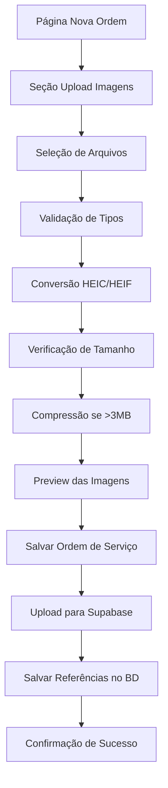

# Sistema de Upload de Imagens para Ordens de Serviço

## 1. Product Overview

Sistema integrado de upload, conversão e compressão automática de imagens para ordens de serviço, permitindo que usuários anexem até 3 fotos por ordem com processamento inteligente de formatos e otimização automática de tamanho.

O sistema resolve o problema de compatibilidade de formatos de imagem (especialmente HEIC/HEIF de dispositivos Apple) e reduz custos de armazenamento através de compressão automática, mantendo qualidade visual adequada para documentação técnica.

Destinado a técnicos e proprietários de assistências técnicas que precisam documentar visualmente os dispositivos e problemas reportados pelos clientes.

## 2. Core Features

### 2.1 User Roles

| Role | Registration Method | Core Permissions |
|------|---------------------|------------------|
| Técnico/Usuário Autenticado | Login existente no sistema | Pode criar ordens de serviço e fazer upload de até 3 imagens por ordem |
| Proprietário da Assistência | Login existente no sistema | Pode criar ordens de serviço, fazer upload de imagens e gerenciar todas as ordens |

### 2.2 Feature Module

O sistema de upload de imagens será integrado à página existente de criação de ordens de serviço:

1. **Página de Nova Ordem de Serviço (/service-orders/new)**: seção de upload de imagens, preview das imagens, processamento automático, validação de limites.

### 2.3 Page Details

| Page Name | Module Name | Feature description |
|-----------|-------------|---------------------|
| Nova Ordem de Serviço | Seção de Upload de Imagens | Permite selecionar até 3 imagens via drag & drop ou clique, converte automaticamente formatos HEIC/HEIF/PNG/JPEG para JPG/WEBP, comprime arquivos maiores que 3MB, exibe preview das imagens selecionadas, mostra barra de progresso durante processamento, valida tipos de arquivo aceitos, permite remover imagens selecionadas antes do upload |
| Nova Ordem de Serviço | Processamento de Imagens | Identifica automaticamente o tipo de arquivo, converte HEIC/HEIF para JPEG usando heic2any, aplica compressão inteligente para arquivos >3MB usando browser-image-compression, mantém qualidade visual adequada, gera nomes padronizados para arquivos |
| Nova Ordem de Serviço | Integração com Supabase | Faz upload das imagens processadas para bucket "imagens" na pasta uploads/{userId}/{timestamp}-{filename}, salva referências das imagens na tabela service_order_images, associa imagens à ordem de serviço via service_order_id, valida permissões de upload |

## 3. Core Process

**Fluxo Principal do Upload de Imagens:**

1. Usuário acessa a página de nova ordem de serviço (/service-orders/new)
2. Preenche dados básicos da ordem (cliente, dispositivo, problema)
3. Na seção "Anexar Imagens", clica ou arrasta até 3 imagens
4. Sistema valida tipos de arquivo aceitos (HEIC, HEIF, PNG, JPEG, JPG, WEBP)
5. Para cada imagem selecionada:
   - Converte HEIC/HEIF para JPEG automaticamente
   - Verifica tamanho do arquivo
   - Se >3MB, aplica compressão mantendo qualidade
   - Gera preview da imagem processada
   - Mostra barra de progresso durante processamento
6. Usuário pode remover imagens indesejadas antes do envio
7. Ao salvar a ordem de serviço:
   - Faz upload das imagens para Supabase Storage
   - Salva referências no banco de dados
   - Associa imagens à ordem criada
8. Sistema confirma sucesso e redireciona para lista de ordens

## 4. User Interface Design

### 4.1 Design Style

- **Cores Primárias**: Manter paleta existente do sistema (dark theme)
- **Cores Secundárias**: Verde para sucesso (#22c55e), vermelho para erro (#ef4444), azul para progresso (#3b82f6)
- **Estilo de Botões**: Rounded corners, hover effects, loading states
- **Fontes**: Inter ou system fonts, tamanhos 14px-16px para textos, 12px para labels
- **Layout**: Card-based design, mobile-first approach
- **Ícones**: Lucide icons (Upload, Image, X, Check, AlertCircle)
- **Animações**: Smooth transitions, loading spinners, progress bars

### 4.2 Page Design Overview

| Page Name | Module Name | UI Elements |
|-----------|-------------|-------------|
| Nova Ordem de Serviço | Seção Upload de Imagens | Card container com border dashed para drag & drop, ícone de upload centralizado, texto "Arraste até 3 imagens ou clique para selecionar", botão "Selecionar Arquivos" estilizado, contador "0/3 imagens", área de preview com thumbnails 80x80px, botões de remoção (X) em cada thumbnail, barra de progresso linear durante processamento, badges de status (Processando, Convertendo, Comprimindo, Concluído) |
| Nova Ordem de Serviço | Preview de Imagens | Grid responsivo 3 colunas em desktop, 2 em tablet, 1 em mobile, thumbnails com aspect ratio 1:1, overlay com nome do arquivo truncado, tamanho do arquivo em KB/MB, botão de remoção no canto superior direito, indicador visual de processamento (spinner overlay) |
| Nova Ordem de Serviço | Estados de Feedback | Loading state com skeleton placeholders, mensagens de erro em toast notifications, confirmação de sucesso com ícone check, validação em tempo real com bordas coloridas (verde/vermelho), tooltip com informações de formato suportado |

### 4.3 Responsiveness

O sistema é mobile-first e touch-optimized:
- **Desktop**: Drag & drop funcional, preview em grid 3 colunas, tooltips informativos
- **Tablet**: Grid 2 colunas, botões touch-friendly (min 44px)
- **Mobile**: Grid 1 coluna, interface simplificada, gestos de swipe para remover
- **Touch Interactions**: Tap para selecionar, long press para preview ampliado, swipe para remover