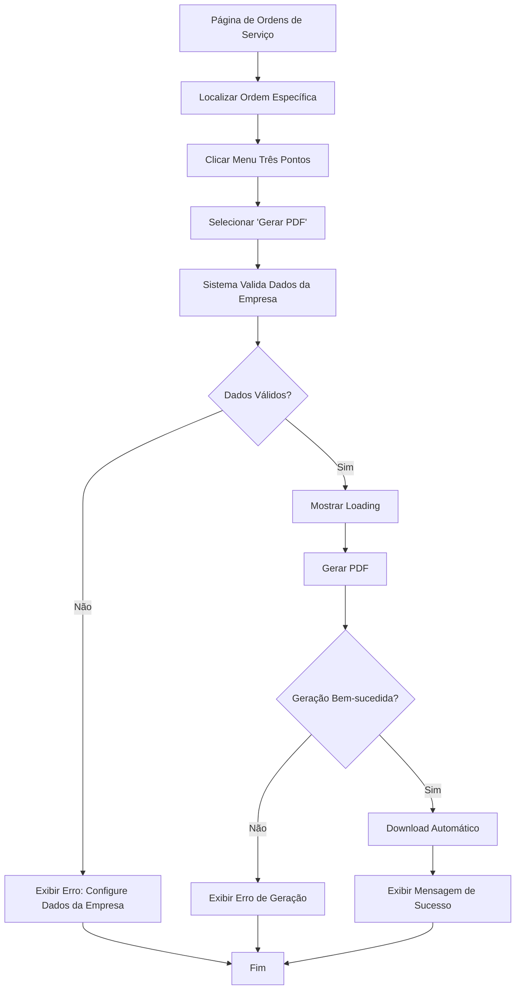

# Sistema de Geração de PDF para Ordens de Serviço - Requisitos de Produto

## 1. Visão Geral do Produto

O sistema de geração de PDF para ordens de serviço é uma extensão do sistema atual que permitirá aos usuários gerar documentos profissionais em PDF contendo todas as informações relevantes de uma ordem de serviço. O sistema seguirá o mesmo padrão de qualidade e usabilidade já estabelecido pelo sistema de geração de PDF de orçamentos.

- **Objetivo Principal**: Facilitar a documentação e compartilhamento de ordens de serviço através de PDFs profissionais e completos.
- **Público-Alvo**: Técnicos, gerentes e proprietários de assistências técnicas que precisam documentar e compartilhar informações de ordens de serviço com clientes e equipe.
- **Valor de Mercado**: Melhora a profissionalização do atendimento, facilita a comunicação com clientes e cria documentação padronizada para controle interno.

## 2. Funcionalidades Principais

### 2.1 Papéis de Usuário

| Papel | Método de Acesso | Permissões Principais |
|-------|------------------|----------------------|
| Usuário Autenticado | Login na plataforma | Pode gerar PDFs de suas próprias ordens de serviço |
| Administrador | Login com perfil admin | Pode gerar PDFs de todas as ordens de serviço da empresa |

### 2.2 Módulos de Funcionalidade

O sistema de PDF para ordens de serviço consiste nas seguintes funcionalidades principais:

1. **Geração de PDF**: Criação de documento PDF completo com todas as informações da ordem de serviço
2. **Download Automático**: Download direto do arquivo PDF gerado
3. **Integração com Interface**: Opção acessível através do menu de ações na listagem de ordens de serviço

### 2.3 Detalhes das Funcionalidades

| Módulo | Funcionalidade | Descrição |
|--------|----------------|-----------|
| Lista de Ordens | Menu de Três Pontos | Adicionar opção "Gerar PDF" no menu dropdown existente |
| Lista de Ordens | Estado de Loading | Mostrar indicador visual durante geração do PDF |
| Lista de Ordens | Tratamento de Erros | Exibir mensagens claras em caso de falha na geração |
| Geração de PDF | Cabeçalho da Empresa | Incluir logo, nome, CNPJ, WhatsApp e endereço da empresa |
| Geração de PDF | Título e Numeração | Exibir "ORDEM DE SERVIÇO" e número formatado como "OS: 0004" |
| Geração de PDF | Dados do Cliente | Nome, telefone, email e endereço do cliente |
| Geração de PDF | Informações do Dispositivo | Tipo, modelo e IMEI/serial do dispositivo |
| Geração de PDF | Detalhes do Serviço | Status atual e descrição do reparo|
| Geração de PDF | Informações de Pagamento | Valor total e status de pagamento (pago/pendente) |
| Geração de PDF | Datas Importantes | Datas de entrada, saída, entrega e previsões |
| Geração de PDF | Observações | Notas adicionais e comentários do cliente |
| Geração de PDF | Rodapé | Data e hora de geração do documento |

## 3. Fluxo Principal de Uso

### Fluxo do Usuário Padrão

1. **Acesso à Lista**: Usuário navega para a página `/service-orders`
2. **Seleção da Ordem**: Localiza a ordem de serviço desejada na lista
3. **Abertura do Menu**: Clica no botão de três pontos (⋮) da ordem específica
4. **Seleção da Opção**: Clica em "Gerar PDF" no menu dropdown
5. **Aguardo da Geração**: Sistema exibe loading enquanto processa o PDF
6. **Download Automático**: PDF é gerado e download inicia automaticamente
7. **Confirmação**: Sistema exibe mensagem de sucesso

### Fluxo de Navegação

## 4. Design da Interface

### 4.1 Estilo de Design

- **Cores Primárias**: Manter consistência com o sistema atual (azul #2980B9 para elementos principais)
- **Cores Secundárias**: Cinza escuro (#404040) para textos, cinza claro (#F5F5F5) para backgrounds
- **Estilo de Botões**: Seguir padrão existente com ícones lucide-react
- **Tipografia**: Helvetica para consistência com PDFs de orçamento
- **Layout**: Integração discreta no menu existente sem alterações visuais significativas
- **Ícones**: Utilizar ícone de download (Download) do lucide-react

### 4.2 Elementos da Interface

| Componente | Elemento | Descrição Visual |
|------------|----------|------------------|
| Menu Dropdown | Opção "Gerar PDF" | Ícone de download + texto, posicionado entre "Editar" e separador |
| Estado Loading | Ícone Animado | Ícone de refresh girando + texto "Gerando PDF..." |
| Estado Erro | Mensagem Toast | Toast vermelho com mensagem de erro específica |
| Estado Sucesso | Mensagem Toast | Toast verde confirmando geração bem-sucedida |

### 4.3 Layout do PDF

| Seção | Elementos Visuais | Especificações |
|-------|------------------|----------------|
| Cabeçalho | Logo + Dados da Empresa | Logo 30x30px, fonte 16pt para nome, 8pt para contatos |
| Título | "ORDEM DE SERVIÇO" + Número | Fonte 18pt azul, número 14pt preto, alinhado à direita |
| Dados Cliente | Box cinza claro | Fundo #F5F5F5, padding 5px, fonte 9pt |
| Dispositivo | Box cinza claro | Mesmo padrão dos dados do cliente |
| Serviço | Status + Problema | Status colorido conforme estado, problema em box |
| Pagamento | Valor + Status | Valor em destaque, status colorido (verde/vermelho) |
| Datas | Lista simples | Fonte 9pt, labels em negrito |
| Observações | Box cinza claro | Altura mínima 20px, texto justificado |
| Rodapé | Data de geração | Fonte 8pt cinza, alinhado à esquerda |

### 4.4 Responsividade

- **Desktop**: Funcionalidade completa com todos os elementos visuais
- **Mobile**: Menu dropdown adaptado para touch, PDFs mantêm layout fixo
- **Tablet**: Experiência similar ao desktop com ajustes de toque

## 5. Requisitos Técnicos

### 5.1 Validações Necessárias

1. **Dados da Empresa**: Sistema deve verificar se dados básicos da empresa estão configurados
2. **Permissões**: Usuário deve ter acesso à ordem de serviço específica
3. **Dados da Ordem**: Ordem deve existir e não estar deletada
4. **Formato de Dados**: Validar formato de datas, valores monetários e textos

### 5.2 Tratamento de Erros

1. **Empresa Não Configurada**: "Configure os dados da empresa antes de gerar o PDF"
2. **Erro de Geração**: "Erro ao gerar PDF da ordem de serviço. Tente novamente."
3. **Ordem Não Encontrada**: "Ordem de serviço não encontrada ou sem permissão de acesso"
4. **Falha de Download**: "Falha no download do PDF. Verifique sua conexão."

### 5.3 Performance

1. **Tempo de Geração**: Máximo 5 segundos para gerar PDF
2. **Tamanho do Arquivo**: PDFs devem ter tamanho otimizado (máximo 2MB)
3. **Cache**: Reutilizar dados da empresa em cache quando disponível
4. **Loading States**: Feedback visual imediato ao usuário

### 5.4 Compatibilidade

1. **Navegadores**: Chrome 90+, Firefox 88+, Safari 14+, Edge 90+
2. **Dispositivos**: Desktop, tablet e mobile
3. **Sistemas**: Windows, macOS, Linux, iOS, Android
4. **Formato**: PDF/A para compatibilidade máxima

## 6. Critérios de Aceitação

### 6.1 Funcionalidade

- [ ] Opção "Gerar PDF" aparece no menu de três pontos
- [ ] PDF é gerado com todas as seções especificadas
- [ ] Download inicia automaticamente após geração
- [ ] Número da OS aparece no formato "OS: 0004"
- [ ] Dados da empresa são incluídos corretamente
- [ ] Layout é consistente com PDFs de orçamento

### 6.2 Usabilidade

- [ ] Processo de geração é intuitivo e rápido
- [ ] Estados de loading são claros e informativos
- [ ] Mensagens de erro são específicas e úteis
- [ ] Interface não sofre alterações visuais significativas
- [ ] Funcionalidade é acessível em dispositivos móveis

### 6.3 Qualidade

- [ ] PDFs são legíveis e profissionais
- [ ] Todas as informações são exibidas corretamente
- [ ] Formatação de datas e valores está correta
- [ ] Layout se adapta a diferentes tamanhos de conteúdo
- [ ] Não há quebras de página inadequadas

### 6.4 Performance

- [ ] Geração de PDF completa em menos de 5 segundos
- [ ] Sistema permanece responsivo durante geração
- [ ] Não há vazamentos de memória
- [ ] Cache de dados da empresa funciona corretamente

## 7. Casos de Uso Especiais

### 7.1 Dados Incompletos

**Cenário**: Ordem de serviço com informações faltantes
**Comportamento**: PDF deve ser gerado com placeholders apropriados
**Exemplo**: "Não informado" para campos vazios

### 7.2 Textos Longos

**Cenário**: Descrição do reparo muito extensa
**Comportamento**: Texto deve quebrar adequadamente sem cortar palavras
**Limite**: Máximo 500 caracteres por seção de texto

### 7.3 Empresa Sem Logo

**Cenário**: Empresa não possui logo configurado
**Comportamento**: PDF deve ser gerado sem logo, mantendo layout
**Alternativa**: Placeholder visual opcional

### 7.4 Múltiplas Gerações

**Cenário**: Usuário gera múltiplos PDFs rapidamente
**Comportamento**: Sistema deve enfileirar requisições e processar sequencialmente
**Limite**: Máximo 3 gerações simultâneas por usuário

## 8. Métricas de Sucesso

### 8.1 Adoção

- **Meta**: 70% dos usuários ativos utilizem a funcionalidade no primeiro mês
- **Medição**: Tracking de cliques na opção "Gerar PDF"

### 8.2 Performance

- **Meta**: 95% das gerações completam em menos de 5 segundos
- **Medição**: Logs de tempo de processamento

### 8.3 Qualidade

- **Meta**: Taxa de erro inferior a 2%
- **Medição**: Logs de erros vs. tentativas bem-sucedidas

### 8.4 Satisfação

- **Meta**: Feedback positivo de 90% dos usuários
- **Medição**: Pesquisas de satisfação e tickets de suporte

## 9. Roadmap de Implementação

### 9.1 Sprint 1 (Semana 1)
- Implementação da estrutura base de geração de PDF
- Criação das funções utilitárias
- Testes unitários básicos

### 9.2 Sprint 2 (Semana 2)
- Integração com a interface existente
- Implementação dos estados de loading e erro
- Testes de integração

### 9.3 Sprint 3 (Semana 3)
- Refinamento do layout do PDF
- Otimizações de performance
- Testes de usabilidade

### 9.4 Sprint 4 (Semana 4)
- Testes finais e correções
- Documentação para usuários
- Deploy em produção

## 10. Considerações Futuras

### 10.1 Melhorias Potenciais

1. **Personalização**: Permitir customização do layout do PDF
2. **Compartilhamento**: Opção de enviar PDF por email diretamente
3. **Histórico**: Manter histórico de PDFs gerados
4. **Templates**: Múltiplos templates de PDF para diferentes necessidades

### 10.2 Integrações

1. **Sistema de Email**: Envio automático para clientes
2. **Armazenamento**: Salvamento automático em cloud storage
3. **Assinatura Digital**: Implementação de assinatura eletrônica
4. **API Externa**: Disponibilização via API para integrações

---

Este documento define todos os requisitos necessários para implementar com sucesso o sistema de geração de PDF para ordens de serviço, garantindo uma experiência consistente e profissional para os usuários.