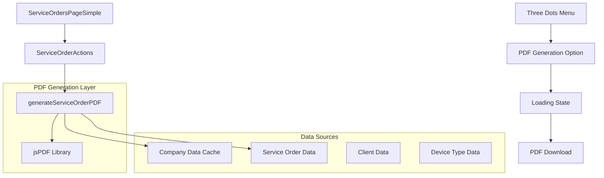

# Sistema de Geração de PDF para Ordens de Serviço - Especificação Técnica

## 1. Visão Geral do Projeto

Este documento especifica a implementação de um sistema de geração de PDF para ordens de serviço, seguindo o padrão já estabelecido pelo sistema de geração de PDF de orçamentos. O sistema permitirá gerar PDFs completos com todas as informações da ordem de serviço, incluindo dados da empresa, cliente e detalhes técnicos.

### 1.1 Objetivos
- Implementar geração de PDF para ordens de serviço similar ao sistema de orçamentos
- Incluir todos os dados exibidos na página `/share/service-order/uuid`
- Integrar opção de geração no menu de três pontos da página `/service-orders`
- Manter consistência visual com o sistema atual
- Formatar número da ordem como "OS: 0004"

## 2. Arquitetura Técnica

### 2.1 Diagrama de Arquitetura



### 2.2 Tecnologias Utilizadas
- **Frontend**: React@18 + TypeScript
- **PDF Generation**: jsPDF (mesma biblioteca do sistema de orçamentos)
- **Styling**: Tailwind CSS
- **State Management**: React Query para cache de dados
- **Backend**: Supabase (dados existentes)

## 3. Estruturas de Dados

### 3.1 Interface ServiceOrderData (Expandida)

```typescript
interface ServiceOrderData {
  id: string;
  formatted_id: string;
  sequential_number?: number;
  device_type: string;
  device_model: string;
  imei_serial?: string | null;
  reported_issue: string;
  status: string;
  is_paid: boolean;
  created_at: string;
  updated_at: string;
  entry_date: string | null;
  exit_date: string | null;
  delivery_date?: string | null;
  total_price?: number;
  payment_status?: string;
  estimated_completion?: string;
  actual_completion?: string;
  customer_notes?: string;
  last_customer_update?: string;
  warranty_months?: number;
  // Dados do cliente (obtidos via JOIN)
  client_name?: string;
  client_phone?: string;
  client_email?: string;
  client_address?: string;
}
```

### 3.2 Interface CompanyData (Reutilizada)

```typescript
interface CompanyData {
  shop_name: string;
  logo_url: string | null;
  address: string | null;
  whatsapp_phone: string | null;
  description: string | null;
  email: string | null;
  website: string | null;
  cnpj?: string | null;
}
```

### 3.3 Interface ServiceOrderPDFData

```typescript
interface ServiceOrderPDFData extends ServiceOrderData {
  company: CompanyData;
  device_type_name: string; // Nome legível do tipo de dispositivo
  status_label: string; // Label traduzido do status
  formatted_dates: {
    entry: string;
    exit?: string;
    delivery?: string;
    estimated_completion?: string;
  };
}
```

## 4. Implementação Detalhada

### 4.1 Arquivo: `src/utils/serviceOrderPdfUtils.ts`

```typescript
import jsPDF from 'jspdf';
import { ServiceOrderData, CompanyData } from '@/types';

// Função principal de geração do PDF
export const generateServiceOrderPDF = async (
  serviceOrder: ServiceOrderData,
  companyData?: CompanyData
): Promise<Blob> => {
  const doc = new jsPDF();
  const pageWidth = doc.internal.pageSize.width;
  const pageHeight = doc.internal.pageSize.height;
  const margin = 20;
  
  // Cores e estilos (consistentes com budget PDF)
  const primaryColor = [41, 128, 185]; // Azul
  const darkGray = [64, 64, 64];
  const lightGray = [245, 245, 245];
  const mediumGray = [200, 200, 200];
  const black = [0, 0, 0];
  const white = [255, 255, 255];
  
  let yPosition = margin;
  
  // 1. Cabeçalho da empresa
  yPosition = await addCompanyHeader(doc, companyData, yPosition, pageWidth, margin);
  
  // 2. Título e número da OS
  yPosition = addServiceOrderTitle(doc, serviceOrder, yPosition, pageWidth, margin);
  
  // 3. Informações do cliente
  yPosition = addClientInfo(doc, serviceOrder, yPosition, pageWidth, margin);
  
  // 4. Informações do dispositivo
  yPosition = addDeviceInfo(doc, serviceOrder, yPosition, pageWidth, margin);
  
  // 5. Detalhes do serviço
  yPosition = addServiceDetails(doc, serviceOrder, yPosition, pageWidth, margin);
  
  // 6. Informações de pagamento
  yPosition = addPaymentInfo(doc, serviceOrder, yPosition, pageWidth, margin);
  
  // 7. Datas importantes
  yPosition = addImportantDates(doc, serviceOrder, yPosition, pageWidth, margin);
  
  // 8. Observações
  yPosition = addNotes(doc, serviceOrder, yPosition, pageWidth, margin);
  
  // 9. Rodapé
  addFooter(doc, companyData, pageHeight);
  
  return doc.output('blob');
};

// Função para salvar o PDF
export const saveServiceOrderPDF = async (
  serviceOrder: ServiceOrderData,
  companyData?: CompanyData
) => {
  try {
    const pdfBlob = await generateServiceOrderPDF(serviceOrder, companyData);
    const validatedCompanyData = validateCompanyData(companyData);
    const fileName = `ordem-servico-${serviceOrder.formatted_id.replace(/[^a-zA-Z0-9]/g, '-')}-${new Date().getTime()}.pdf`;
    
    // Download do arquivo
    const url = URL.createObjectURL(pdfBlob);
    const link = document.createElement('a');
    link.href = url;
    link.download = fileName;
    document.body.appendChild(link);
    link.click();
    document.body.removeChild(link);
    URL.revokeObjectURL(url);
  } catch (error) {
    console.error('Erro ao gerar/salvar PDF da ordem de serviço:', error);
    throw new Error('Falha ao gerar PDF. Verifique os dados da empresa.');
  }
};
```

### 4.2 Funções Auxiliares do PDF

```typescript
// Adicionar cabeçalho da empresa
const addCompanyHeader = async (
  doc: jsPDF,
  companyData: CompanyData,
  yPosition: number,
  pageWidth: number,
  margin: number
): Promise<number> => {
  // Logo da empresa (se disponível)
  if (companyData?.logo_url) {
    try {
      const logoImg = await loadImage(companyData.logo_url);
      doc.addImage(logoImg, 'JPEG', margin, yPosition, 30, 30);
    } catch (error) {
      // Fallback: placeholder para logo
      doc.setFillColor(240, 240, 240);
      doc.rect(margin, yPosition, 30, 30, 'F');
    }
  }
  
  // Nome da empresa
  doc.setFontSize(16);
  doc.setFont('helvetica', 'bold');
  doc.setTextColor(...black);
  doc.text(companyData?.shop_name || 'Empresa', margin + 35, yPosition + 10);
  
  // Informações de contato
  doc.setFontSize(8);
  doc.setFont('helvetica', 'normal');
  doc.setTextColor(...darkGray);
  
  let contactY = yPosition + 18;
  if (companyData?.whatsapp_phone) {
    doc.text(`WhatsApp: ${companyData.whatsapp_phone}`, margin + 35, contactY);
    contactY += 4;
  }
  
  if (companyData?.cnpj) {
    doc.text(`CNPJ: ${companyData.cnpj}`, margin + 35, contactY);
    contactY += 4;
  }
  
  if (companyData?.address) {
    const addressLines = doc.splitTextToSize(companyData.address, pageWidth - margin - 35 - 20);
    doc.text(addressLines, margin + 35, contactY);
    contactY += addressLines.length * 4;
  }
  
  return Math.max(yPosition + 35, contactY + 10);
};

// Adicionar título e número da OS
const addServiceOrderTitle = (
  doc: jsPDF,
  serviceOrder: ServiceOrderData,
  yPosition: number,
  pageWidth: number,
  margin: number
): number => {
  // Linha separadora
  doc.setDrawColor(...mediumGray);
  doc.setLineWidth(0.5);
  doc.line(margin, yPosition, pageWidth - margin, yPosition);
  
  yPosition += 10;
  
  // Título "ORDEM DE SERVIÇO"
  doc.setFontSize(18);
  doc.setFont('helvetica', 'bold');
  doc.setTextColor(...primaryColor);
  doc.text('ORDEM DE SERVIÇO', margin, yPosition);
  
  // Número da OS (formato OS: 0004)
  const osNumber = serviceOrder.sequential_number 
    ? `OS: ${serviceOrder.sequential_number.toString().padStart(4, '0')}`
    : serviceOrder.formatted_id;
  
  doc.setFontSize(14);
  doc.setFont('helvetica', 'bold');
  doc.setTextColor(...black);
  const osNumberWidth = doc.getTextWidth(osNumber);
  doc.text(osNumber, pageWidth - margin - osNumberWidth, yPosition);
  
  yPosition += 15;
  
  // Data de emissão
  doc.setFontSize(8);
  doc.setFont('helvetica', 'normal');
  doc.setTextColor(...darkGray);
  const issueDate = `Data de Emissão: ${format(new Date(), 'dd/MM/yyyy', { locale: ptBR })}`;
  const issueDateWidth = doc.getTextWidth(issueDate);
  doc.text(issueDate, pageWidth - margin - issueDateWidth, yPosition);
  
  return yPosition + 10;
};

// Adicionar informações do cliente
const addClientInfo = (
  doc: jsPDF,
  serviceOrder: ServiceOrderData,
  yPosition: number,
  pageWidth: number,
  margin: number
): number => {
  doc.setFontSize(12);
  doc.setFont('helvetica', 'bold');
  doc.setTextColor(...black);
  doc.text('DADOS DO CLIENTE', margin, yPosition);
  
  yPosition += 8;
  
  // Box para informações do cliente
  const clientBoxHeight = 25;
  doc.setFillColor(...lightGray);
  doc.rect(margin, yPosition, pageWidth - 2 * margin, clientBoxHeight, 'FD');
  
  doc.setFontSize(9);
  doc.setFont('helvetica', 'normal');
  doc.setTextColor(...black);
  
  let clientY = yPosition + 6;
  
  if (serviceOrder.client_name) {
    doc.setFont('helvetica', 'bold');
    doc.text('Nome:', margin + 5, clientY);
    doc.setFont('helvetica', 'normal');
    doc.text(serviceOrder.client_name, margin + 25, clientY);
    clientY += 5;
  }
  
  if (serviceOrder.client_phone) {
    doc.setFont('helvetica', 'bold');
    doc.text('Telefone:', margin + 5, clientY);
    doc.setFont('helvetica', 'normal');
    doc.text(serviceOrder.client_phone, margin + 35, clientY);
    clientY += 5;
  }
  
  if (serviceOrder.client_email) {
    doc.setFont('helvetica', 'bold');
    doc.text('Email:', margin + 5, clientY);
    doc.setFont('helvetica', 'normal');
    doc.text(serviceOrder.client_email, margin + 25, clientY);
  }
  
  return yPosition + clientBoxHeight + 10;
};

// Adicionar informações do dispositivo
const addDeviceInfo = (
  doc: jsPDF,
  serviceOrder: ServiceOrderData,
  yPosition: number,
  pageWidth: number,
  margin: number
): number => {
  doc.setFontSize(12);
  doc.setFont('helvetica', 'bold');
  doc.setTextColor(...black);
  doc.text('INFORMAÇÕES DO DISPOSITIVO', margin, yPosition);
  
  yPosition += 8;
  
  // Box para informações do dispositivo
  const deviceBoxHeight = 20;
  doc.setFillColor(...lightGray);
  doc.rect(margin, yPosition, pageWidth - 2 * margin, deviceBoxHeight, 'FD');
  
  doc.setFontSize(9);
  doc.setFont('helvetica', 'normal');
  doc.setTextColor(...black);
  
  let deviceY = yPosition + 6;
  
  // Tipo e modelo do dispositivo
  doc.setFont('helvetica', 'bold');
  doc.text('Dispositivo:', margin + 5, deviceY);
  doc.setFont('helvetica', 'normal');
  doc.text(`${serviceOrder.device_type} - ${serviceOrder.device_model}`, margin + 40, deviceY);
  deviceY += 5;
  
  // IMEI/Serial (se disponível)
  if (serviceOrder.imei_serial) {
    doc.setFont('helvetica', 'bold');
    doc.text('IMEI/Serial:', margin + 5, deviceY);
    doc.setFont('helvetica', 'normal');
    doc.text(serviceOrder.imei_serial, margin + 40, deviceY);
  }
  
  return yPosition + deviceBoxHeight + 10;
};

// Adicionar detalhes do serviço
const addServiceDetails = (
  doc: jsPDF,
  serviceOrder: ServiceOrderData,
  yPosition: number,
  pageWidth: number,
  margin: number
): number => {
  doc.setFontSize(12);
  doc.setFont('helvetica', 'bold');
  doc.setTextColor(...black);
  doc.text('DETALHES DO SERVIÇO', margin, yPosition);
  
  yPosition += 8;
  
  // Status atual
  doc.setFontSize(9);
  doc.setFont('helvetica', 'bold');
  doc.text('Status:', margin, yPosition);
  doc.setFont('helvetica', 'normal');
  doc.text(getStatusLabel(serviceOrder.status), margin + 25, yPosition);
  
  yPosition += 8;
  
  // Problema relatado
  doc.setFont('helvetica', 'bold');
  doc.text('Reparo Realizado:', margin, yPosition);
  yPosition += 5;
  
  const issueLines = doc.splitTextToSize(serviceOrder.reported_issue, pageWidth - 2 * margin - 10);
  const issueBoxHeight = Math.max(issueLines.length * 4 + 8, 15);
  
  doc.setFillColor(...lightGray);
  doc.rect(margin, yPosition, pageWidth - 2 * margin, issueBoxHeight, 'FD');
  
  doc.setFont('helvetica', 'normal');
  doc.text(issueLines, margin + 5, yPosition + 5);
  
  return yPosition + issueBoxHeight + 10;
};

// Adicionar informações de pagamento
const addPaymentInfo = (
  doc: jsPDF,
  serviceOrder: ServiceOrderData,
  yPosition: number,
  pageWidth: number,
  margin: number
): number => {
  doc.setFontSize(12);
  doc.setFont('helvetica', 'bold');
  doc.setTextColor(...black);
  doc.text('INFORMAÇÕES DE PAGAMENTO', margin, yPosition);
  
  yPosition += 8;
  
  // Box para informações de pagamento
  const paymentBoxHeight = 15;
  doc.setFillColor(...lightGray);
  doc.rect(margin, yPosition, pageWidth - 2 * margin, paymentBoxHeight, 'FD');
  
  doc.setFontSize(9);
  doc.setFont('helvetica', 'normal');
  doc.setTextColor(...black);
  
  let paymentY = yPosition + 6;
  
  // Valor total
  if (serviceOrder.total_price) {
    doc.setFont('helvetica', 'bold');
    doc.text('Valor Total:', margin + 5, paymentY);
    doc.setFont('helvetica', 'normal');
    doc.text(`R$ ${serviceOrder.total_price.toFixed(2).replace('.', ',')}`, margin + 40, paymentY);
  }
  
  // Status de pagamento
  const paymentStatus = serviceOrder.is_paid ? 'PAGO' : 'PENDENTE';
  const paymentColor = serviceOrder.is_paid ? [34, 197, 94] : [239, 68, 68];
  
  doc.setTextColor(...paymentColor);
  doc.setFont('helvetica', 'bold');
  const statusWidth = doc.getTextWidth(paymentStatus);
  doc.text(paymentStatus, pageWidth - margin - statusWidth - 5, paymentY);
  
  return yPosition + paymentBoxHeight + 10;
};

// Adicionar datas importantes
const addImportantDates = (
  doc: jsPDF,
  serviceOrder: ServiceOrderData,
  yPosition: number,
  pageWidth: number,
  margin: number
): number => {
  doc.setFontSize(12);
  doc.setFont('helvetica', 'bold');
  doc.setTextColor(...black);
  doc.text('DATAS IMPORTANTES', margin, yPosition);
  
  yPosition += 8;
  
  doc.setFontSize(9);
  doc.setFont('helvetica', 'normal');
  doc.setTextColor(...black);
  
  // Data de entrada
  if (serviceOrder.entry_date) {
    doc.setFont('helvetica', 'bold');
    doc.text('Data de Entrada:', margin, yPosition);
    doc.setFont('helvetica', 'normal');
    doc.text(formatDateTime(serviceOrder.entry_date), margin + 50, yPosition);
    yPosition += 5;
  }
  
  // Data de saída
  if (serviceOrder.exit_date) {
    doc.setFont('helvetica', 'bold');
    doc.text('Data de Saída:', margin, yPosition);
    doc.setFont('helvetica', 'normal');
    doc.text(formatDateTime(serviceOrder.exit_date), margin + 50, yPosition);
    yPosition += 5;
  }
  
  // Data de entrega
  if (serviceOrder.delivery_date) {
    doc.setFont('helvetica', 'bold');
    doc.text('Data de Entrega:', margin, yPosition);
    doc.setFont('helvetica', 'normal');
    doc.text(formatDateTime(serviceOrder.delivery_date), margin + 50, yPosition);
    yPosition += 5;
  }
  
  return yPosition + 10;
};

// Adicionar observações
const addNotes = (
  doc: jsPDF,
  serviceOrder: ServiceOrderData,
  yPosition: number,
  pageWidth: number,
  margin: number
): number => {
  doc.setFontSize(12);
  doc.setFont('helvetica', 'bold');
  doc.setTextColor(...black);
  doc.text('OBSERVAÇÕES', margin, yPosition);
  
  yPosition += 8;
  
  const notesText = serviceOrder.customer_notes?.trim() || 'Nenhuma observação adicional.';
  const notesLines = doc.splitTextToSize(notesText, pageWidth - 2 * margin - 10);
  const notesBoxHeight = Math.max(notesLines.length * 4 + 8, 20);
  
  doc.setFillColor(...lightGray);
  doc.rect(margin, yPosition, pageWidth - 2 * margin, notesBoxHeight, 'FD');
  
  doc.setFontSize(8);
  doc.setFont('helvetica', 'normal');
  doc.setTextColor(...black);
  doc.text(notesLines, margin + 5, yPosition + 5);
  
  return yPosition + notesBoxHeight + 10;
};

// Adicionar rodapé
const addFooter = (
  doc: jsPDF,
  companyData: CompanyData,
  pageHeight: number
): void => {
  const footerY = pageHeight - 20;
  
  doc.setFontSize(8);
  doc.setTextColor(100, 100, 100);
  doc.setFont('helvetica', 'normal');
  
  const footerText = `Documento gerado automaticamente em ${format(new Date(), 'dd/MM/yyyy HH:mm', { locale: ptBR })}`;
  doc.text(footerText, 20, footerY);
};

// Funções utilitárias
const getStatusLabel = (status: string): string => {
  const statusLabels = {
    opened: 'Aberto',
    pending_approval: 'Aguardando Aprovação',
    in_progress: 'Em Andamento',
    waiting_parts: 'Aguardando Peças',
    waiting_client: 'Aguardando Cliente',
    under_warranty: 'Em Garantia',
    ready_for_pickup: 'Pronto para Retirada',
    completed: 'Concluído',
    delivered: 'Entregue',
    cancelled: 'Cancelado',
    archived: 'Arquivado'
  };
  
  return statusLabels[status as keyof typeof statusLabels] || status;
};

const formatDateTime = (dateString: string): string => {
  return format(new Date(dateString), 'dd/MM/yyyy HH:mm', { locale: ptBR });
};

const loadImage = (url: string): Promise<string> => {
  return new Promise((resolve, reject) => {
    const img = new Image();
    img.crossOrigin = 'anonymous';
    img.onload = () => {
      const canvas = document.createElement('canvas');
      const ctx = canvas.getContext('2d');
      canvas.width = img.width;
      canvas.height = img.height;
      ctx?.drawImage(img, 0, 0);
      resolve(canvas.toDataURL('image/jpeg'));
    };
    img.onerror = reject;
    img.src = url;
  });
};

const validateCompanyData = (companyData?: CompanyData): CompanyData => {
  return {
    shop_name: companyData?.shop_name || 'Minha Empresa',
    logo_url: companyData?.logo_url || null,
    address: companyData?.address || null,
    whatsapp_phone: companyData?.whatsapp_phone || null,
    description: companyData?.description || null,
    email: companyData?.email || null,
    website: companyData?.website || null,
    cnpj: companyData?.cnpj || null
  };
};
```

## 5. Integração na Interface

### 5.1 Modificação em `ServiceOrdersPageSimple.tsx`

```typescript
// Adicionar import
import { generateServiceOrderPDF, saveServiceOrderPDF } from '@/utils/serviceOrderPdfUtils';
import { useCompanyDataLoader } from '@/hooks/useCompanyDataLoader';

// Dentro do componente
const { companyData, hasValidData } = useCompanyDataLoader();
const [generatingPDF, setGeneratingPDF] = useState<string | null>(null);

// Função para gerar PDF
const handleGenerateServiceOrderPDF = async (serviceOrder: ServiceOrder) => {
  if (!hasValidData) {
    toast.error('Configure os dados da empresa antes de gerar o PDF');
    return;
  }
  
  setGeneratingPDF(serviceOrder.id);
  
  try {
    await saveServiceOrderPDF(serviceOrder, companyData);
    toast.success('PDF da ordem de serviço gerado com sucesso!');
  } catch (error) {
    console.error('Erro ao gerar PDF:', error);
    toast.error('Erro ao gerar PDF da ordem de serviço');
  } finally {
    setGeneratingPDF(null);
  }
};

// Modificar o DropdownMenu para incluir opção de PDF
<DropdownMenu>
  <DropdownMenuTrigger asChild>
    <Button variant="ghost" size="sm">
      <MoreVertical className="h-4 w-4" />
    </Button>
  </DropdownMenuTrigger>
  <DropdownMenuContent align="end">
    <DropdownMenuItem onClick={() => navigate(`/service-orders/${order.id}/edit`)}>
      <Edit className="mr-2 h-4 w-4" />
      Editar
    </DropdownMenuItem>
    
    <DropdownMenuItem 
      onClick={() => handleGenerateServiceOrderPDF(order)}
      disabled={generatingPDF === order.id}
    >
      {generatingPDF === order.id ? (
        <RefreshCw className="mr-2 h-4 w-4 animate-spin" />
      ) : (
        <Download className="mr-2 h-4 w-4" />
      )}
      {generatingPDF === order.id ? 'Gerando PDF...' : 'Gerar PDF'}
    </DropdownMenuItem>
    
    <DropdownMenuSeparator />
    
    <DropdownMenuItem 
      onClick={() => handleDeleteServiceOrder(order.id)}
      className="text-red-600"
    >
      <Trash2 className="mr-2 h-4 w-4" />
      Excluir
    </DropdownMenuItem>
  </DropdownMenuContent>
</DropdownMenu>
```

### 5.2 Hook para Dados da Ordem de Serviço

```typescript
// src/hooks/useServiceOrderForPDF.ts
import { useQuery } from '@tanstack/react-query';
import { supabase } from '@/integrations/supabase/client';

export const useServiceOrderForPDF = (serviceOrderId: string) => {
  return useQuery({
    queryKey: ['service-order-pdf', serviceOrderId],
    queryFn: async () => {
      const { data, error } = await supabase
        .from('service_orders')
        .select(`
          *,
          clients (
            name,
            phone,
            email,
            address
          ),
          device_types (
            name
          )
        `)
        .eq('id', serviceOrderId)
        .single();
      
      if (error) throw error;
      
      // Transformar dados para o formato esperado pelo PDF
      return {
        ...data,
        client_name: data.clients?.name,
        client_phone: data.clients?.phone,
        client_email: data.clients?.email,
        client_address: data.clients?.address,
        device_type_name: data.device_types?.name || data.device_type
      };
    },
    enabled: !!serviceOrderId
  });
};
```

## 6. Layout do PDF

### 6.1 Estrutura Visual

```
┌─────────────────────────────────────────────────────────┐
│ [LOGO]  EMPRESA NOME                                    │
│         WhatsApp: (11) 99999-9999                      │
│         CNPJ: 00.000.000/0001-00                       │
│         Endereço: Rua Example, 123                     │
├─────────────────────────────────────────────────────────┤
│ ORDEM DE SERVIÇO                           OS: 0004     │
│                                   Data: 15/01/2025     │
├─────────────────────────────────────────────────────────┤
│ DADOS DO CLIENTE                                        │
│ ┌─────────────────────────────────────────────────────┐ │
│ │ Nome: João Silva                                    │ │
│ │ Telefone: (11) 98765-4321                          │ │
│ │ Email: joao@email.com                              │ │
│ └─────────────────────────────────────────────────────┘ │
├─────────────────────────────────────────────────────────┤
│ INFORMAÇÕES DO DISPOSITIVO                              │
│ ┌─────────────────────────────────────────────────────┐ │
│ │ Dispositivo: Smartphone - iPhone 12                │ │
│ │ IMEI/Serial: 123456789012345                       │ │
│ └─────────────────────────────────────────────────────┘ │
├─────────────────────────────────────────────────────────┤
│ DETALHES DO SERVIÇO                                     │
│ Status: Em Andamento                                    │
│                                                         │
│ Reparo Realizado:                                      │
│ ┌─────────────────────────────────────────────────────┐ │
│ │ Tela quebrada após queda. Touch não funciona       │ │
│ │ corretamente na parte inferior.                     │ │
│ └─────────────────────────────────────────────────────┘ │
├─────────────────────────────────────────────────────────┤
│ INFORMAÇÕES DE PAGAMENTO                                │
│ ┌─────────────────────────────────────────────────────┐ │
│ │ Valor Total: R$ 350,00                    PENDENTE  │ │
│ └─────────────────────────────────────────────────────┘ │
├─────────────────────────────────────────────────────────┤
│ DATAS IMPORTANTES                                       │
│ Data de Entrada: 10/01/2025 14:30                      │
│ Data de Saída: 15/01/2025 16:00                        │
│ Data de Entrega: 16/01/2025 10:00                      │
├─────────────────────────────────────────────────────────┤
│ OBSERVAÇÕES                                             │
│ ┌─────────────────────────────────────────────────────┐ │
│ │ Cliente solicitou urgência. Verificar disponibili- │ │
│ │ dade de peças no estoque.                           │ │
│ └─────────────────────────────────────────────────────┘ │
├─────────────────────────────────────────────────────────┤
│ Documento gerado automaticamente em 15/01/2025 10:30   │
└─────────────────────────────────────────────────────────┘
```

## 7. Plano de Implementação

### 7.1 Fase 1: Estrutura Base (1-2 dias)
1. Criar arquivo `serviceOrderPdfUtils.ts`
2. Implementar função `generateServiceOrderPDF` básica
3. Implementar função `saveServiceOrderPDF`
4. Criar hook `useServiceOrderForPDF`

### 7.2 Fase 2: Integração UI (1 dia)
1. Modificar `ServiceOrdersPageSimple.tsx`
2. Adicionar opção no menu de três pontos
3. Implementar estados de loading
4. Adicionar tratamento de erros

### 7.3 Fase 3: Layout e Styling (1-2 dias)
1. Implementar todas as seções do PDF
2. Ajustar espaçamentos e cores
3. Garantir consistência visual
4. Testar com diferentes tamanhos de dados

### 7.4 Fase 4: Testes e Refinamentos (1 dia)
1. Testar com diferentes cenários de dados
2. Validar formatação de datas e valores
3. Testar responsividade do layout
4. Ajustes finais de UX

## 8. Considerações Técnicas

### 8.1 Performance
- Reutilizar cache de dados da empresa
- Otimizar carregamento de imagens
- Implementar loading states adequados

### 8.2 Tratamento de Erros
- Validação de dados obrigatórios
- Fallbacks para dados ausentes
- Mensagens de erro claras para o usuário

### 8.3 Compatibilidade
- Testar em diferentes navegadores
- Garantir funcionamento em dispositivos móveis
- Validar download em diferentes sistemas operacionais

### 8.4 Segurança
- Validar permissões de acesso aos dados
- Não expor informações sensíveis
- Seguir padrões de segurança existentes

## 9. Testes Necessários

### 9.1 Testes Unitários
- Funções de formatação de dados
- Validação de dados de entrada
- Geração de PDF com dados mínimos

### 9.2 Testes de Integração
- Fluxo completo de geração de PDF
- Integração com dados da empresa
- Download do arquivo

### 9.3 Testes de Interface
- Funcionamento do menu de três pontos
- Estados de loading
- Tratamento de erros na UI

## 10. Documentação de Uso

### 10.1 Para Desenvolvedores
- Documentar APIs criadas
- Exemplos de uso das funções
- Guia de troubleshooting

### 10.2 Para Usuários Finais
- Como gerar PDF de ordem de serviço
- Onde encontrar a opção no sistema
- Solução de problemas comuns

---

Este documento serve como guia completo para implementação do sistema de geração de PDF para ordens de serviço, garantindo consistência com o sistema existente e atendendo a todos os requisitos especificados.