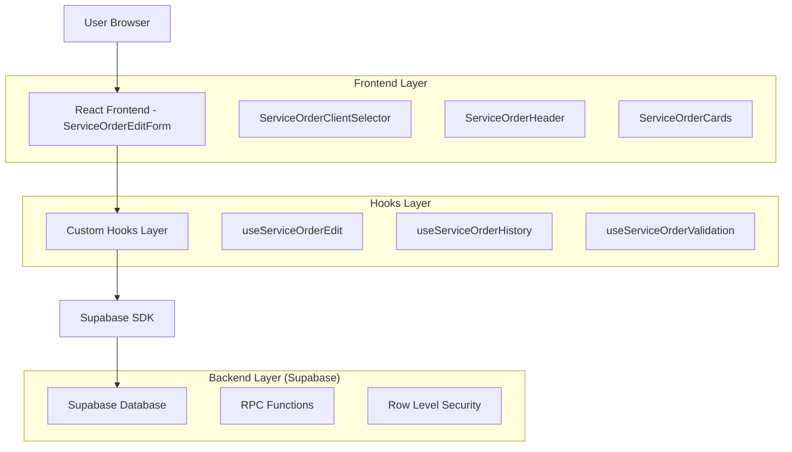
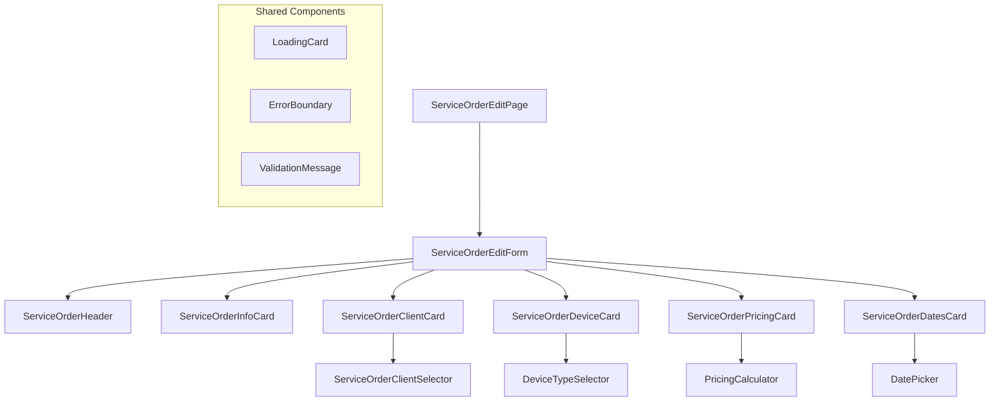
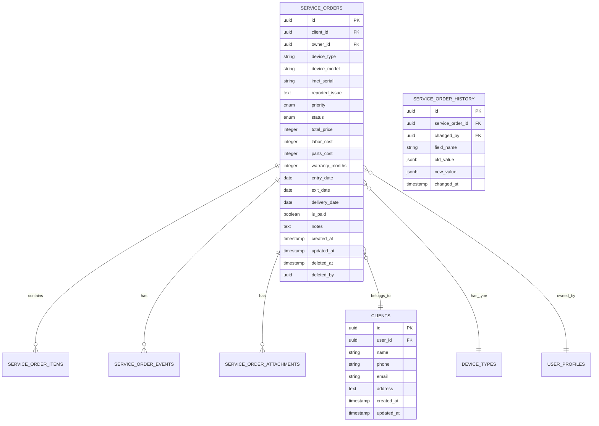

# Arquitetura Técnica - Melhorias na Edição de Ordens de Serviço

## 1. Arquitetura Geral



## 2. Tecnologias e Dependências

### 2.1 Frontend

* **React\@18** + **TypeScript** - Base da aplicação

* **React Hook Form** - Gestão de formulários

* **Zod** - Validação de esquemas

* **TanStack Query** - Cache e sincronização de dados

* **Tailwind CSS** - Estilização

* **Shadcn/ui** - Componentes de interface

* **Lucide React** - Ícones

* **Sonner** - Notificações toast

### 2.2 Backend

* **Supabase** - Backend as a Service

* **PostgreSQL** - Banco de dados

* **Row Level Security (RLS)** - Segurança de dados

* **Supabase Functions** - Lógica server-side

## 3. Definições de Rotas

| Rota                       | Propósito                        | Componente              |
| -------------------------- | -------------------------------- | ----------------------- |
| `/service-orders/:id/edit` | Edição de ordem de serviço       | ServiceOrderEditPage    |
| `/service-orders/:id`      | Visualização de ordem de serviço | ServiceOrderDetailsPage |
| `/service-orders/new`      | Criação de nova ordem de serviço | ServiceOrderFormPage    |
| `/service-orders`          | Listagem de ordens de serviço    | ServiceOrdersPageSimple |

## 4. Definições de API

### 4.1 Core APIs

#### Buscar dados completos para edição

```typescript
// RPC Function
get_service_order_edit_data(p_service_order_id: UUID)
```

**Request:**

| Param Name            | Param Type | isRequired | Description            |
| --------------------- | ---------- | ---------- | ---------------------- |
| p\_service\_order\_id | UUID       | true       | ID da ordem de serviço |

**Response:**

| Param Name      | Param Type | Description                |
| --------------- | ---------- | -------------------------- |
| service\_order  | JSONB      | Dados completos da OS      |
| client\_data    | JSONB      | Dados do cliente associado |
| change\_history | JSONB\[]   | Histórico de alterações    |
| attachments     | JSONB\[]   | Anexos da OS               |

**Example Response:**

```json
{
  "service_order": {
    "id": "123e4567-e89b-12d3-a456-426614174000",
    "formatted_id": "OS-0001",
    "device_type": "Smartphone",
    "device_model": "iPhone 14",
    "status": "in_progress",
    "priority": "high",
    "total_price": 25000,
    "created_at": "2024-01-15T10:30:00Z"
  },
  "client_data": {
    "id": "456e7890-e89b-12d3-a456-426614174001",
    "name": "João Silva",
    "phone": "+5511999999999",
    "email": "joao@email.com"
  },
  "change_history": [
    {
      "changed_at": "2024-01-15T14:30:00Z",
      "changed_by": "user@email.com",
      "field": "status",
      "old_value": "opened",
      "new_value": "in_progress"
    }
  ],
  "attachments": [
    {
      "id": "789e0123-e89b-12d3-a456-426614174002",
      "filename": "device_photo.jpg",
      "url": "https://storage.url/file.jpg",
      "type": "image"
    }
  ]
}
```

#### Atualizar ordem de serviço

```typescript
// RPC Function
update_service_order_with_history(p_service_order_id: UUID, p_updates: JSONB)
```

**Request:**

| Param Name            | Param Type | isRequired | Description               |
| --------------------- | ---------- | ---------- | ------------------------- |
| p\_service\_order\_id | UUID       | true       | ID da ordem de serviço    |
| p\_updates            | JSONB      | true       | Dados a serem atualizados |

**Response:**

| Param Name      | Param Type | Description                |
| --------------- | ---------- | -------------------------- |
| success         | boolean    | Status da operação         |
| updated\_fields | string\[]  | Campos que foram alterados |

### 4.2 APIs de Suporte

#### Buscar histórico de alterações

```typescript
GET /api/service-orders/:id/history
```

#### Upload de anexos

```typescript
POST /api/service-orders/:id/attachments
```

#### Enviar notificação para cliente

```typescript
POST /api/service-orders/:id/notify-client
```

## 5. Arquitetura de Componentes



### 5.1 Componentes Principais

#### ServiceOrderEditForm

```typescript
interface ServiceOrderEditFormProps {
  serviceOrderId: string;
  onSuccess: () => void;
  onCancel: () => void;
}

export const ServiceOrderEditForm = ({ 
  serviceOrderId, 
  onSuccess, 
  onCancel 
}: ServiceOrderEditFormProps) => {
  const { data, isLoading, error } = useServiceOrderEdit(serviceOrderId);
  const { register, handleSubmit, formState } = useForm<ServiceOrderFormData>({
    resolver: zodResolver(serviceOrderSchema)
  });
  
  // Implementação...
};
```

#### ServiceOrderClientSelector

```typescript
interface ServiceOrderClientSelectorProps {
  selectedClientId: string | null;
  onClientSelect: (client: Client, clientId?: string) => void;
  placeholder?: string;
  disabled?: boolean;
}

export const ServiceOrderClientSelector = ({ 
  selectedClientId, 
  onClientSelect, 
  placeholder = "Selecione um cliente",
  disabled = false 
}: ServiceOrderClientSelectorProps) => {
  // Similar ao WormClientSelector
};
```

### 5.2 Hooks Customizados

#### useServiceOrderEdit

```typescript
export const useServiceOrderEdit = (serviceOrderId: string) => {
  return useQuery({
    queryKey: ['service-order-edit', serviceOrderId],
    queryFn: async () => {
      const { data, error } = await supabase
        .rpc('get_service_order_edit_data', { 
          p_service_order_id: serviceOrderId 
        });
      
      if (error) throw error;
      return data[0];
    },
    enabled: !!serviceOrderId,
    staleTime: 5 * 60 * 1000, // 5 minutos
    cacheTime: 10 * 60 * 1000, // 10 minutos
  });
};
```

#### useServiceOrderUpdate

```typescript
export const useServiceOrderUpdate = () => {
  const queryClient = useQueryClient();
  
  return useMutation({
    mutationFn: async ({ id, updates }: { id: string; updates: Partial<ServiceOrder> }) => {
      const { data, error } = await supabase
        .rpc('update_service_order_with_history', {
          p_service_order_id: id,
          p_updates: updates
        });
      
      if (error) throw error;
      return data;
    },
    onSuccess: (data, variables) => {
      // Invalidar cache relacionado
      queryClient.invalidateQueries(['service-order-edit', variables.id]);
      queryClient.invalidateQueries(['service-orders']);
      
      toast.success('Ordem de serviço atualizada com sucesso');
    },
    onError: (error) => {
      console.error('Erro ao atualizar ordem de serviço:', error);
      toast.error('Erro ao atualizar ordem de serviço');
    }
  });
};
```

## 6. Modelo de Dados

### 6.1 Diagrama ER



### 6.2 DDL (Data Definition Language)

#### Tabela de Histórico de Alterações

```sql
-- Criar tabela de histórico
CREATE TABLE service_order_history (
    id UUID PRIMARY KEY DEFAULT gen_random_uuid(),
    service_order_id UUID NOT NULL REFERENCES service_orders(id) ON DELETE CASCADE,
    changed_by UUID NOT NULL REFERENCES auth.users(id),
    field_name VARCHAR(100) NOT NULL,
    old_value JSONB,
    new_value JSONB,
    changed_at TIMESTAMP WITH TIME ZONE DEFAULT NOW()
);

-- Índices para performance
CREATE INDEX idx_service_order_history_service_order_id 
ON service_order_history(service_order_id);

CREATE INDEX idx_service_order_history_changed_at 
ON service_order_history(changed_at DESC);

-- RLS Policy
ALTER TABLE service_order_history ENABLE ROW LEVEL SECURITY;

CREATE POLICY "service_order_history_select_policy" ON service_order_history
    FOR SELECT USING (
        EXISTS (
            SELECT 1 FROM service_orders so
            WHERE so.id = service_order_history.service_order_id
            AND ((so.owner_id = auth.uid()) OR public.is_current_user_admin())
        )
    );
```

#### Função para Atualização com Histórico

```sql
CREATE OR REPLACE FUNCTION update_service_order_with_history(
    p_service_order_id UUID,
    p_updates JSONB
)
RETURNS TABLE (
    success BOOLEAN,
    updated_fields TEXT[]
)
LANGUAGE plpgsql
SECURITY DEFINER
AS $$
DECLARE
    v_old_record service_orders%ROWTYPE;
    v_field TEXT;
    v_old_value JSONB;
    v_new_value JSONB;
    v_updated_fields TEXT[] := ARRAY[]::TEXT[];
BEGIN
    -- Verificar permissões
    IF NOT EXISTS (
        SELECT 1 FROM service_orders 
        WHERE id = p_service_order_id 
        AND ((owner_id = auth.uid()) OR public.is_current_user_admin())
    ) THEN
        RAISE EXCEPTION 'Acesso negado ou ordem de serviço não encontrada';
    END IF;
    
    -- Buscar registro atual
    SELECT * INTO v_old_record 
    FROM service_orders 
    WHERE id = p_service_order_id;
    
    -- Iterar sobre os campos a serem atualizados
    FOR v_field IN SELECT jsonb_object_keys(p_updates)
    LOOP
        -- Obter valores antigo e novo
        EXECUTE format('SELECT to_jsonb($1.%I)', v_field) 
        USING v_old_record INTO v_old_value;
        
        v_new_value := p_updates->v_field;
        
        -- Se os valores são diferentes, registrar no histórico
        IF v_old_value IS DISTINCT FROM v_new_value THEN
            INSERT INTO service_order_history (
                service_order_id,
                changed_by,
                field_name,
                old_value,
                new_value
            ) VALUES (
                p_service_order_id,
                auth.uid(),
                v_field,
                v_old_value,
                v_new_value
            );
            
            v_updated_fields := array_append(v_updated_fields, v_field);
        END IF;
    END LOOP;
    
    -- Atualizar o registro principal
    IF array_length(v_updated_fields, 1) > 0 THEN
        UPDATE service_orders 
        SET 
            device_type = COALESCE((p_updates->>'device_type')::VARCHAR, device_type),
            device_model = COALESCE((p_updates->>'device_model')::VARCHAR, device_model),
            imei_serial = COALESCE((p_updates->>'imei_serial')::VARCHAR, imei_serial),
            reported_issue = COALESCE((p_updates->>'reported_issue')::TEXT, reported_issue),
            priority = COALESCE((p_updates->>'priority')::service_order_priority, priority),
            status = COALESCE((p_updates->>'status')::service_order_status, status),
            total_price = COALESCE((p_updates->>'total_price')::INTEGER, total_price),
            labor_cost = COALESCE((p_updates->>'labor_cost')::INTEGER, labor_cost),
            parts_cost = COALESCE((p_updates->>'parts_cost')::INTEGER, parts_cost),
            warranty_months = COALESCE((p_updates->>'warranty_months')::INTEGER, warranty_months),
            entry_date = COALESCE((p_updates->>'entry_date')::DATE, entry_date),
            exit_date = COALESCE((p_updates->>'exit_date')::DATE, exit_date),
            delivery_date = COALESCE((p_updates->>'delivery_date')::DATE, delivery_date),
            is_paid = COALESCE((p_updates->>'is_paid')::BOOLEAN, is_paid),
            notes = COALESCE((p_updates->>'notes')::TEXT, notes),
            updated_at = NOW()
        WHERE id = p_service_order_id;
    END IF;
    
    RETURN QUERY SELECT TRUE, v_updated_fields;
END;
$$;

-- Conceder permissões
GRANT EXECUTE ON FUNCTION update_service_order_with_history(UUID, JSONB) 
TO authenticated;
```

#### Função para Buscar Dados de Edição

```sql
CREATE OR REPLACE FUNCTION get_service_order_edit_data(
    p_service_order_id UUID
)
RETURNS TABLE (
    service_order JSONB,
    client_data JSONB,
    change_history JSONB,
    attachments JSONB
)
LANGUAGE plpgsql
SECURITY DEFINER
AS $$
BEGIN
    -- Verificar permissões
    IF NOT EXISTS (
        SELECT 1 FROM service_orders 
        WHERE id = p_service_order_id 
        AND ((owner_id = auth.uid()) OR public.is_current_user_admin())
        AND deleted_at IS NULL
    ) THEN
        RAISE EXCEPTION 'Acesso negado ou ordem de serviço não encontrada';
    END IF;
    
    RETURN QUERY
    SELECT 
        -- Dados da ordem de serviço
        to_jsonb(so.*) as service_order,
        
        -- Dados do cliente
        CASE 
            WHEN c.id IS NOT NULL THEN to_jsonb(c.*)
            ELSE NULL
        END as client_data,
        
        -- Histórico de alterações (últimas 50)
        COALESCE(
            (
                SELECT jsonb_agg(
                    jsonb_build_object(
                        'id', h.id,
                        'field_name', h.field_name,
                        'old_value', h.old_value,
                        'new_value', h.new_value,
                        'changed_at', h.changed_at,
                        'changed_by_email', u.email
                    ) ORDER BY h.changed_at DESC
                )
                FROM service_order_history h
                LEFT JOIN auth.users u ON h.changed_by = u.id
                WHERE h.service_order_id = so.id
                LIMIT 50
            ),
            '[]'::jsonb
        ) as change_history,
        
        -- Anexos
        COALESCE(
            (
                SELECT jsonb_agg(
                    jsonb_build_object(
                        'id', a.id,
                        'filename', a.filename,
                        'file_path', a.file_path,
                        'file_size', a.file_size,
                        'content_type', a.content_type,
                        'uploaded_at', a.uploaded_at
                    )
                )
                FROM service_order_attachments a
                WHERE a.service_order_id = so.id
            ),
            '[]'::jsonb
        ) as attachments
        
    FROM service_orders so
    LEFT JOIN clients c ON so.client_id = c.id
    WHERE so.id = p_service_order_id
    AND so.deleted_at IS NULL;
END;
$$;

-- Conceder permissões
GRANT EXECUTE ON FUNCTION get_service_order_edit_data(UUID) 
TO authenticated;
```

## 7. Considerações de Performance

### 7.1 Otimizações de Query

* Índices compostos para consultas frequentes

* Paginação para histórico de alterações

* Cache de dados de cliente

* Lazy loading de anexos

### 7.2 Otimizações de Frontend

* Debounce em campos de busca

* Virtualização para listas grandes

* Memoização de componentes pesados

* Code splitting por rota

### 7.3 Métricas de Performance

* Tempo de carregamento inicial < 2s

* Tempo de salvamento < 1s

* First Contentful Paint < 1.5s

* Largest Contentful Paint < 2.5s

## 8. Segurança

### 8.1 Autenticação e Autorização

* JWT tokens via Supabase Auth

* Row Level Security (RLS) em todas as tabelas

* Verificação de propriedade em todas as operações

* Rate limiting em APIs sensíveis

### 8.2 Validação de Dados

* Validação client-side com Zod

* Validação server-side em RPC functions

* Sanitização de inputs

* Prevenção de SQL injection

### 8.3 Auditoria

* Log completo de alterações

* Rastreamento de usuário

* Timestamps em todas as operações

* Backup automático antes de alterações críticas

## 9. Monitoramento e Observabilidade

### 9.1 Métricas de Aplicação

* Tempo de resposta das APIs

* Taxa de erro por endpoint

* Uso de recursos (CPU, memória)

* Número de usuários ativos

### 9.2 Métricas de Negócio

* Tempo médio de edição de OS

* Taxa de conclusão de edições

* Número de campos alterados por edição

* Satisfação do usuário (NPS)

### 9.3 Alertas

* Erro rate > 5%

* Tempo de resposta > 5s

* Falhas de autenticação

* Uso excessivo de recursos

## 10. Deployment e DevOps

### 10.1 Pipeline de Deploy

1. **Development** - Ambiente local com Supabase local
2. **Staging** - Ambiente de testes com dados sintéticos
3. **Production** - Ambiente de produção

### 10.2 Estratégia de Release

* Feature flags para rollout gradual

* Blue-green deployment

* Rollback automático em caso de erro

* Testes automatizados em cada stage

### 10.3 Backup e Recovery

* Backup diário do banco de dados

* Replicação em tempo real

* Plano de disaster recovery

* RTO < 4 horas, RPO < 1 hora

