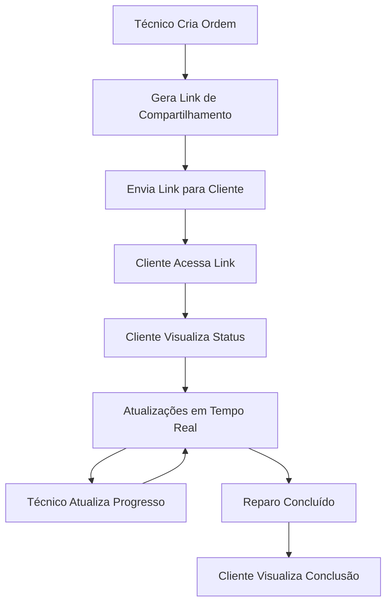

# Documento de Requisitos do Produto - Sistema Service Orders Reestruturado

## 1. Visão Geral do Produto

O sistema de Service Orders será transformado em uma plataforma moderna de acompanhamento de reparos em tempo real, focada na experiência do cliente. O sistema permitirá que técnicos criem e gerenciem ordens de serviço através de links compartilháveis, enquanto clientes acompanham o progresso de seus equipamentos em tempo real através de uma interface pública intuitiva.

- **Objetivo Principal**: Criar transparência total no processo de reparo, permitindo que clientes acompanhem cada etapa do serviço sem necessidade de contato direto.
- **Valor de Mercado**: Diferenciação competitiva através de transparência e comunicação proativa, aumentando a satisfação e confiança do cliente.

## 2. Funcionalidades Principais

### 2.1 Papéis de Usuário

| Papel | Método de Registro | Permissões Principais |
|-------|-------------------|----------------------|
| Técnico/Admin | Login existente no sistema | Criar, editar e gerenciar ordens de serviço; Gerar links de compartilhamento; Atualizar status e progresso |
| Cliente | Acesso via link compartilhado (sem registro) | Visualizar status do reparo; Acompanhar timeline; Ver informações de pagamento |

### 2.2 Módulos de Funcionalidade

O sistema reestruturado consiste nas seguintes páginas principais:

1. **Painel de Gestão de Links**: Interface para técnicos criarem e gerenciarem links compartilháveis das ordens de serviço.
2. **Página de Acompanhamento Público**: Interface para clientes visualizarem o progresso do reparo em tempo real.
3. **Formulário de Ordem de Serviço**: Criação e edição de ordens de serviço com foco em informações técnicas.

### 2.3 Detalhes das Páginas

| Nome da Página | Nome do Módulo | Descrição da Funcionalidade |
|----------------|----------------|----------------------------|
| Painel de Gestão (/service-orders) | Lista de Ordens | Exibir todas as ordens de serviço com preview expandido; Botões para gerar/copiar links de compartilhamento; Filtros por status, prioridade e data |
| Painel de Gestão | Ações de Compartilhamento | Gerar novos tokens de compartilhamento; Copiar links para área de transferência; Compartilhar via WhatsApp; Visualizar estatísticas de acesso |
| Acompanhamento Público (/share/service-order/:token) | Informações do Equipamento | Mostrar tipo, modelo e problema reportado do equipamento; Exibir data de recebimento e previsão de conclusão |
| Acompanhamento Público | Timeline de Progresso | Timeline visual com todas as atualizações do reparo; Indicadores de status atual; Histórico completo de mudanças |
| Acompanhamento Público | Status de Pagamento | Card dedicado mostrando status atual do pagamento; Indicadores visuais claros (pendente, parcial, pago, em atraso) |
| Acompanhamento Público | Atualizações em Tempo Real | Conexão WebSocket para atualizações automáticas; Indicador de conectividade; Notificações de novas atualizações |
| Formulário de Ordem (/service-orders/new, /service-orders/:id/edit) | Dados do Equipamento | Campos para tipo, modelo, IMEI/serial e problema reportado; Informações do cliente |
| Formulário de Ordem | Configurações de Serviço | Status, prioridade, datas estimadas; Notas técnicas e do cliente; Configurações de visibilidade |
| Formulário de Ordem | Gestão de Pagamento | Seletor de status de pagamento; Campos para observações sobre pagamento |

## 3. Fluxo Principal de Processos

### Fluxo do Técnico/Admin:
1. **Criação da Ordem**: Técnico recebe equipamento e cria nova ordem de serviço
2. **Configuração Inicial**: Define status inicial, prioridade e estimativa de conclusão
3. **Geração de Link**: Gera link de compartilhamento para o cliente
4. **Compartilhamento**: Envia link via WhatsApp ou copia para envio manual
5. **Atualizações**: Atualiza status, progresso e informações conforme reparo avança
6. **Finalização**: Marca como concluído e atualiza status de pagamento

### Fluxo do Cliente:
1. **Acesso ao Link**: Cliente recebe e acessa link compartilhado
2. **Visualização Inicial**: Vê informações do equipamento e status atual
3. **Acompanhamento**: Monitora timeline de progresso em tempo real
4. **Notificações**: Recebe atualizações automáticas sobre mudanças
5. **Finalização**: Visualiza conclusão do reparo e status de pagamento

## 4. Design da Interface do Usuário

### 4.1 Estilo de Design

- **Cores Primárias**: Azul (#3B82F6) para elementos principais, Verde (#10B981) para status positivos
- **Cores Secundárias**: Amarelo (#F59E0B) para avisos, Vermelho (#EF4444) para alertas
- **Estilo de Botões**: Arredondados com sombra sutil, estados hover bem definidos
- **Tipografia**: Inter ou similar, tamanhos 14px (corpo), 16px (títulos), 12px (legendas)
- **Layout**: Design responsivo mobile-first, cards para organização de conteúdo
- **Ícones**: Lucide React para consistência, estilo outline

### 4.2 Visão Geral do Design das Páginas

| Nome da Página | Nome do Módulo | Elementos da UI |
|----------------|----------------|-----------------|
| Painel de Gestão | Lista de Ordens | Cards expandidos com informações completas; Badges coloridos para status; Botões de ação prominentes; Filtros em sidebar |
| Painel de Gestão | Ações de Compartilhamento | Modal para geração de links; Botões de cópia com feedback visual; Integração WhatsApp; QR Code para acesso rápido |
| Acompanhamento Público | Header da Empresa | Logo e informações da empresa; Breadcrumb com ID da ordem; Indicador de última atualização |
| Acompanhamento Público | Timeline de Progresso | Timeline vertical com ícones coloridos; Cards para cada evento; Animações suaves para novas atualizações |
| Acompanhamento Público | Status de Pagamento | Card destacado com cores específicas; Ícones intuitivos; Descrições claras do status |
| Formulário de Ordem | Campos de Entrada | Inputs com validação em tempo real; Selects estilizados; Textarea para observações; Toggle switches para opções |

### 4.3 Responsividade

O sistema é projetado mobile-first com adaptação completa para desktop:
- **Mobile**: Layout em coluna única, navegação por tabs, cards empilhados
- **Tablet**: Layout híbrido com sidebar colapsável, cards em grid 2x2
- **Desktop**: Layout completo com sidebar fixa, múltiplas colunas, hover states
- **Interação Touch**: Botões com área mínima de 44px, gestos de swipe para navegação

## 5. Requisitos Funcionais Detalhados

### 5.1 Gestão de Ordens de Serviço

**RF001 - Criação de Ordem de Serviço**
- Sistema deve permitir criação de nova ordem com campos obrigatórios: tipo de equipamento, modelo, problema reportado
- Deve gerar automaticamente ID formatado e timestamp de criação
- Deve definir status inicial como "opened" e prioridade padrão como "medium"

**RF002 - Edição de Ordem de Serviço**
- Sistema deve permitir edição de todos os campos exceto ID e data de criação
- Mudanças devem ser registradas automaticamente no histórico de eventos
- Deve validar campos obrigatórios antes de salvar

**RF003 - Remoção de Valores Monetários**
- Interface não deve exibir campos de preço (total_price, labor_cost, parts_cost)
- Campos devem permanecer no banco para compatibilidade, mas ocultos na UI
- Foco deve ser em informações técnicas e de progresso

### 5.2 Sistema de Compartilhamento

**RF004 - Geração de Links de Compartilhamento**
- Sistema deve gerar tokens únicos e seguros para cada ordem
- Links devem ter validade configurável (padrão: 90 dias)
- Deve permitir regeneração de tokens quando necessário

**RF005 - Acesso Público via Token**
- Página pública deve carregar dados da ordem via token válido
- Deve exibir apenas informações relevantes para o cliente
- Deve registrar acessos para auditoria

**RF006 - Compartilhamento via WhatsApp**
- Sistema deve gerar mensagem formatada com link
- Deve incluir informações básicas da ordem na mensagem
- Deve abrir WhatsApp Web ou app nativo conforme dispositivo

### 5.3 Atualizações em Tempo Real

**RF007 - Conexão em Tempo Real**
- Sistema deve estabelecer conexão WebSocket via Supabase Realtime
- Deve implementar fallback com polling a cada 30 segundos
- Deve exibir indicador de status de conectividade

**RF008 - Notificações de Atualização**
- Cliente deve receber notificações visuais de novas atualizações
- Sistema deve destacar mudanças recentes na timeline
- Deve manter histórico de todas as atualizações

### 5.4 Gestão de Status e Pagamento

**RF009 - Controle de Status de Pagamento**
- Sistema deve suportar status: pendente, parcial, pago, em atraso
- Mudanças devem ser registradas no histórico de eventos
- Deve exibir status de forma clara e intuitiva

**RF010 - Timeline de Eventos**
- Sistema deve registrar automaticamente mudanças relevantes
- Deve permitir adição manual de notas técnicas e do cliente
- Timeline deve ser ordenada cronologicamente (mais recente primeiro)

## 6. Requisitos Não Funcionais

### 6.1 Performance

- **Tempo de carregamento**: Página pública deve carregar em menos de 2 segundos
- **Atualizações em tempo real**: Latência máxima de 5 segundos para propagação
- **Capacidade**: Sistema deve suportar até 1000 ordens ativas simultaneamente

### 6.2 Segurança

- **Tokens de compartilhamento**: Devem ser únicos, não previsíveis e com expiração
- **Acesso público**: Apenas dados não sensíveis devem ser expostos
- **Auditoria**: Todos os acessos e mudanças devem ser registrados

### 6.3 Usabilidade

- **Interface intuitiva**: Cliente deve conseguir entender status sem treinamento
- **Responsividade**: Funcionalidade completa em dispositivos móveis
- **Acessibilidade**: Conformidade com WCAG 2.1 nível AA

### 6.4 Confiabilidade

- **Disponibilidade**: 99.5% de uptime durante horário comercial
- **Recuperação**: Reconexão automática em caso de perda de conectividade
- **Backup**: Dados devem ser preservados mesmo em caso de falhas

## 7. Critérios de Aceitação

### 7.1 Funcionalidade Principal

- ✅ Técnico consegue criar ordem de serviço sem campos de preço
- ✅ Sistema gera link de compartilhamento automaticamente
- ✅ Cliente acessa link e visualiza informações da ordem
- ✅ Atualizações aparecem em tempo real na página do cliente
- ✅ Timeline mostra histórico completo de mudanças

### 7.2 Interface do Usuário

- ✅ Design responsivo funciona em mobile, tablet e desktop
- ✅ Status de pagamento é claramente visível e compreensível
- ✅ Timeline é visualmente atrativa e fácil de seguir
- ✅ Indicadores de conectividade funcionam corretamente

### 7.3 Performance e Confiabilidade

- ✅ Página pública carrega em menos de 2 segundos
- ✅ Atualizações em tempo real têm latência menor que 5 segundos
- ✅ Sistema funciona offline com sincronização posterior
- ✅ Todos os eventos são registrados corretamente

Este documento de requisitos serve como base para o desenvolvimento da nova versão do sistema de Service Orders, garantindo que todas as funcionalidades atendam às necessidades dos usuários e aos objetivos de negócio.