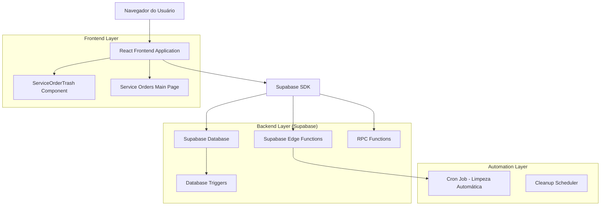
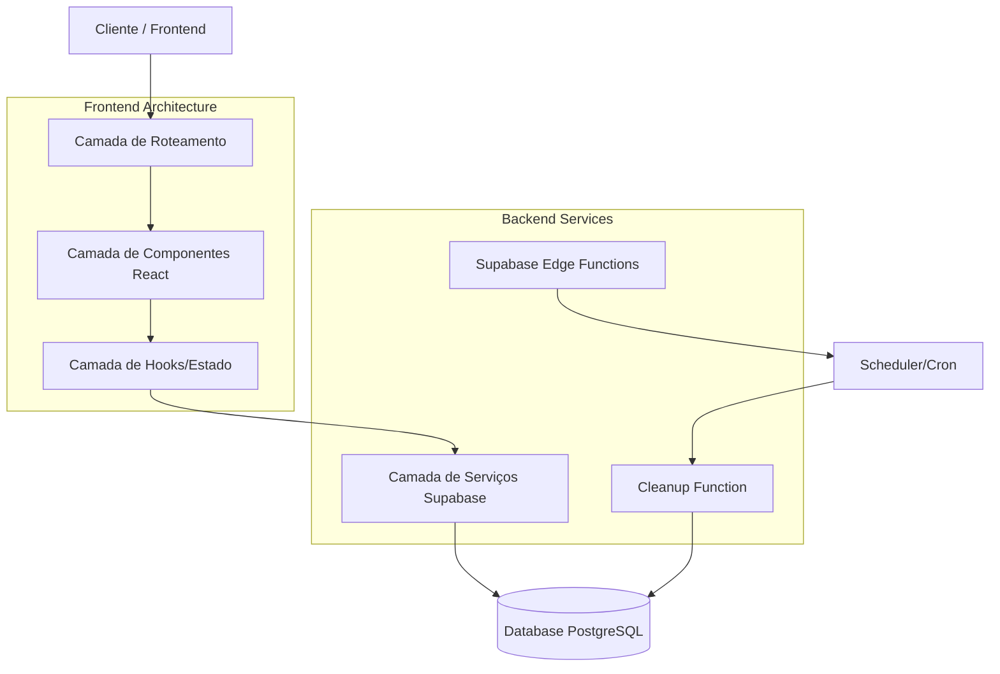
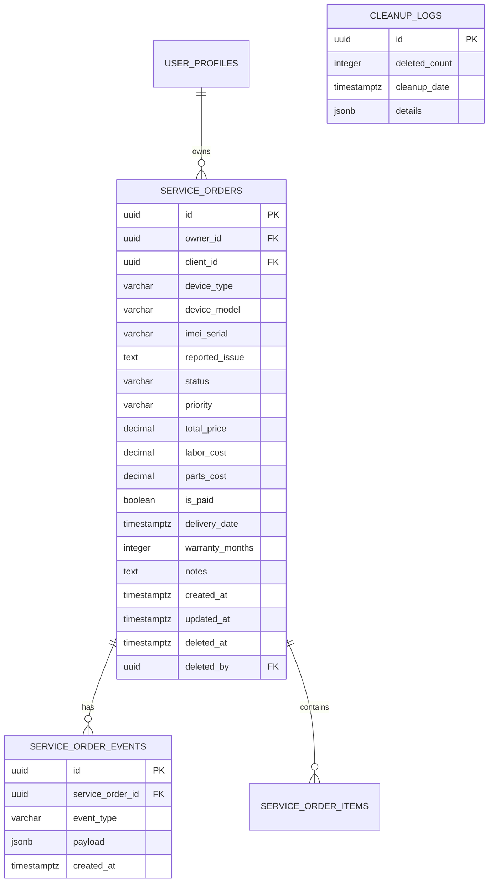

# Arquitetura Técnica - Sistema de Lixeira para Ordens de Serviço

## 1. Design da Arquitetura



## 2. Descrição da Tecnologia

- **Frontend**: React@18 + TypeScript + TailwindCSS@3 + Vite
- **Backend**: Supabase (PostgreSQL + Edge Functions)
- **Roteamento**: React Router v6
- **Estado**: TanStack Query v4 para cache e sincronização
- **UI Components**: Shadcn/ui + Lucide React icons
- **Automação**: Supabase Edge Functions com cron jobs

## 3. Definições de Rotas

| Rota | Propósito |
|------|-----------|
| `/service-orders` | Página principal de ordens de serviço com link para lixeira |
| `/service-orders/trash` | Interface da lixeira para gerenciar ordens excluídas |
| `/service-orders/new` | Criar nova ordem de serviço |
| `/service-orders/:id/edit` | Editar ordem de serviço existente |

## 4. Definições de API

### 4.1 APIs Principais do Sistema de Lixeira

**Obter ordens excluídas**
```
RPC: get_deleted_service_orders()
```

Parâmetros: Nenhum

Resposta:
| Nome do Parâmetro | Tipo | Descrição |
|-------------------|------|-----------|
| id | UUID | ID único da ordem de serviço |
| device_type | string | Tipo do dispositivo |
| device_model | string | Modelo do dispositivo |
| deleted_at | timestamp | Data/hora da exclusão |
| deleted_by | UUID | ID do usuário que excluiu |

**Restaurar ordem de serviço**
```
RPC: restore_service_order(service_order_id)
```

Parâmetros:
| Nome do Parâmetro | Tipo | Obrigatório | Descrição |
|-------------------|------|-------------|-----------|
| service_order_id | UUID | true | ID da ordem a ser restaurada |

Resposta:
| Nome do Parâmetro | Tipo | Descrição |
|-------------------|------|-----------|
| success | boolean | Status da operação |

**Exclusão permanente individual**
```
RPC: hard_delete_service_order(service_order_id)
```

Parâmetros:
| Nome do Parâmetro | Tipo | Obrigatório | Descrição |
|-------------------|------|-------------|-----------|
| service_order_id | UUID | true | ID da ordem a ser excluída permanentemente |

**Esvaziar lixeira completa**
```
RPC: empty_service_orders_trash()
```

Resposta:
| Nome do Parâmetro | Tipo | Descrição |
|-------------------|------|-----------|
| deleted_count | integer | Número de ordens excluídas permanentemente |

**Limpeza automática (nova função)**
```
RPC: cleanup_old_deleted_service_orders()
```

Resposta:
| Nome do Parâmetro | Tipo | Descrição |
|-------------------|------|-----------|
| deleted_count | integer | Número de ordens limpas automaticamente |
| cleanup_date | timestamp | Data/hora da limpeza |

## 5. Arquitetura do Servidor



## 6. Modelo de Dados

### 6.1 Definição do Modelo de Dados



### 6.2 Linguagem de Definição de Dados

**Tabela service_orders (já existente - campos relevantes para lixeira)**
```sql
-- Campos específicos para sistema de lixeira
ALTER TABLE service_orders 
ADD COLUMN IF NOT EXISTS deleted_at TIMESTAMPTZ DEFAULT NULL,
ADD COLUMN IF NOT EXISTS deleted_by UUID REFERENCES auth.users(id);

-- Índices para performance da lixeira
CREATE INDEX IF NOT EXISTS idx_service_orders_deleted_at 
ON service_orders(deleted_at) WHERE deleted_at IS NOT NULL;

CREATE INDEX IF NOT EXISTS idx_service_orders_deleted_by 
ON service_orders(deleted_by) WHERE deleted_by IS NOT NULL;
```

**Nova tabela para logs de limpeza automática**
```sql
-- Tabela para auditoria de limpeza automática
CREATE TABLE IF NOT EXISTS cleanup_logs (
    id UUID PRIMARY KEY DEFAULT gen_random_uuid(),
    deleted_count INTEGER NOT NULL DEFAULT 0,
    cleanup_date TIMESTAMPTZ DEFAULT NOW(),
    details JSONB DEFAULT '{}',
    created_at TIMESTAMPTZ DEFAULT NOW()
);

-- Índice para consultas de auditoria
CREATE INDEX idx_cleanup_logs_cleanup_date 
ON cleanup_logs(cleanup_date DESC);

-- Permissões
GRANT SELECT ON cleanup_logs TO authenticated;
GRANT ALL PRIVILEGES ON cleanup_logs TO service_role;
```

**Nova função RPC para limpeza automática**
```sql
-- Função para limpeza automática de ordens > 30 dias
CREATE OR REPLACE FUNCTION cleanup_old_deleted_service_orders()
RETURNS TABLE(deleted_count INTEGER, cleanup_date TIMESTAMPTZ)
LANGUAGE plpgsql
SECURITY DEFINER
AS $$
DECLARE
    v_deleted_count INTEGER;
    v_cleanup_date TIMESTAMPTZ;
    v_order_ids UUID[];
BEGIN
    v_cleanup_date := NOW();
    
    -- Buscar IDs das ordens para excluir (> 30 dias na lixeira)
    SELECT array_agg(id) INTO v_order_ids
    FROM service_orders 
    WHERE deleted_at IS NOT NULL 
    AND deleted_at < (NOW() - INTERVAL '30 days');
    
    -- Se não há ordens para excluir
    IF v_order_ids IS NULL THEN
        v_deleted_count := 0;
    ELSE
        -- Excluir eventos relacionados primeiro
        DELETE FROM service_order_events 
        WHERE service_order_id = ANY(v_order_ids);
        
        -- Excluir as ordens permanentemente
        DELETE FROM service_orders 
        WHERE id = ANY(v_order_ids);
        
        GET DIAGNOSTICS v_deleted_count = ROW_COUNT;
    END IF;
    
    -- Registrar log de limpeza
    INSERT INTO cleanup_logs (deleted_count, cleanup_date, details)
    VALUES (
        v_deleted_count, 
        v_cleanup_date,
        jsonb_build_object(
            'order_ids', v_order_ids,
            'threshold_date', (NOW() - INTERVAL '30 days')
        )
    );
    
    RETURN QUERY SELECT v_deleted_count, v_cleanup_date;
END;
$$;

-- Permissões para a função
GRANT EXECUTE ON FUNCTION cleanup_old_deleted_service_orders() TO service_role;
```

**Edge Function para automação (deploy separado)**
```typescript
// supabase/functions/cleanup-service-orders/index.ts
import { serve } from "https://deno.land/std@0.168.0/http/server.ts"
import { createClient } from 'https://esm.sh/@supabase/supabase-js@2'

serve(async (req) => {
  try {
    const supabase = createClient(
      Deno.env.get('SUPABASE_URL') ?? '',
      Deno.env.get('SUPABASE_SERVICE_ROLE_KEY') ?? ''
    )
    
    const { data, error } = await supabase
      .rpc('cleanup_old_deleted_service_orders')
    
    if (error) throw error
    
    return new Response(
      JSON.stringify({ 
        success: true, 
        result: data 
      }),
      { headers: { "Content-Type": "application/json" } }
    )
  } catch (error) {
    return new Response(
      JSON.stringify({ 
        success: false, 
        error: error.message 
      }),
      { status: 500, headers: { "Content-Type": "application/json" } }
    )
  }
})
```