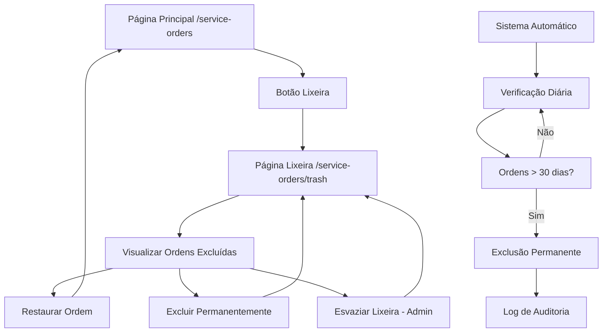

# Sistema de Lixeira para Ordens de Serviço - PRD

## 1. Visão Geral do Produto

Sistema de lixeira inteligente para ordens de serviço que permite recuperação de dados excluídos acidentalmente e limpeza automática após 30 dias. O sistema oferece uma camada adicional de segurança para dados críticos do negócio, permitindo que usuários restaurem ordens de serviço excluídas por engano enquanto mantém a organização através da limpeza automática.

- **Problema a resolver**: Perda acidental de dados importantes de ordens de serviço e necessidade de gerenciamento eficiente de dados excluídos
- **Usuários**: Técnicos, administradores e gerentes que trabalham com ordens de serviço
- **Valor**: Redução de perda de dados críticos e melhoria na confiança do sistema

## 2. Funcionalidades Principais

### 2.1 Papéis de Usuário

| Papel | Método de Acesso | Permissões Principais |
|-------|------------------|----------------------|
| Usuário Padrão | Acesso ao módulo Service Orders (Beta) | Pode visualizar e restaurar suas próprias ordens excluídas |
| Administrador | Perfil admin + módulo Service Orders | Pode gerenciar toda a lixeira, esvaziar completamente e excluir permanentemente |

### 2.2 Módulos de Funcionalidade

O sistema de lixeira consiste nas seguintes páginas principais:

1. **Página de Lixeira**: interface para visualizar, restaurar e gerenciar ordens excluídas
2. **Sistema de Exclusão Automática**: processo em background para limpeza após 30 dias
3. **Integração com Listagem Principal**: acesso direto à lixeira a partir da página de ordens de serviço

### 2.3 Detalhes das Páginas

| Nome da Página | Nome do Módulo | Descrição da Funcionalidade |
|----------------|----------------|----------------------------|
| Lixeira de Ordens | Visualização de Excluídos | Exibir todas as ordens de serviço excluídas com informações de quando foram excluídas e por quem |
| Lixeira de Ordens | Restauração Individual | Restaurar uma ordem de serviço específica de volta ao estado ativo |
| Lixeira de Ordens | Exclusão Permanente | Excluir permanentemente uma ordem específica (não pode ser desfeita) |
| Lixeira de Ordens | Esvaziamento Completo | Excluir permanentemente todas as ordens da lixeira (apenas admin) |
| Sistema Background | Limpeza Automática | Executar limpeza automática de ordens com mais de 30 dias na lixeira |

## 3. Processo Principal

### Fluxo do Usuário Padrão:
1. Usuário acessa `/service-orders` (listagem principal)
2. Clica em "Lixeira" ou acessa diretamente `/service-orders/trash`
3. Visualiza ordens excluídas com opções de restaurar ou excluir permanentemente
4. Pode restaurar ordens individuais ou excluir permanentemente (com confirmação)

### Fluxo do Administrador:
1. Acessa a lixeira com permissões completas
2. Pode esvaziar toda a lixeira de uma vez
3. Tem acesso a relatórios de limpeza automática
4. Pode configurar políticas de retenção

### Fluxo Automático do Sistema:
1. Sistema executa verificação diária (via cron job ou função agendada)
2. Identifica ordens com `deleted_at` > 30 dias
3. Remove permanentemente essas ordens
4. Registra logs de auditoria

## 4. Design da Interface

### 4.1 Estilo de Design

- **Cores Primárias**: Vermelho (#ef4444) para ações destrutivas, Verde (#22c55e) para restauração
- **Cores Secundárias**: Cinza (#6b7280) para elementos neutros, Amarelo (#f59e0b) para avisos
- **Estilo de Botões**: Rounded com ícones, variantes outline e solid
- **Fontes**: Inter, tamanhos 14px (corpo), 16px (títulos), 24px (cabeçalhos)
- **Layout**: Card-based com grid responsivo, navegação superior
- **Ícones**: Lucide React (Trash2, RotateCcw, AlertTriangle, Calendar)

### 4.2 Visão Geral do Design das Páginas

| Nome da Página | Nome do Módulo | Elementos da UI |
|----------------|----------------|-----------------|
| Lixeira | Cabeçalho | Título "Lixeira", contador de itens, botão "Esvaziar Lixeira" (admin) com cor vermelha |
| Lixeira | Lista de Ordens | Cards com borda vermelha à esquerda, informações da ordem, badges de status e prioridade |
| Lixeira | Ações por Item | Botões "Restaurar" (verde, ícone RotateCcw) e "Excluir Permanentemente" (vermelho, ícone Trash2) |
| Lixeira | Estado Vazio | Ícone Trash2 grande, texto "Lixeira vazia", cor cinza suave |
| Lixeira | Confirmações | AlertDialog com ícone AlertTriangle, texto explicativo, botões de confirmação |

### 4.3 Responsividade

- **Desktop-first** com adaptação para mobile
- **Grid responsivo**: 1 coluna em mobile, 2-3 colunas em desktop
- **Otimização touch**: Botões com tamanho mínimo 44px, espaçamento adequado
- **Navegação móvel**: Menu hambúrguer com acesso direto à lixeira