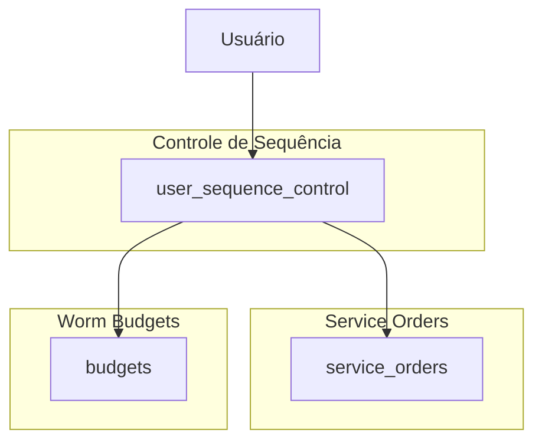

# Sistema de Numeração Sequencial Unificado - Service Orders e Worm Budgets

## 1. Visão Geral do Projeto

Implementação de um sistema de numeração sequencial unificado entre as funcionalidades de Service Orders (/service-orders) e Worm Budgets (/worm), onde cada usuário possui sua própria sequência de numeração OS 0001 até OS 9999. O sistema garante que orçamentos e ordens de serviço compartilhem a mesma sequência numérica por usuário.

## 2. Análise da Implementação Atual

### 2.1 Service Orders - Estado Atual
- **Sistema implementado**: Numeração sequencial global (não por usuário)
- **Formato**: "OS: 0000" (ex: OS: 0001, OS: 0002)
- **Tabela de controle**: `service_order_sequence`
- **Campo na tabela**: `sequential_number` em `service_orders`
- **Função de formatação**: `format_service_order_id(seq_number INTEGER)`
- **Limite**: 0001-9999 com reset automático

### 2.2 Worm Budgets - Estado Atual
- **Sistema implementado**: Apenas UUID
- **Identificação**: Sem numeração sequencial visível
- **Tabela principal**: `budgets`
- **Necessidade**: Implementar numeração sequencial por usuário

## 3. Arquitetura da Solução

### 3.1 Estrutura de Dados Proposta



### 3.2 Tabelas Necessárias

#### Nova Tabela: `user_sequence_control`
```sql
CREATE TABLE user_sequence_control (
  id UUID PRIMARY KEY DEFAULT gen_random_uuid(),
  user_id UUID NOT NULL REFERENCES auth.users(id),
  current_number INTEGER NOT NULL DEFAULT 0,
  last_reset_at TIMESTAMP WITH TIME ZONE DEFAULT NOW(),
  created_at TIMESTAMP WITH TIME ZONE DEFAULT NOW(),
  updated_at TIMESTAMP WITH TIME ZONE DEFAULT NOW(),
  UNIQUE(user_id)
);
```

#### Modificações em `service_orders`
```sql
-- Manter sequential_number mas agora será por usuário
ALTER TABLE service_orders 
ADD COLUMN IF NOT EXISTS user_sequential_number INTEGER;
```

#### Modificações em `budgets`
```sql
-- Adicionar numeração sequencial
ALTER TABLE budgets 
ADD COLUMN IF NOT EXISTS sequential_number INTEGER;
```

## 4. Implementação Técnica

### 4.1 Funções de Controle de Sequência

#### Função Principal: Gerar Número Sequencial por Usuário
```sql
CREATE OR REPLACE FUNCTION generate_user_sequential_number(p_user_id UUID)
RETURNS INTEGER AS $$
DECLARE
  v_current_number INTEGER;
  v_new_number INTEGER;
BEGIN
  -- Lock para evitar concorrência por usuário
  PERFORM pg_advisory_lock(hashtext(p_user_id::text));
  
  -- Obter ou criar registro do usuário
  INSERT INTO user_sequence_control (user_id, current_number)
  VALUES (p_user_id, 0)
  ON CONFLICT (user_id) DO NOTHING;
  
  -- Obter número atual
  SELECT current_number INTO v_current_number 
  FROM user_sequence_control 
  WHERE user_id = p_user_id;
  
  -- Incrementar número
  v_new_number := v_current_number + 1;
  
  -- Reset após 9999
  IF v_new_number > 9999 THEN
    v_new_number := 1;
    UPDATE user_sequence_control 
    SET current_number = v_new_number, 
        last_reset_at = NOW(),
        updated_at = NOW()
    WHERE user_id = p_user_id;
  ELSE
    UPDATE user_sequence_control 
    SET current_number = v_new_number,
        updated_at = NOW()
    WHERE user_id = p_user_id;
  END IF;
  
  -- Liberar lock
  PERFORM pg_advisory_unlock(hashtext(p_user_id::text));
  
  RETURN v_new_number;
END;
$$ LANGUAGE plpgsql;
```

#### Função de Formatação
```sql
CREATE OR REPLACE FUNCTION format_user_sequence_id(seq_number INTEGER)
RETURNS TEXT AS $$
BEGIN
  RETURN 'OS: ' || LPAD(seq_number::TEXT, 4, '0');
END;
$$ LANGUAGE plpgsql IMMUTABLE;
```

### 4.2 Triggers para Atribuição Automática

#### Trigger para Service Orders
```sql
CREATE OR REPLACE FUNCTION assign_user_sequential_number_service_orders()
RETURNS TRIGGER AS $$
BEGIN
  IF NEW.sequential_number IS NULL THEN
    NEW.sequential_number := generate_user_sequential_number(NEW.owner_id);
  END IF;
  RETURN NEW;
END;
$$ LANGUAGE plpgsql;

DROP TRIGGER IF EXISTS trigger_assign_user_sequential_service_orders ON service_orders;
CREATE TRIGGER trigger_assign_user_sequential_service_orders
  BEFORE INSERT ON service_orders
  FOR EACH ROW
  EXECUTE FUNCTION assign_user_sequential_number_service_orders();
```

#### Trigger para Budgets
```sql
CREATE OR REPLACE FUNCTION assign_user_sequential_number_budgets()
RETURNS TRIGGER AS $$
BEGIN
  IF NEW.sequential_number IS NULL THEN
    NEW.sequential_number := generate_user_sequential_number(NEW.owner_id);
  END IF;
  RETURN NEW;
END;
$$ LANGUAGE plpgsql;

CREATE TRIGGER trigger_assign_user_sequential_budgets
  BEFORE INSERT ON budgets
  FOR EACH ROW
  EXECUTE FUNCTION assign_user_sequential_number_budgets();
```

### 4.3 Atualização de Funções RPC Existentes

#### Service Orders
```sql
-- Atualizar get_service_orders para incluir formatted_id por usuário
CREATE OR REPLACE FUNCTION public.get_service_orders(
  p_limit integer DEFAULT 50,
  p_offset integer DEFAULT 0,
  p_status text DEFAULT NULL
)
RETURNS TABLE(
  id uuid,
  formatted_id text,
  device_type varchar,
  device_model varchar,
  status varchar,
  created_at timestamptz
) AS $$
BEGIN
  RETURN QUERY
  SELECT 
    so.id,
    format_user_sequence_id(so.sequential_number) as formatted_id,
    so.device_type,
    so.device_model,
    so.status::varchar,
    so.created_at
  FROM service_orders so
  WHERE so.owner_id = auth.uid()
    AND so.deleted_at IS NULL
    AND (p_status IS NULL OR so.status::text = p_status)
  ORDER BY so.created_at DESC
  LIMIT p_limit
  OFFSET p_offset;
END;
$$ LANGUAGE plpgsql SECURITY DEFINER;
```

#### Worm Budgets
```sql
-- Criar função para buscar budgets com formatted_id
CREATE OR REPLACE FUNCTION public.get_worm_budgets(
  p_user_id uuid,
  p_limit integer DEFAULT 50,
  p_offset integer DEFAULT 0
)
RETURNS TABLE(
  id uuid,
  formatted_id text,
  client_name text,
  device_type text,
  total_price numeric,
  created_at timestamptz
) AS $$
BEGIN
  RETURN QUERY
  SELECT 
    b.id,
    format_user_sequence_id(b.sequential_number) as formatted_id,
    b.client_name,
    b.device_type,
    b.total_price,
    b.created_at
  FROM budgets b
  WHERE b.owner_id = p_user_id
    AND b.deleted_at IS NULL
  ORDER BY b.created_at DESC
  LIMIT p_limit
  OFFSET p_offset;
END;
$$ LANGUAGE plpgsql SECURITY DEFINER;
```

## 5. Migração de Dados Existentes

### 5.1 Script de Migração
```sql
-- 1. Criar estruturas necessárias
-- (Executar scripts de criação de tabelas e funções acima)

-- 2. Migrar dados existentes de Service Orders
WITH user_orders AS (
  SELECT 
    owner_id,
    id,
    ROW_NUMBER() OVER (PARTITION BY owner_id ORDER BY created_at) as user_seq
  FROM service_orders 
  WHERE deleted_at IS NULL
    AND sequential_number IS NULL
)
UPDATE service_orders 
SET sequential_number = user_orders.user_seq
FROM user_orders
WHERE service_orders.id = user_orders.id;

-- 3. Migrar dados existentes de Budgets
WITH user_budgets AS (
  SELECT 
    owner_id,
    id,
    ROW_NUMBER() OVER (PARTITION BY owner_id ORDER BY created_at) as user_seq
  FROM budgets 
  WHERE deleted_at IS NULL
)
UPDATE budgets 
SET sequential_number = user_budgets.user_seq
FROM user_budgets
WHERE budgets.id = user_budgets.id;

-- 4. Atualizar controle de sequência por usuário
INSERT INTO user_sequence_control (user_id, current_number)
SELECT 
  owner_id,
  GREATEST(
    COALESCE(MAX(so.sequential_number), 0),
    COALESCE(MAX(b.sequential_number), 0)
  ) as max_number
FROM (
  SELECT DISTINCT owner_id FROM service_orders WHERE deleted_at IS NULL
  UNION
  SELECT DISTINCT owner_id FROM budgets WHERE deleted_at IS NULL
) users
LEFT JOIN service_orders so ON so.owner_id = users.owner_id AND so.deleted_at IS NULL
LEFT JOIN budgets b ON b.owner_id = users.owner_id AND b.deleted_at IS NULL
GROUP BY owner_id
ON CONFLICT (user_id) DO UPDATE SET
  current_number = EXCLUDED.current_number,
  updated_at = NOW();
```

## 6. Integração com Frontend

### 6.1 Hooks Necessários

#### Hook para Service Orders
```typescript
// hooks/useServiceOrdersWithSequence.ts
export const useServiceOrdersWithSequence = () => {
  return useQuery({
    queryKey: ['service-orders-with-sequence'],
    queryFn: async () => {
      const { data, error } = await supabase
        .rpc('get_service_orders')
      
      if (error) throw error
      return data
    }
  })
}
```

#### Hook para Worm Budgets
```typescript
// hooks/useWormBudgetsWithSequence.ts
export const useWormBudgetsWithSequence = (userId: string) => {
  return useQuery({
    queryKey: ['worm-budgets-with-sequence', userId],
    queryFn: async () => {
      const { data, error } = await supabase
        .rpc('get_worm_budgets', { p_user_id: userId })
      
      if (error) throw error
      return data
    }
  })
}
```

### 6.2 Componentes de Interface

#### Exibição do ID Formatado
```typescript
// components/SequentialIdDisplay.tsx
interface SequentialIdDisplayProps {
  formattedId: string
  className?: string
}

export const SequentialIdDisplay = ({ formattedId, className }: SequentialIdDisplayProps) => {
  return (
    <span className={cn(
      "inline-flex items-center px-2 py-1 rounded-md text-xs font-medium",
      "bg-blue-100 text-blue-800 dark:bg-blue-900 dark:text-blue-200",
      className
    )}>
      {formattedId}
    </span>
  )
}
```

#### Funcionalidade de Busca
```typescript
// components/UnifiedSearch.tsx
export const UnifiedSearch = () => {
  const [searchTerm, setSearchTerm] = useState('')
  
  const searchResults = useQuery({
    queryKey: ['unified-search', searchTerm],
    queryFn: async () => {
      // Buscar em service orders e budgets pelo formatted_id ou outros campos
      const [serviceOrders, budgets] = await Promise.all([
        supabase.rpc('search_service_orders', { search_term: searchTerm }),
        supabase.rpc('search_budgets', { search_term: searchTerm })
      ])
      
      return {
        serviceOrders: serviceOrders.data || [],
        budgets: budgets.data || []
      }
    },
    enabled: searchTerm.length > 0
  })
  
  return (
    <div className="space-y-4">
      <Input
        placeholder="Buscar por OS: 0001, cliente, dispositivo..."
        value={searchTerm}
        onChange={(e) => setSearchTerm(e.target.value)}
      />
      {/* Resultados da busca */}
    </div>
  )
}
```

## 7. Funcionalidades de Busca

### 7.1 Busca Unificada por ID Sequencial
```sql
CREATE OR REPLACE FUNCTION public.search_by_sequential_id(
  p_user_id uuid,
  p_search_term text
)
RETURNS TABLE(
  item_type text,
  id uuid,
  formatted_id text,
  title text,
  created_at timestamptz
) AS $$
BEGIN
  -- Extrair número da busca (ex: "OS: 0001" -> 1)
  DECLARE
    v_search_number INTEGER;
  BEGIN
    v_search_number := CAST(regexp_replace(p_search_term, '[^0-9]', '', 'g') AS INTEGER);
  EXCEPTION
    WHEN OTHERS THEN
      v_search_number := NULL;
  END;
  
  RETURN QUERY
  -- Buscar em Service Orders
  SELECT 
    'service_order'::text as item_type,
    so.id,
    format_user_sequence_id(so.sequential_number) as formatted_id,
    (so.device_type || ' - ' || so.device_model) as title,
    so.created_at
  FROM service_orders so
  WHERE so.owner_id = p_user_id
    AND so.deleted_at IS NULL
    AND (
      v_search_number IS NOT NULL AND so.sequential_number = v_search_number
      OR format_user_sequence_id(so.sequential_number) ILIKE '%' || p_search_term || '%'
      OR so.device_type ILIKE '%' || p_search_term || '%'
      OR so.device_model ILIKE '%' || p_search_term || '%'
    )
  
  UNION ALL
  
  -- Buscar em Budgets
  SELECT 
    'budget'::text as item_type,
    b.id,
    format_user_sequence_id(b.sequential_number) as formatted_id,
    (COALESCE(b.client_name, 'Cliente não informado') || ' - ' || COALESCE(b.device_type, 'Dispositivo')) as title,
    b.created_at
  FROM budgets b
  WHERE b.owner_id = p_user_id
    AND b.deleted_at IS NULL
    AND (
      v_search_number IS NOT NULL AND b.sequential_number = v_search_number
      OR format_user_sequence_id(b.sequential_number) ILIKE '%' || p_search_term || '%'
      OR b.client_name ILIKE '%' || p_search_term || '%'
      OR b.device_type ILIKE '%' || p_search_term || '%'
    )
  
  ORDER BY created_at DESC;
END;
$$ LANGUAGE plpgsql SECURITY DEFINER;
```

## 8. Monitoramento e Administração

### 8.1 View de Monitoramento
```sql
CREATE OR REPLACE VIEW v_user_sequence_status AS
SELECT 
  usc.user_id,
  up.name as user_name,
  usc.current_number,
  usc.last_reset_at,
  (9999 - usc.current_number) as remaining_numbers,
  CASE 
    WHEN usc.current_number > 9000 THEN 'ALERT'
    WHEN usc.current_number > 8000 THEN 'WARNING'
    ELSE 'OK'
  END as status,
  (
    SELECT COUNT(*) FROM service_orders 
    WHERE owner_id = usc.user_id AND deleted_at IS NULL
  ) as total_service_orders,
  (
    SELECT COUNT(*) FROM budgets 
    WHERE owner_id = usc.user_id AND deleted_at IS NULL
  ) as total_budgets
FROM user_sequence_control usc
LEFT JOIN user_profiles up ON up.id = usc.user_id;
```

### 8.2 Função de Reset Manual (Admin)
```sql
CREATE OR REPLACE FUNCTION admin_reset_user_sequence(
  p_user_id uuid,
  p_admin_id uuid
)
RETURNS boolean AS $$
BEGIN
  -- Verificar se é admin
  IF NOT public.is_current_user_admin() THEN
    RAISE EXCEPTION 'Acesso negado: apenas administradores podem resetar sequências';
  END IF;
  
  -- Reset da sequência
  UPDATE user_sequence_control 
  SET 
    current_number = 0,
    last_reset_at = NOW(),
    updated_at = NOW()
  WHERE user_id = p_user_id;
  
  -- Log da operação
  INSERT INTO admin_logs (
    admin_id,
    action,
    target_user_id,
    details
  ) VALUES (
    p_admin_id,
    'RESET_USER_SEQUENCE',
    p_user_id,
    jsonb_build_object(
      'action', 'Manual sequence reset',
      'timestamp', NOW()
    )
  );
  
  RETURN true;
END;
$$ LANGUAGE plpgsql SECURITY DEFINER;
```

## 9. Testes e Validação

### 9.1 Testes de Concorrência
```sql
-- Teste de concorrência para geração de números sequenciais
DO $$
DECLARE
  test_user_id UUID := gen_random_uuid();
  i INTEGER;
  result INTEGER;
BEGIN
  -- Simular múltiplas inserções simultâneas
  FOR i IN 1..10 LOOP
    SELECT generate_user_sequential_number(test_user_id) INTO result;
    RAISE NOTICE 'Iteração %: Número gerado = %', i, result;
  END LOOP;
END
$$;
```

### 9.2 Validação de Integridade
```sql
CREATE OR REPLACE FUNCTION validate_sequence_integrity()
RETURNS TABLE(
  user_id uuid,
  issue_type text,
  description text
) AS $$
BEGIN
  RETURN QUERY
  -- Verificar duplicatas em service orders
  SELECT 
    so.owner_id,
    'DUPLICATE_SERVICE_ORDER'::text,
    'Números sequenciais duplicados em service orders'::text
  FROM service_orders so
  WHERE so.deleted_at IS NULL
  GROUP BY so.owner_id, so.sequential_number
  HAVING COUNT(*) > 1
  
  UNION ALL
  
  -- Verificar duplicatas em budgets
  SELECT 
    b.owner_id,
    'DUPLICATE_BUDGET'::text,
    'Números sequenciais duplicados em budgets'::text
  FROM budgets b
  WHERE b.deleted_at IS NULL
  GROUP BY b.owner_id, b.sequential_number
  HAVING COUNT(*) > 1
  
  UNION ALL
  
  -- Verificar conflitos entre service orders e budgets
  SELECT 
    so.owner_id,
    'CROSS_TABLE_CONFLICT'::text,
    'Mesmo número sequencial usado em service order e budget'::text
  FROM service_orders so
  INNER JOIN budgets b ON so.owner_id = b.owner_id 
    AND so.sequential_number = b.sequential_number
  WHERE so.deleted_at IS NULL AND b.deleted_at IS NULL;
END;
$$ LANGUAGE plpgsql;
```

## 10. Cronograma de Implementação

### Fase 1: Preparação (1-2 dias)
- [ ] Criar nova tabela `user_sequence_control`
- [ ] Implementar funções de geração e formatação
- [ ] Criar triggers para atribuição automática

### Fase 2: Migração (1 dia)
- [ ] Executar script de migração de dados existentes
- [ ] Validar integridade dos dados migrados
- [ ] Atualizar funções RPC existentes

### Fase 3: Frontend (2-3 dias)
- [ ] Atualizar hooks para usar novas funções
- [ ] Implementar componentes de exibição
- [ ] Adicionar funcionalidade de busca unificada

### Fase 4: Testes (1 dia)
- [ ] Testes de concorrência
- [ ] Validação de integridade
- [ ] Testes de interface

### Fase 5: Deploy (1 dia)
- [ ] Deploy em ambiente de produção
- [ ] Monitoramento pós-deploy
- [ ] Documentação final

## 11. Considerações de Segurança

- **Controle de Acesso**: Apenas o proprietário pode ver seus números sequenciais
- **Prevenção de Conflitos**: Uso de locks advisory para evitar duplicatas
- **Auditoria**: Logs de todas as operações administrativas
- **Validação**: Funções de verificação de integridade

## 12. Benefícios da Implementação

- **Identificação Única**: Cada usuário tem sua própria sequência
- **Busca Eficiente**: Busca rápida por ID sequencial
- **Consistência**: Mesmo padrão entre service orders e budgets
- **Escalabilidade**: Suporte a múltiplos usuários sem conflitos
- **Usabilidade**: IDs amigáveis para usuários finais