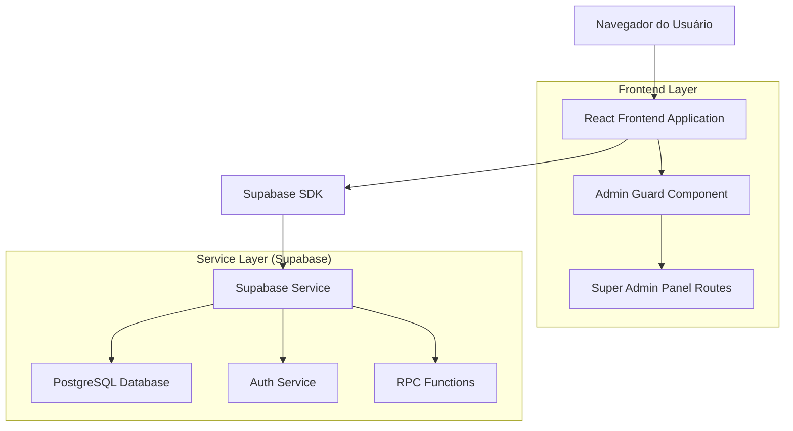
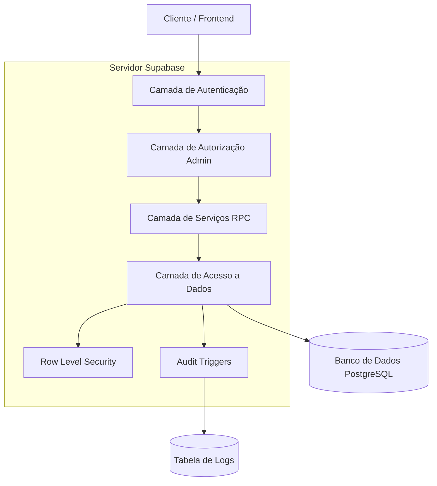
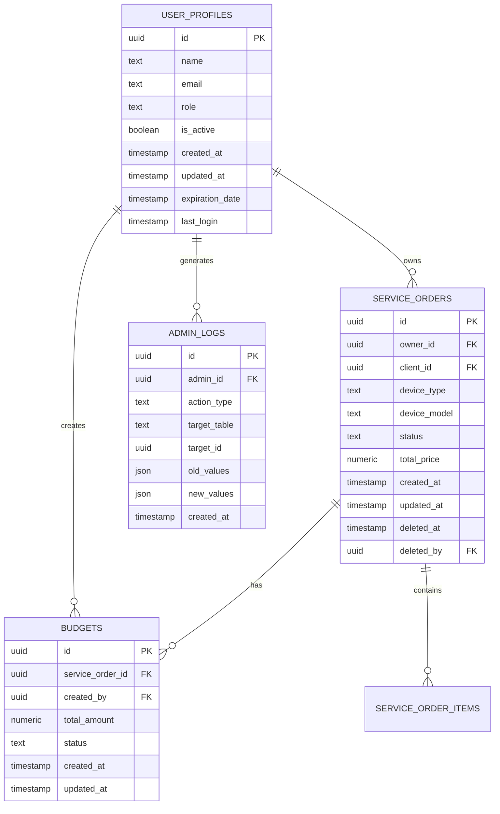

# Arquitetura Técnica - Painel de Super Administrador

## 1. Design da Arquitetura



## 2. Descrição das Tecnologias

- Frontend: React@18 + TypeScript + TailwindCSS@3 + Vite
- Backend: Supabase (PostgreSQL + Auth + RPC Functions)
- Roteamento: React Router DOM@6
- Estado: TanStack Query@4 para cache e sincronização
- UI Components: Shadcn/ui + Lucide React
- Autenticação: Supabase Auth com RLS (Row Level Security)

## 3. Definições de Rotas

| Rota | Propósito |
|------|-----------|
| /supadmin | Dashboard principal do super administrador |
| /supadmin/users | Gerenciamento completo de usuários |
| /supadmin/users/:id | Perfil detalhado e ações de usuário específico |
| /supadmin/service-orders | Controle de ordens de serviço por usuário |
| /supadmin/data-management | Ferramentas de gerenciamento e exclusão de dados |
| /supadmin/audit-logs | Auditoria e logs de ações administrativas |
| /supadmin/system-settings | Configurações avançadas do sistema |

## 4. Definições de API

### 4.1 APIs Principais

**Gerenciamento de Usuários**
```
RPC /rpc/admin_get_all_users_detailed
```

Request:
| Nome do Parâmetro | Tipo do Parâmetro | Obrigatório | Descrição |
|-------------------|-------------------|-------------|-----------|
| p_limit | integer | false | Limite de resultados (padrão: 50) |
| p_offset | integer | false | Offset para paginação (padrão: 0) |
| p_search | text | false | Termo de busca por nome ou email |
| p_role_filter | text | false | Filtro por role (admin, user, etc.) |
| p_status_filter | text | false | Filtro por status (active, inactive) |

Response:
| Nome do Parâmetro | Tipo do Parâmetro | Descrição |
|-------------------|-------------------|-----------|
| id | uuid | ID único do usuário |
| name | text | Nome completo do usuário |
| email | text | Email do usuário |
| role | text | Papel do usuário no sistema |
| is_active | boolean | Status ativo/inativo |
| created_at | timestamp | Data de criação da conta |
| last_login | timestamp | Último acesso |
| service_orders_count | integer | Quantidade de ordens de serviço |
| total_revenue | numeric | Receita total gerada |

**Exclusão Completa de Usuário**
```
RPC /rpc/admin_delete_user_completely
```

Request:
| Nome do Parâmetro | Tipo do Parâmetro | Obrigatório | Descrição |
|-------------------|-------------------|-------------|-----------|
| p_user_id | uuid | true | ID do usuário a ser excluído |
| p_confirmation_code | text | true | Código de confirmação para segurança |
| p_delete_auth_user | boolean | true | Se deve excluir também do Supabase Auth |

Response:
| Nome do Parâmetro | Tipo do Parâmetro | Descrição |
|-------------------|-------------------|-----------|
| success | boolean | Status da operação |
| deleted_records | json | Detalhes dos registros excluídos |
| message | text | Mensagem de confirmação ou erro |

**Gerenciamento de Ordens de Serviço por Usuário**
```
RPC /rpc/admin_get_user_service_orders
```

Request:
| Nome do Parâmetro | Tipo do Parâmetro | Obrigatório | Descrição |
|-------------------|-------------------|-------------|-----------|
| p_user_id | uuid | true | ID do usuário |
| p_include_deleted | boolean | false | Incluir ordens excluídas |
| p_status_filter | text | false | Filtro por status |
| p_date_from | date | false | Data inicial do filtro |
| p_date_to | date | false | Data final do filtro |

Response:
| Nome do Parâmetro | Tipo do Parâmetro | Descrição |
|-------------------|-------------------|-----------|
| id | uuid | ID da ordem de serviço |
| client_name | text | Nome do cliente |
| device_type | text | Tipo do dispositivo |
| status | text | Status atual da ordem |
| total_price | numeric | Valor total |
| created_at | timestamp | Data de criação |
| is_deleted | boolean | Se está na lixeira |

Exemplo de Request:
```json
{
  "p_user_id": "123e4567-e89b-12d3-a456-426614174000",
  "p_include_deleted": true,
  "p_status_filter": "completed"
}
```

Exemplo de Response:
```json
{
  "success": true,
  "data": [
    {
      "id": "456e7890-e89b-12d3-a456-426614174001",
      "client_name": "João Silva",
      "device_type": "Smartphone",
      "status": "completed",
      "total_price": 150.00,
      "created_at": "2024-01-15T10:30:00Z",
      "is_deleted": false
    }
  ],
  "total_count": 25
}
```

## 5. Arquitetura do Servidor



## 6. Modelo de Dados

### 6.1 Definição do Modelo de Dados



### 6.2 Linguagem de Definição de Dados

**Tabela de Logs Administrativos (admin_logs)**
```sql
-- Criar tabela para logs administrativos
CREATE TABLE admin_logs (
    id UUID PRIMARY KEY DEFAULT gen_random_uuid(),
    admin_id UUID REFERENCES auth.users(id) ON DELETE SET NULL,
    action_type VARCHAR(50) NOT NULL,
    target_table VARCHAR(50) NOT NULL,
    target_id UUID,
    old_values JSONB,
    new_values JSONB,
    ip_address INET,
    user_agent TEXT,
    created_at TIMESTAMP WITH TIME ZONE DEFAULT NOW()
);

-- Criar índices para performance
CREATE INDEX idx_admin_logs_admin_id ON admin_logs(admin_id);
CREATE INDEX idx_admin_logs_created_at ON admin_logs(created_at DESC);
CREATE INDEX idx_admin_logs_action_type ON admin_logs(action_type);
CREATE INDEX idx_admin_logs_target_table ON admin_logs(target_table);

-- Função para exclusão completa de usuário
CREATE OR REPLACE FUNCTION admin_delete_user_completely(
    p_user_id UUID,
    p_confirmation_code TEXT,
    p_delete_auth_user BOOLEAN DEFAULT true
)
RETURNS JSON
LANGUAGE plpgsql
SECURITY DEFINER
AS $$
DECLARE
    v_admin_id UUID;
    v_deleted_records JSON;
    v_service_orders_count INTEGER;
    v_budgets_count INTEGER;
BEGIN
    -- Verificar se é admin
    IF NOT public.is_current_user_admin() THEN
        RAISE EXCEPTION 'Acesso negado: apenas administradores podem excluir usuários';
    END IF;
    
    -- Verificar código de confirmação (deve ser o email do usuário)
    IF NOT EXISTS (
        SELECT 1 FROM auth.users 
        WHERE id = p_user_id AND email = p_confirmation_code
    ) THEN
        RAISE EXCEPTION 'Código de confirmação inválido';
    END IF;
    
    v_admin_id := auth.uid();
    
    -- Contar registros antes da exclusão
    SELECT COUNT(*) INTO v_service_orders_count 
    FROM service_orders WHERE owner_id = p_user_id;
    
    SELECT COUNT(*) INTO v_budgets_count 
    FROM budgets WHERE created_by = p_user_id;
    
    -- Excluir dados relacionados
    DELETE FROM budgets WHERE created_by = p_user_id;
    DELETE FROM service_orders WHERE owner_id = p_user_id;
    DELETE FROM user_profiles WHERE id = p_user_id;
    
    -- Se solicitado, excluir do Supabase Auth
    IF p_delete_auth_user THEN
        -- Nota: Esta operação requer privilégios especiais
        PERFORM auth.admin_delete_user(p_user_id);
    END IF;
    
    -- Preparar resposta
    v_deleted_records := json_build_object(
        'user_id', p_user_id,
        'service_orders_deleted', v_service_orders_count,
        'budgets_deleted', v_budgets_count,
        'auth_user_deleted', p_delete_auth_user,
        'deleted_at', NOW(),
        'deleted_by', v_admin_id
    );
    
    -- Registrar log administrativo
    INSERT INTO admin_logs (
        admin_id, action_type, target_table, target_id, 
        new_values, created_at
    ) VALUES (
        v_admin_id, 'DELETE_USER_COMPLETELY', 'user_profiles', p_user_id,
        v_deleted_records, NOW()
    );
    
    RETURN json_build_object(
        'success', true,
        'deleted_records', v_deleted_records,
        'message', 'Usuário excluído completamente do sistema'
    );
END;
$$;

-- Função para obter usuários com detalhes administrativos
CREATE OR REPLACE FUNCTION admin_get_all_users_detailed(
    p_limit INTEGER DEFAULT 50,
    p_offset INTEGER DEFAULT 0,
    p_search TEXT DEFAULT NULL,
    p_role_filter TEXT DEFAULT NULL,
    p_status_filter TEXT DEFAULT NULL
)
RETURNS TABLE (
    id UUID,
    name TEXT,
    email TEXT,
    role TEXT,
    is_active BOOLEAN,
    created_at TIMESTAMP WITH TIME ZONE,
    last_login TIMESTAMP WITH TIME ZONE,
    service_orders_count BIGINT,
    total_revenue NUMERIC
)
LANGUAGE plpgsql
SECURITY DEFINER
AS $$
BEGIN
    -- Verificar se é admin
    IF NOT public.is_current_user_admin() THEN
        RAISE EXCEPTION 'Acesso negado: apenas administradores podem listar usuários';
    END IF;
    
    RETURN QUERY
    SELECT 
        up.id,
        up.name,
        au.email,
        up.role,
        up.is_active,
        up.created_at,
        au.last_sign_in_at as last_login,
        COALESCE(so_stats.orders_count, 0) as service_orders_count,
        COALESCE(so_stats.total_revenue, 0) as total_revenue
    FROM user_profiles up
    LEFT JOIN auth.users au ON up.id = au.id
    LEFT JOIN (
        SELECT 
            owner_id,
            COUNT(*) as orders_count,
            SUM(total_price) as total_revenue
        FROM service_orders 
        WHERE deleted_at IS NULL
        GROUP BY owner_id
    ) so_stats ON up.id = so_stats.owner_id
    WHERE 
        (p_search IS NULL OR 
         up.name ILIKE '%' || p_search || '%' OR 
         au.email ILIKE '%' || p_search || '%')
        AND (p_role_filter IS NULL OR up.role = p_role_filter)
        AND (p_status_filter IS NULL OR 
             (p_status_filter = 'active' AND up.is_active = true) OR
             (p_status_filter = 'inactive' AND up.is_active = false))
    ORDER BY up.created_at DESC
    LIMIT p_limit OFFSET p_offset;
END;
$$;

-- Políticas RLS para admin_logs
ALTER TABLE admin_logs ENABLE ROW LEVEL SECURITY;

CREATE POLICY "Admins can view all admin logs" ON admin_logs
    FOR SELECT USING (public.is_current_user_admin());

CREATE POLICY "Admins can insert admin logs" ON admin_logs
    FOR INSERT WITH CHECK (public.is_current_user_admin());

-- Dados iniciais para testes
INSERT INTO admin_logs (admin_id, action_type, target_table, target_id, new_values)
SELECT 
    id, 'SYSTEM_INIT', 'admin_logs', gen_random_uuid(),
    '{"message": "Sistema de logs administrativos inicializado"}'::jsonb
FROM user_profiles 
WHERE role = 'admin' 
LIMIT 1;
```