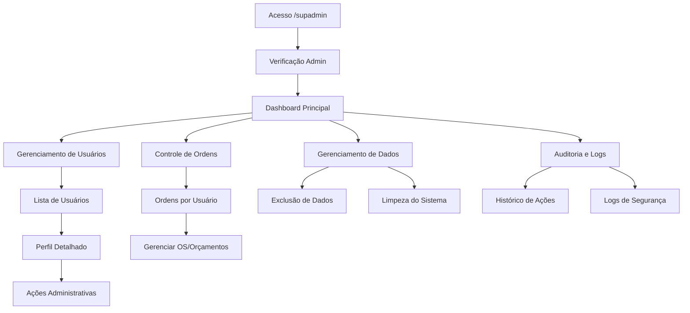

# Painel de Super Administrador - One-Drip

## 1. Visão Geral do Produto

O Painel de Super Administrador é uma interface administrativa avançada para o sistema One-Drip, acessível exclusivamente através da rota `/supadmin` para usuários com função `admin`. Este painel centraliza o controle total sobre usuários, dados e operações críticas do sistema, proporcionando aos administradores ferramentas poderosas para gerenciamento completo da plataforma.

O painel resolve a necessidade de controle administrativo granular, permitindo que administradores gerenciem usuários, suas ordens de serviço, orçamentos e dados associados de forma segura e eficiente. O valor estratégico está na capacidade de manter a integridade do sistema através de operações administrativas centralizadas e auditadas.

## 2. Funcionalidades Principais

### 2.1 Papéis de Usuário

| Papel | Método de Acesso | Permissões Principais |
|-------|------------------|----------------------|
| Super Admin | Acesso direto via `/supadmin` com role `admin` | Controle total sobre usuários, dados e sistema |

### 2.2 Módulos de Funcionalidade

O painel de super administrador consiste nas seguintes páginas principais:

1. **Dashboard Principal**: visão geral do sistema, estatísticas de usuários, métricas de ordens de serviço e alertas administrativos.
2. **Gerenciamento de Usuários**: listagem completa de usuários, busca avançada, visualização de perfis e ações administrativas.
3. **Controle de Ordens de Serviço**: visualização e gerenciamento de todas as ordens de serviço do sistema por usuário.
4. **Gerenciamento de Dados**: ferramentas para limpeza e exclusão de dados, backup e restauração.
5. **Auditoria e Logs**: histórico de ações administrativas, logs de segurança e monitoramento de atividades.

### 2.3 Detalhes das Páginas

| Nome da Página | Nome do Módulo | Descrição da Funcionalidade |
|----------------|----------------|----------------------------|
| Dashboard Principal | Painel de Controle | Exibir estatísticas gerais do sistema, contadores de usuários ativos/inativos, total de ordens de serviço, alertas de segurança e métricas de performance. |
| Dashboard Principal | Alertas e Notificações | Mostrar alertas críticos, notificações de sistema e avisos de manutenção. |
| Gerenciamento de Usuários | Lista de Usuários | Listar todos os usuários com filtros por status, role, data de criação e atividade. Incluir busca por nome, email e ID. |
| Gerenciamento de Usuários | Perfil Detalhado | Visualizar perfil completo do usuário incluindo dados pessoais, histórico de licenças, estatísticas de uso e atividade recente. |
| Gerenciamento de Usuários | Ações de Usuário | Editar dados do usuário, alterar role, ativar/desativar conta, resetar senha e excluir usuário permanentemente. |
| Controle de Ordens | Visualização por Usuário | Listar todas as ordens de serviço de um usuário específico com filtros por status, data e tipo de dispositivo. |
| Controle de Ordens | Gerenciamento de OS | Visualizar, editar, excluir e transferir ordens de serviço entre usuários. |
| Controle de Ordens | Orçamentos Vinculados | Gerenciar orçamentos associados às ordens de serviço, incluindo aprovação e rejeição. |
| Gerenciamento de Dados | Exclusão de Dados | Apagar todos os dados relacionados a um usuário específico incluindo ordens de serviço, orçamentos, logs e arquivos. |
| Gerenciamento de Dados | Limpeza do Sistema | Ferramentas para limpeza de dados órfãos, arquivos não utilizados e otimização do banco de dados. |
| Auditoria e Logs | Histórico de Ações | Visualizar todas as ações administrativas realizadas com filtros por usuário, data e tipo de ação. |
| Auditoria e Logs | Logs de Segurança | Monitorar tentativas de acesso, falhas de autenticação e atividades suspeitas. |

## 3. Processo Principal

### Fluxo de Administração de Usuários

O administrador acessa o painel através da rota `/supadmin`, onde é autenticado e verificado seu papel de admin. No dashboard principal, visualiza estatísticas gerais e pode navegar para o gerenciamento de usuários. Na lista de usuários, pode buscar e filtrar usuários específicos, acessar perfis detalhados e realizar ações administrativas como edição, desativação ou exclusão completa.

### Fluxo de Gerenciamento de Dados

Para gerenciar dados de um usuário, o administrador navega para o perfil do usuário e acessa as opções de gerenciamento de dados. Pode visualizar todas as ordens de serviço e orçamentos associados, realizar exclusões seletivas ou optar pela exclusão completa de todos os dados do usuário. Todas as ações são registradas nos logs de auditoria.

## 4. Design da Interface do Usuário

### 4.1 Estilo de Design

- **Cores Primárias**: Azul escuro (#1e40af) para elementos principais, vermelho (#dc2626) para ações destrutivas
- **Cores Secundárias**: Cinza (#6b7280) para textos secundários, verde (#059669) para ações positivas
- **Estilo de Botões**: Botões arredondados com sombras sutis, estados hover e focus bem definidos
- **Tipografia**: Inter como fonte principal, tamanhos de 14px para texto base, 16px para títulos de seção
- **Layout**: Design baseado em cards com navegação lateral fixa, layout responsivo com breakpoints em 768px e 1024px
- **Ícones**: Lucide React para consistência, ícones de 20px para ações e 16px para indicadores

### 4.2 Visão Geral do Design das Páginas

| Nome da Página | Nome do Módulo | Elementos da UI |
|----------------|----------------|-----------------|
| Dashboard Principal | Painel de Controle | Cards de estatísticas com ícones, gráficos de barras para métricas, tabela de atividades recentes com paginação. |
| Dashboard Principal | Alertas e Notificações | Lista de alertas com códigos de cor por prioridade, botões de ação rápida, timestamps relativos. |
| Gerenciamento de Usuários | Lista de Usuários | Tabela responsiva com filtros dropdown, campo de busca com autocomplete, botões de ação por linha, paginação avançada. |
| Gerenciamento de Usuários | Perfil Detalhado | Layout em duas colunas, cards informativos, tabs para diferentes seções, botões de ação contextuais. |
| Controle de Ordens | Visualização por Usuário | Tabela de ordens com filtros laterais, modal de detalhes, indicadores visuais de status, botões de ação em grupo. |
| Gerenciamento de Dados | Exclusão de Dados | Interface de confirmação em múltiplas etapas, checkboxes para seleção de dados, barras de progresso para operações, modais de confirmação. |
| Auditoria e Logs | Histórico de Ações | Timeline de eventos, filtros avançados com date picker, exportação de dados, visualização detalhada em modal. |

### 4.3 Responsividade

O painel é projetado com abordagem desktop-first, adaptando-se para tablets e dispositivos móveis. Em telas menores, a navegação lateral se transforma em menu hambúrguer, tabelas se tornam cards empilháveis e filtros são agrupados em dropdowns. Todas as interações são otimizadas para touch em dispositivos móveis.