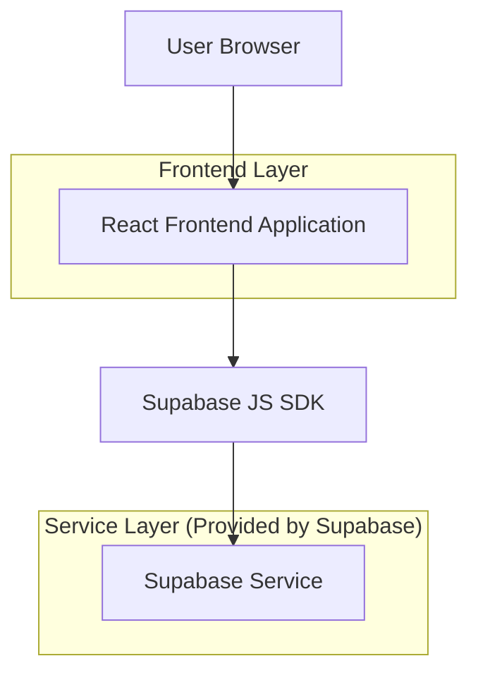
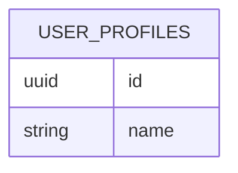

## 1.Architecture design


## 2.Technology Description
- Frontend: React@18 + react-router-dom@6 + tailwindcss@3 + Radix UI (shadcn/ui) + vite
- Backend: None (chamadas diretas via Supabase SDK)
- BaaS: Supabase (Auth + Database)

## 3.Route definitions
| Route | Purpose |
|-------|---------|
| /settings | Hub de configurações com navegação interna por seções (empresa, perfil, privacidade) |
| /service-orders/settings | Redirecionar para /settings |

## 6.Data model(if applicable)
### 6.1 Data model definition


### 6.2 Data Definition Language
User Profiles (user_profiles)
```
-- Campos mínimos observados pelo front-end
CREATE TABLE user_profiles (
  id UUID PRIMARY KEY,
  name TEXT
);
```
