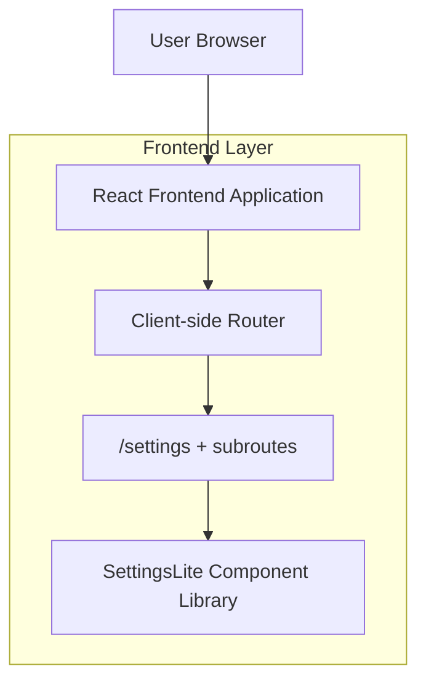

## 1.Architecture design

## 2.Technology Description
- Frontend: React@18 + TypeScript + react-router + tailwindcss@3 (glassmorphism) + vite
- Backend: None (escopo é apenas UI/UX do /settings)

## 3.Route definitions
| Route | Purpose |
|---|---|
| /settings | Hub principal de configurações (lista + busca + seções) |
| /settings/profile | Editar dados de perfil |
| /settings/security | Ações e preferências de segurança |
| /settings/company | Dados/preferências de empresa |
| /settings/budget-warning | Configurar/visualizar avisos de orçamento |
| /settings/cache-clear | Fluxo de limpeza de cache com confirmação |
| /settings/account-data | Exportar/excluir dados da conta |

## 6.Data model(if applicable)
Não aplicável para este redesign (sem requisitos de persistência definidos no escopo).