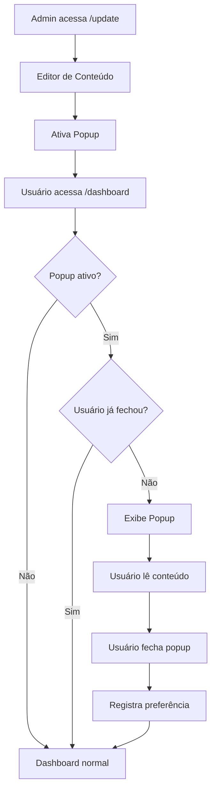

# Documento de Requisitos do Produto - Seção Administrativa de Atualizações

## 1. Visão Geral do Produto

Sistema administrativo para gerenciamento de notificações de atualização através de popups informativos no dashboard. A funcionalidade permite que administradores controlem a exibição de informações sobre novas versões e melhorias do sistema diretamente para os usuários finais.

O sistema resolve a necessidade de comunicação eficiente sobre atualizações do produto, permitindo que administradores informem todos os usuários sobre novas funcionalidades de forma centralizada e controlada.

## 2. Funcionalidades Principais

### 2.1 Papéis de Usuário

| Papel | Método de Registro | Permissões Principais |
|-------|-------------------|----------------------|
| Administrador | Já existente no sistema | Acesso completo à seção /update, criação e edição de popups |
| Usuário Comum | Já existente no sistema | Visualização de popups no dashboard, capacidade de fechar permanentemente |

### 2.2 Módulo de Funcionalidades

O sistema de atualizações consiste nas seguintes páginas principais:

1. **Página Administrativa (/update)**: painel de controle, editor de conteúdo, configurações de ativação
2. **Dashboard com Popup**: exibição condicional do popup, controles de interação do usuário

### 2.3 Detalhes das Páginas

| Nome da Página | Nome do Módulo | Descrição da Funcionalidade |
|----------------|----------------|----------------------------|
| Página Administrativa | Painel de Controle | Ativar/desativar popup globalmente, visualizar estatísticas de visualização |
| Página Administrativa | Editor de Conteúdo | Editar título, descrição, link e URL do popup com preview em tempo real |
| Página Administrativa | Configurações Avançadas | Definir duração de exibição, configurar comportamento de fechamento |
| Dashboard | Popup de Atualização | Exibir popup quando ativo, botão de fechamento permanente, design responsivo |
| Dashboard | Sistema de Preferências | Registrar quando usuário fecha popup, respeitar preferências até nova ativação |

## 3. Processo Principal

### Fluxo do Administrador
1. Administrador acessa /update através do menu administrativo
2. Cria ou edita conteúdo do popup usando editor visual
3. Ativa o popup para exibição no dashboard
4. Monitora estatísticas de visualização e interação

### Fluxo do Usuário Comum
1. Usuário acessa /dashboard normalmente
2. Se popup estiver ativo e usuário não tiver fechado anteriormente, popup é exibido
3. Usuário pode ler conteúdo e clicar no link para mais detalhes
4. Usuário pode fechar popup permanentemente usando botão X
5. Popup não reaparece até próxima ativação por administrador

## 4. Design da Interface do Usuário

### 4.1 Estilo de Design

- **Cores Primárias**: Azul (#3B82F6) para elementos administrativos, Verde (#10B981) para confirmações
- **Cores Secundárias**: Cinza (#6B7280) para textos secundários, Vermelho (#EF4444) para alertas
- **Estilo de Botões**: Arredondados com sombra sutil, efeitos hover suaves
- **Fontes**: Inter para títulos (16-24px), sistema padrão para corpo (14-16px)
- **Layout**: Design em cards com espaçamento generoso, navegação lateral para admin
- **Ícones**: Lucide React com estilo minimalista, tamanho 20-24px

### 4.2 Visão Geral do Design das Páginas

| Nome da Página | Nome do Módulo | Elementos da UI |
|----------------|----------------|-----------------|
| Página Administrativa | Painel de Controle | Card principal com toggle switch, estatísticas em grid 2x2, botões de ação primários |
| Página Administrativa | Editor de Conteúdo | Formulário em duas colunas, preview ao vivo, editor de texto rico, campos de URL validados |
| Dashboard | Popup de Atualização | Modal overlay com backdrop escuro (opacity 0.5), card centralizado com sombra, botão X no canto superior direito |

### 4.3 Responsividade

O produto é desktop-first com adaptação mobile completa. O popup utiliza design responsivo que se adapta a telas pequenas, mantendo legibilidade e usabilidade. Otimização para touch em dispositivos móveis com botões de tamanho adequado (mínimo 44px).