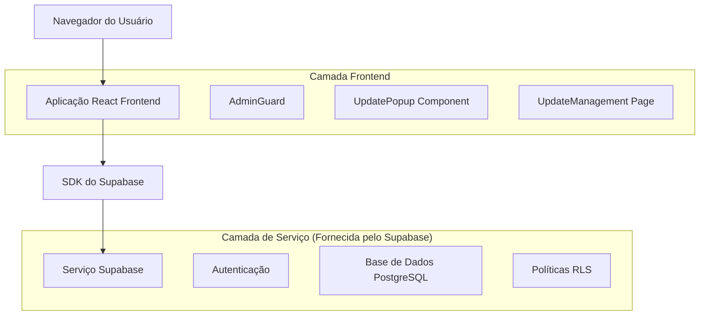
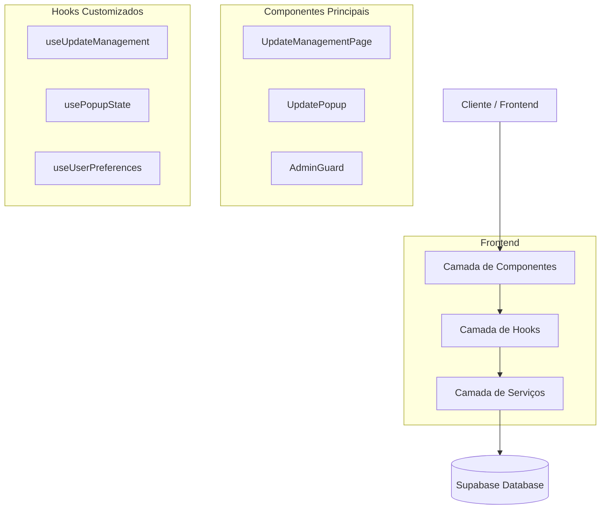
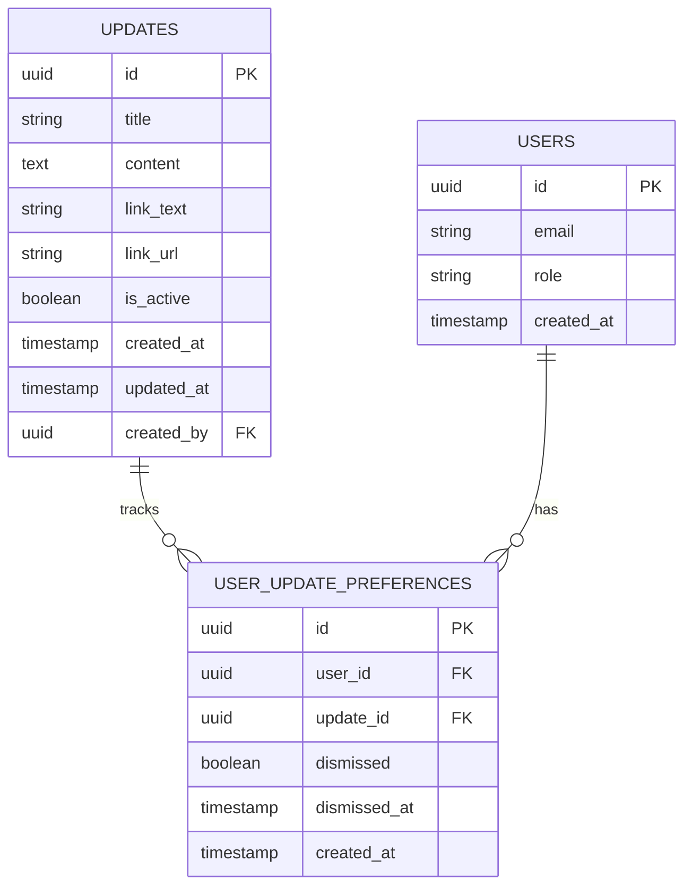

# Documento de Arquitetura Técnica - Sistema de Atualizações Administrativas

## 1. Design da Arquitetura



## 2. Descrição das Tecnologias

* Frontend: React\@18 + TypeScript + Tailwind CSS + shadcn/ui + Vite

* Backend: Supabase (PostgreSQL + Auth + RLS)

* Gerenciamento de Estado: React Query + Context API

* Roteamento: React Router v6

* Validação: Zod + React Hook Form

## 3. Definições de Rotas

| Rota       | Propósito                                                                             |
| ---------- | ------------------------------------------------------------------------------------- |
| /update    | Página administrativa para gerenciar popups de atualização (protegida por AdminGuard) |
| /dashboard | Dashboard principal onde o popup de atualização é exibido condicionalmente            |

## 4. Definições de API

### 4.1 APIs Principais

**Gerenciamento de Atualizações**

```
GET /api/updates/current
```

Resposta:

| Nome do Parâmetro | Tipo do Parâmetro | Descrição               |
| ----------------- | ----------------- | ----------------------- |
| id                | string            | ID único da atualização |
| title             | string            | Título da atualização   |
| content           | string            | Conteúdo em markdown    |
| link\_text        | string            | Texto do link           |
| link\_url         | string            | URL do link             |
| is\_active        | boolean           | Status de ativação      |
| created\_at       | string            | Data de criação         |

```
POST /api/updates
```

Requisição:

| Nome do Parâmetro | Tipo do Parâmetro | Obrigatório | Descrição                                        |
| ----------------- | ----------------- | ----------- | ------------------------------------------------ |
| title             | string            | true        | Título da atualização                            |
| content           | string            | true        | Conteúdo da atualização                          |
| link\_text        | string            | false       | Texto do link (padrão: "Para mais detalhes")     |
| link\_url         | string            | false       | URL do link (padrão: "<https://onedrip.com.br>") |
| is\_active        | boolean           | true        | Status de ativação                               |

**Preferências do Usuário**

```
POST /api/user-preferences/dismiss-update
```

Requisição:

| Nome do Parâmetro | Tipo do Parâmetro | Obrigatório | Descrição                 |
| ----------------- | ----------------- | ----------- | ------------------------- |
| update\_id        | string            | true        | ID da atualização fechada |
| user\_id          | string            | true        | ID do usuário             |

## 5. Diagrama da Arquitetura do Servidor



## 6. Modelo de Dados

### 6.1 Definição do Modelo de Dados



### 6.2 Linguagem de Definição de Dados

**Tabela de Atualizações (updates)**

```sql
-- Criar tabela
CREATE TABLE updates (
    id UUID PRIMARY KEY DEFAULT gen_random_uuid(),
    title VARCHAR(255) NOT NULL,
    content TEXT NOT NULL,
    link_text VARCHAR(100) DEFAULT 'Para mais detalhes',
    link_url VARCHAR(500) DEFAULT 'https://onedrip.com.br',
    is_active BOOLEAN DEFAULT false,
    created_at TIMESTAMP WITH TIME ZONE DEFAULT NOW(),
    updated_at TIMESTAMP WITH TIME ZONE DEFAULT NOW(),
    created_by UUID REFERENCES auth.users(id) ON DELETE SET NULL
);

-- Criar índices
CREATE INDEX idx_updates_is_active ON updates(is_active);
CREATE INDEX idx_updates_created_at ON updates(created_at DESC);

-- Políticas RLS
ALTER TABLE updates ENABLE ROW LEVEL SECURITY;

-- Admins podem fazer tudo
CREATE POLICY "Admins can manage updates" ON updates
    FOR ALL USING (
        EXISTS (
            SELECT 1 FROM profiles 
            WHERE profiles.id = auth.uid() 
            AND profiles.role = 'admin'
        )
    );

-- Usuários autenticados podem ler atualizações ativas
CREATE POLICY "Users can read active updates" ON updates
    FOR SELECT USING (is_active = true AND auth.role() = 'authenticated');

-- Dados iniciais
INSERT INTO updates (title, content, link_text, link_url, is_active, created_by)
VALUES (
    'Atualização 2.7',
    E'- Adicionado sistema de geração de PDF para ordens de serviço\n- Melhorias na gestão de termos de garantia\n- Outras otimizações',
    'Para mais detalhes',
    'https://onedrip.com.br',
    false,
    (SELECT id FROM auth.users WHERE email LIKE '%admin%' LIMIT 1)
);
```

**Tabela de Preferências do Usuário (user\_update\_preferences)**

```sql
-- Criar tabela
CREATE TABLE user_update_preferences (
    id UUID PRIMARY KEY DEFAULT gen_random_uuid(),
    user_id UUID NOT NULL REFERENCES auth.users(id) ON DELETE CASCADE,
    update_id UUID NOT NULL REFERENCES updates(id) ON DELETE CASCADE,
    dismissed BOOLEAN DEFAULT false,
    dismissed_at TIMESTAMP WITH TIME ZONE,
    created_at TIMESTAMP WITH TIME ZONE DEFAULT NOW(),
    UNIQUE(user_id, update_id)
);

-- Criar índices
CREATE INDEX idx_user_update_preferences_user_id ON user_update_preferences(user_id);
CREATE INDEX idx_user_update_preferences_update_id ON user_update_preferences(update_id);
CREATE INDEX idx_user_update_preferences_dismissed ON user_update_preferences(dismissed);

-- Políticas RLS
ALTER TABLE user_update_preferences ENABLE ROW LEVEL SECURITY;

-- Usuários podem gerenciar suas próprias preferências
CREATE POLICY "Users can manage own preferences" ON user_update_preferences
    FOR ALL USING (user_id = auth.uid());

-- Admins podem ver todas as preferências
CREATE POLICY "Admins can view all preferences" ON user_update_preferences
    FOR SELECT USING (
        EXISTS (
            SELECT 1 FROM profiles 
            WHERE profiles.id = auth.uid() 
            AND profiles.role = 'admin'
        )
    );
```

**Função para marcar atualização como fechada**

```sql
-- Função para registrar fechamento de popup
CREATE OR REPLACE FUNCTION dismiss_update(update_uuid UUID)
RETURNS VOID AS $$
BEGIN
    INSERT INTO user_update_preferences (user_id, update_id, dismissed, dismissed_at)
    VALUES (auth.uid(), update_uuid, true, NOW())
    ON CONFLICT (user_id, update_id) 
    DO UPDATE SET 
        dismissed = true,
        dismissed_at = NOW();
END;
$$ LANGUAGE plpgsql SECURITY DEFINER;

-- Conceder permissão para usuários autenticados
GRANT EXECUTE ON FUNCTION dismiss_update(UUID) TO authenticated;
```

