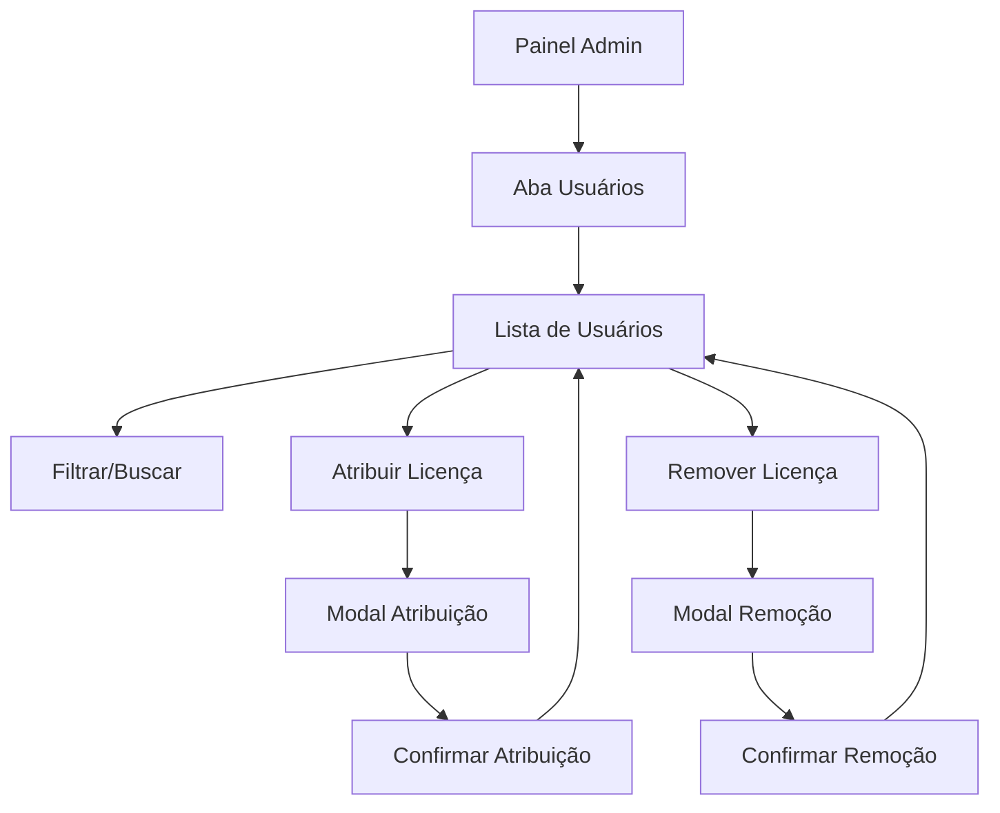

# Requisitos: Seção de Gerenciamento de Usuários

## 1. Visão Geral do Produto
Adicionar uma nova seção "Gerenciamento de Usuários" ao painel administrativo de licenças, permitindo que administradores visualizem todos os usuários do sistema e gerenciem suas licenças de forma centralizada. Esta funcionalidade complementa o sistema existente de gerenciamento de licenças, oferecendo uma visão focada nos usuários.

## 2. Funcionalidades Principais

### 2.1 Papéis de Usuário
| Papel | Método de Acesso | Permissões Principais |
|-------|------------------|----------------------|
| Administrador | Acesso ao painel admin | Pode visualizar todos os usuários, atribuir/remover licenças, filtrar e buscar |

### 2.2 Módulos de Funcionalidade
Nossa seção de gerenciamento de usuários consistirá nas seguintes páginas principais:
1. **Aba Usuários**: lista de usuários, filtros de busca, status de licenças, ações de gerenciamento.

### 2.3 Detalhes das Páginas
| Nome da Página | Nome do Módulo | Descrição da Funcionalidade |
|----------------|----------------|----------------------------|
| Aba Usuários | Lista de Usuários | Exibir todos os usuários com informações básicas (nome, email, data de cadastro) |
| Aba Usuários | Filtros e Busca | Filtrar por status de licença, buscar por nome/email, ordenar por diferentes critérios |
| Aba Usuários | Status de Licenças | Mostrar status atual da licença de cada usuário (ativa, expirada, sem licença) |
| Aba Usuários | Ações de Gerenciamento | Botões para atribuir licença, remover licença, ver detalhes do usuário |
| Aba Usuários | Modal de Atribuição | Interface para selecionar licença disponível e atribuir ao usuário |
| Aba Usuários | Modal de Remoção | Confirmação e motivo para remover licença do usuário |

## 3. Processo Principal
O administrador acessa o painel de licenças, navega para a nova aba "Usuários", visualiza a lista de usuários com seus respectivos status de licenças, pode filtrar/buscar usuários específicos, e realizar ações de atribuição ou remoção de licenças através de modais dedicados.

## 4. Design da Interface do Usuário

### 4.1 Estilo de Design
- **Cores primárias**: Azul (#3B82F6) para ações principais, Verde (#10B981) para status ativo
- **Cores secundárias**: Cinza (#6B7280) para texto secundário, Vermelho (#EF4444) para ações de remoção
- **Estilo de botões**: Arredondados com bordas suaves, seguindo o padrão shadcn/ui
- **Fonte**: Inter ou system font, tamanhos 14px para texto normal, 16px para títulos
- **Layout**: Cards para cada usuário, layout responsivo em grid
- **Ícones**: Lucide React icons (Users, UserPlus, UserMinus, Search, Filter)

### 4.2 Visão Geral do Design das Páginas

| Nome da Página | Nome do Módulo | Elementos da UI |
|----------------|----------------|-----------------|
| Aba Usuários | Cabeçalho | Título "Usuários", contador total, botão de atualizar |
| Aba Usuários | Filtros | Barra de busca, filtro por status de licença, ordenação |
| Aba Usuários | Lista de Usuários | Cards com avatar, nome, email, status da licença, botões de ação |
| Aba Usuários | Card do Usuário | Avatar circular, nome em negrito, email em cinza, badge de status, botões "Atribuir" e "Remover" |
| Modal Atribuição | Formulário | Seletor de licença disponível, campo de observações, botões cancelar/confirmar |
| Modal Remoção | Confirmação | Informações do usuário, campo de motivo, botões cancelar/confirmar |

### 4.3 Responsividade
- **Desktop-first**: Layout otimizado para telas grandes com grid de 3-4 colunas
- **Mobile-adaptive**: Em dispositivos móveis, cards empilhados em coluna única
- **Touch-friendly**: Botões com tamanho mínimo de 44px para interação touch