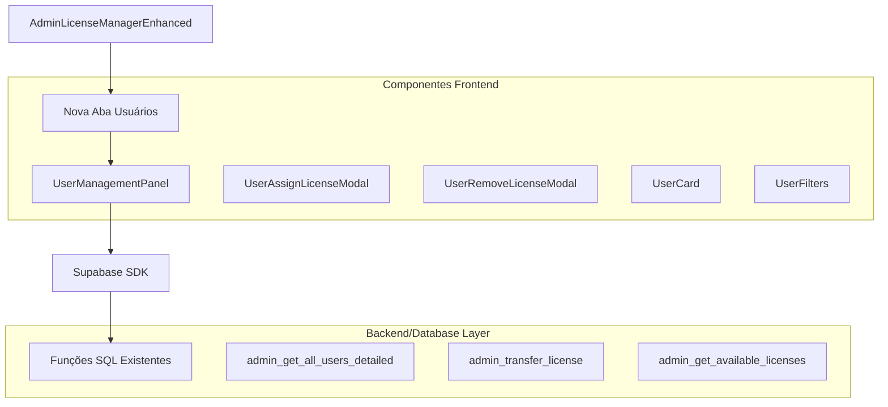
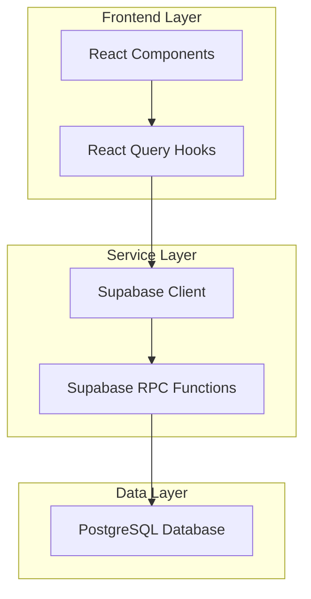
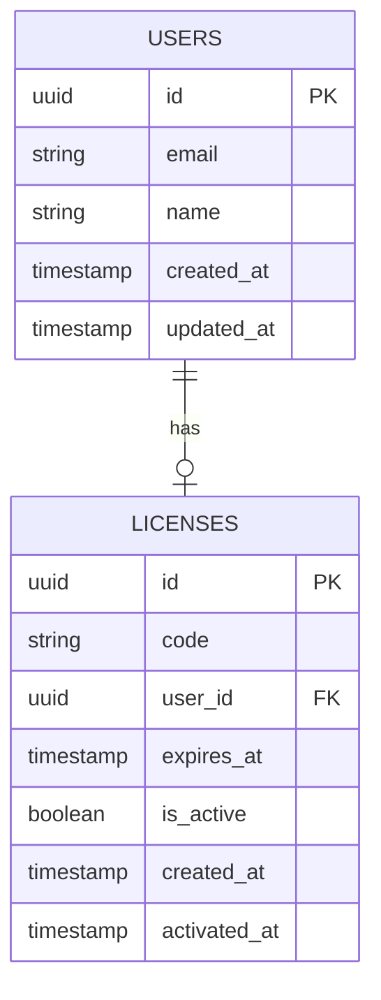

# Arquitetura Técnica: Seção de Gerenciamento de Usuários

## 1. Design da Arquitetura



## 2. Descrição da Tecnologia
- **Frontend**: React@18 + TypeScript + tailwindcss@3 + shadcn/ui
- **Backend**: Supabase (PostgreSQL + RPC functions)
- **Estado**: React Query (@tanstack/react-query) para cache e sincronização
- **UI Components**: shadcn/ui (Card, Button, Input, Select, Modal, Badge)

## 3. Definições de Rotas
| Rota | Propósito |
|------|-----------|
| /admin/licenses?tab=users | Nova aba de usuários no painel de licenças existente |

## 4. Definições de API

### 4.1 APIs Principais

**Buscar usuários detalhados**
```
RPC: admin_get_all_users_detailed()
```

Resposta:
| Nome do Parâmetro | Tipo | Descrição |
|-------------------|------|-----------|
| id | UUID | ID único do usuário |
| email | string | Email do usuário |
| name | string | Nome completo do usuário |
| created_at | timestamp | Data de criação da conta |
| license_id | UUID | ID da licença atual (se houver) |
| license_code | string | Código da licença atual (se houver) |
| license_expires_at | timestamp | Data de expiração da licença (se houver) |
| license_is_active | boolean | Status da licença (se houver) |

**Buscar licenças disponíveis**
```
RPC: admin_get_available_licenses()
```

Resposta:
| Nome do Parâmetro | Tipo | Descrição |
|-------------------|------|-----------|
| id | UUID | ID da licença |
| code | string | Código da licença |
| expires_at | timestamp | Data de expiração |
| is_active | boolean | Status da licença |

**Transferir licença para usuário**
```
RPC: admin_transfer_license(license_id, target_user_id, notes)
```

Requisição:
| Nome do Parâmetro | Tipo | Obrigatório | Descrição |
|-------------------|------|-------------|-----------|
| license_id | UUID | true | ID da licença a ser transferida |
| target_user_id | UUID | true | ID do usuário que receberá a licença |
| notes | string | false | Observações sobre a transferência |

Resposta:
| Nome do Parâmetro | Tipo | Descrição |
|-------------------|------|-----------|
| success | boolean | Status da operação |
| message | string | Mensagem de retorno |

## 5. Arquitetura do Servidor



## 6. Modelo de Dados

### 6.1 Definição do Modelo de Dados



### 6.2 Linguagem de Definição de Dados

**Funções SQL Existentes (já implementadas)**

```sql
-- Função para buscar todos os usuários com detalhes de licenças
CREATE OR REPLACE FUNCTION admin_get_all_users_detailed()
RETURNS TABLE (
    id UUID,
    email VARCHAR,
    name VARCHAR,
    created_at TIMESTAMP WITH TIME ZONE,
    license_id UUID,
    license_code VARCHAR,
    license_expires_at TIMESTAMP WITH TIME ZONE,
    license_is_active BOOLEAN
) AS $$
BEGIN
    RETURN QUERY
    SELECT 
        u.id,
        u.email,
        u.name,
        u.created_at,
        l.id as license_id,
        l.code as license_code,
        l.expires_at as license_expires_at,
        l.is_active as license_is_active
    FROM users u
    LEFT JOIN licenses l ON u.id = l.user_id
    ORDER BY u.created_at DESC;
END;
$$ LANGUAGE plpgsql SECURITY DEFINER;

-- Função para buscar licenças disponíveis (sem usuário)
CREATE OR REPLACE FUNCTION admin_get_available_licenses()
RETURNS TABLE (
    id UUID,
    code VARCHAR,
    expires_at TIMESTAMP WITH TIME ZONE,
    is_active BOOLEAN
) AS $$
BEGIN
    RETURN QUERY
    SELECT 
        l.id,
        l.code,
        l.expires_at,
        l.is_active
    FROM licenses l
    WHERE l.user_id IS NULL
    AND l.is_active = true
    ORDER BY l.created_at DESC;
END;
$$ LANGUAGE plpgsql SECURITY DEFINER;

-- Permissões
GRANT EXECUTE ON FUNCTION admin_get_all_users_detailed() TO authenticated;
GRANT EXECUTE ON FUNCTION admin_get_available_licenses() TO authenticated;
```

**Estrutura de Componentes**

```typescript
// Tipos TypeScript para a nova seção
interface UserWithLicense {
  id: string;
  email: string;
  name: string;
  created_at: string;
  license_id?: string;
  license_code?: string;
  license_expires_at?: string;
  license_is_active?: boolean;
}

interface AvailableLicense {
  id: string;
  code: string;
  expires_at: string;
  is_active: boolean;
}

interface UserManagementPanelProps {
  // Props do componente principal
}

interface UserAssignLicenseModalProps {
  user: UserWithLicense;
  isOpen: boolean;
  onClose: () => void;
  onSuccess: () => void;
}

interface UserRemoveLicenseModalProps {
  user: UserWithLicense;
  isOpen: boolean;
  onClose: () => void;
  onSuccess: () => void;
}
```