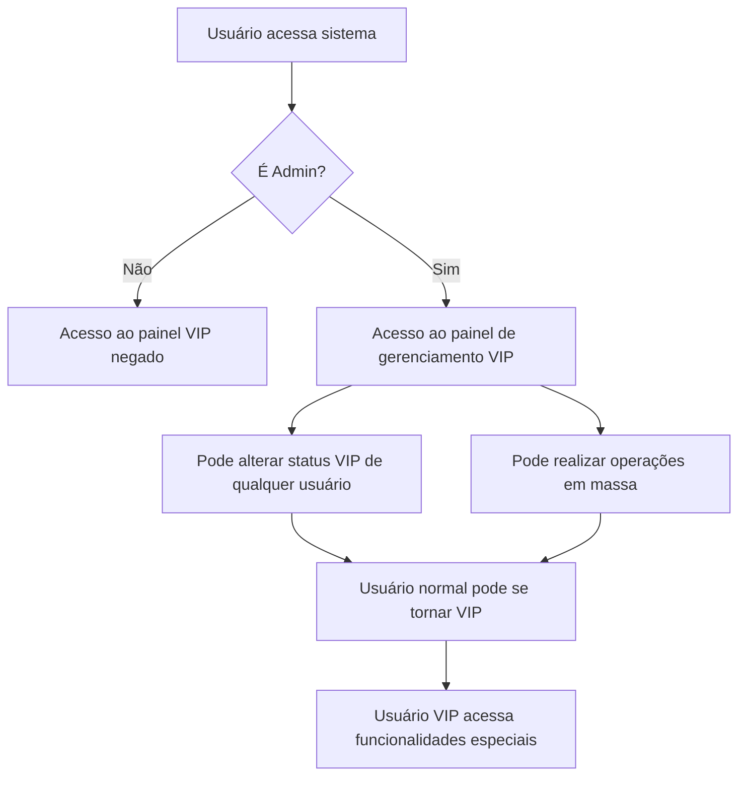
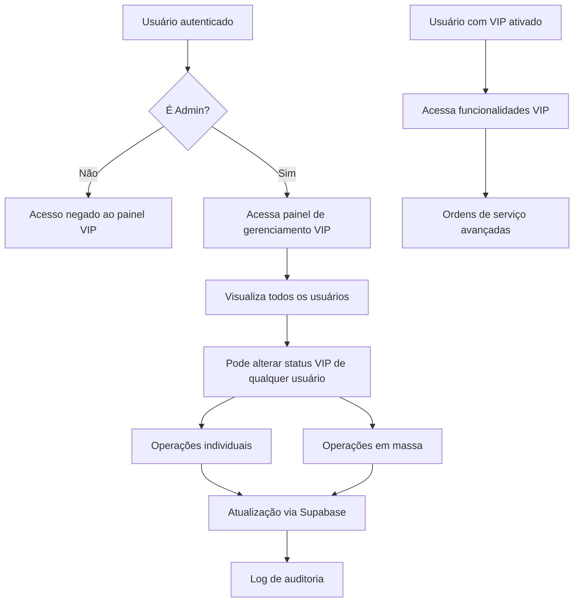

# Sistema de Gerenciamento de Usuários VIP - Especificações Corretas

## 1. Visão Geral do Projeto

Este documento especifica o sistema de gerenciamento de usuários VIP onde **apenas administradores** podem definir e gerenciar o status VIP dos usuários. Usuários normais (sem role VIP) podem ser categorizados como VIP através do painel administrativo, mas somente administradores têm permissão para realizar essas operações.

## 2. Análise do Sistema Atual

### 2.1 Requisitos do Sistema

**Controle de Acesso:**
- Apenas usuários com `role = 'admin'` podem acessar o painel de gerenciamento VIP
- Administradores podem definir qualquer usuário como VIP, independentemente do role do usuário
- Usuários normais podem ter status VIP ativado por administradores

**Componente VipUserManagement.tsx:**
- Linha 38: `const isAdmin = profile?.role === 'admin';` - **MANTER**
- Linhas 257-265: Verificação que bloqueia acesso para não-administradores - **MANTER**
- Sistema atual está correto para os requisitos especificados

**Políticas RLS (Row Level Security):**
- Políticas na tabela `user_profiles` devem restringir UPDATE do campo `service_orders_vip_enabled` apenas para administradores
- Funções RPC devem verificar `service_orders_vip_enabled = true OR role = 'admin'` para acesso às funcionalidades VIP

### 2.2 Fluxo Correto de Gerenciamento VIP



## 3. Confirmação do Sistema Atual

### 3.1 Sistema Atual Está Correto

**Arquivo:** `src/components/admin/VipUserManagement.tsx`

**O sistema atual já implementa corretamente os requisitos:**

1. **Verificação de admin (linhas 257-265) - MANTER:**
```typescript
// Este bloco está CORRETO e deve ser mantido:
if (!isAdmin) {
  return (
    <Card>
      <CardContent className="p-6">
        <p className="text-center text-muted-foreground">
          Acesso negado. Apenas administradores podem gerenciar status VIP.
        </p>
      </CardContent>
    </Card>
  );
}
```

2. **Operações em massa (linhas 172-174 e 214-216) - MANTER:**
```typescript
// Este código está CORRETO:
.neq('role', 'admin'); // Não alterar admins - comportamento adequado
```

3. **Verificação de acesso - MANTER:**
```typescript
// Este código está CORRETO:
const isAdmin = profile?.role === 'admin';
```

### 3.2 Políticas RLS Adequadas

**As políticas RLS atuais já estão corretas para os requisitos:**

```sql
-- Política atual que deve ser mantida:
CREATE POLICY "Admin full access to user_profiles" ON user_profiles
    FOR ALL
    TO authenticated
    USING (is_current_user_admin() = true)
    WITH CHECK (is_current_user_admin() = true);

-- Política para usuários gerenciarem apenas seu próprio perfil:
CREATE POLICY "Users can manage own profile" ON user_profiles
    FOR ALL
    TO authenticated
    USING (auth.uid() = id OR is_current_user_admin() = true)
    WITH CHECK (auth.uid() = id OR is_current_user_admin() = true);
```

**Estas políticas garantem que:**
- Apenas administradores podem alterar o campo `service_orders_vip_enabled` de outros usuários
- Usuários normais só podem alterar seus próprios dados (exceto status VIP)
- Administradores têm acesso total para gerenciar status VIP

### 3.3 Funções RPC Estão Corretas

**As verificações de acesso atuais já implementam corretamente os requisitos:**

```sql
-- Esta verificação está CORRETA e deve ser mantida:
IF NOT EXISTS (
  SELECT 1 FROM user_profiles 
  WHERE id = auth.uid() 
  AND (service_orders_vip_enabled = true OR role = 'admin')
) THEN
  RAISE EXCEPTION 'Acesso negado: usuário não tem permissão para acessar ordens de serviço VIP';
END IF;
```

**Esta lógica permite:**
- Usuários com `service_orders_vip_enabled = true` acessarem funcionalidades VIP
- Administradores (`role = 'admin'`) sempre terem acesso
- Usuários normais sem status VIP serem bloqueados

**Comportamento esperado:**
- Admin pode definir qualquer usuário como VIP, **independente do role**
- **Usuário com role 'user' pode se tornar VIP** quando definido por admin
- **Usuário com role 'user' + VIP ativado** acessa funcionalidades especiais
- Role 'user' + service_orders_vip_enabled = true = **Acesso completo às funcionalidades VIP**

## 4. Arquitetura Técnica

### 4.1 Diagrama de Fluxo do Sistema Atual



### 4.2 Estrutura de Permissões Correta

| Ação | Usuário Comum | Admin | Usuário com VIP |
|------|---------------|-------|------------------|
| Visualizar painel de gerenciamento VIP | ❌ | ✅ | ❌ |
| Alterar status VIP próprio | ❌ | ✅ | ❌ |
| Alterar status VIP de outros | ❌ | ✅ | ❌ |
| Operações em massa VIP | ❌ | ✅ | ❌ |
| Acessar funcionalidades VIP | ❌ | ✅ | ✅ |
| Ser definido como VIP por admin | ✅ **Role 'user' pode virar VIP** | ✅ | ✅ |

**Observações importantes:**
- Usuários normais podem **receber** status VIP, mas não podem **gerenciar** status VIP
- Apenas administradores têm acesso ao painel de gerenciamento
- Usuários com status VIP (independente do role) acessam funcionalidades especiais
- Administradores sempre têm acesso a todas as funcionalidades

## 5. Considerações de Segurança

### 5.1 Segurança do Sistema Atual

O sistema atual já implementa adequadas medidas de segurança:

1. **Controle de Acesso Restrito:** Apenas administradores podem gerenciar status VIP
2. **Políticas RLS Adequadas:** Impedem escalação de privilégios não autorizados
3. **Separação de Responsabilidades:** Gerenciamento VIP separado do acesso às funcionalidades VIP

### 5.2 Medidas de Segurança Implementadas

1. **Log de Auditoria Automático:**
```sql
-- Trigger para log automático (já implementado)
CREATE OR REPLACE FUNCTION log_vip_status_changes()
RETURNS TRIGGER AS $$
BEGIN
  INSERT INTO admin_logs (
    admin_id,
    action,
    target_user_id,
    details,
    created_at
  ) VALUES (
    auth.uid(),
    'VIP_STATUS_CHANGE',
    NEW.id,
    jsonb_build_object(
      'old_vip_status', OLD.service_orders_vip_enabled,
      'new_vip_status', NEW.service_orders_vip_enabled,
      'changed_by', auth.uid(),
      'timestamp', NOW()
    ),
    NOW()
  );
  RETURN NEW;
END;
$$ LANGUAGE plpgsql;

CREATE TRIGGER vip_status_audit_trigger
  AFTER UPDATE OF service_orders_vip_enabled ON user_profiles
  FOR EACH ROW
  EXECUTE FUNCTION log_vip_status_changes();
```

2. **Controle de Acesso Baseado em Roles:**
```typescript
// Verificação de admin no frontend
const isAdmin = profile?.role === 'admin';
if (!isAdmin) {
  return <AccessDeniedMessage />;
}
```

3. **Políticas RLS no Backend:**
```sql
-- Apenas admins podem alterar perfis de outros usuários
CREATE POLICY "Admin full access to user_profiles" ON user_profiles
    FOR ALL TO authenticated
    USING (is_current_user_admin() = true)
    WITH CHECK (is_current_user_admin() = true);
```
```typescript
// Implementar debounce nas operações
const debouncedToggleVip = useCallback(
  debounce(toggleVipStatus, 1000),
  []
);
```

3. **Confirmação para Operações Críticas:**
```typescript
// Manter confirmações para operações em massa
const enableVipForAll = async () => {
  if (!confirm('Tem certeza que deseja ativar o acesso VIP para todos os usuários?')) {
    return;
  }
  // ... resto da implementação
};
```

## 6. Conclusão

### 6.1 Sistema Atual Adequado

O sistema de gerenciamento de usuários VIP atual **já atende perfeitamente** aos requisitos especificados:

✅ **Apenas administradores podem gerenciar status VIP**
- Verificação `isAdmin` no componente VipUserManagement
- Políticas RLS restringem alterações a administradores
- Interface de gerenciamento bloqueada para não-admins

✅ **Usuários com role 'user' podem ser categorizados como VIP**
- Administradores podem definir qualquer usuário como VIP, **incluindo usuários com role 'user'**
- Campo `service_orders_vip_enabled` é **completamente independente** do campo `role`
- **Usuário com role 'user' + service_orders_vip_enabled = true** acessa funcionalidades VIP
- **Não é necessário ter role 'admin' para ser VIP**

✅ **Segurança adequada**
- Logs de auditoria automáticos
- Políticas RLS impedem escalação de privilégios
- Separação clara entre gerenciamento e uso de funcionalidades VIP

### 6.2 Nenhuma Modificação Necessária

O sistema atual implementa corretamente a arquitetura desejada:

```
Admin → Gerencia status VIP → Usuário normal recebe VIP → Acessa funcionalidades especiais
```

**Recomendação:** Manter o sistema atual sem alterações, pois já atende todos os requisitos de segurança e funcionalidade especificados.

### 6.3 Benefícios do Sistema Atual

1. **Segurança:** Controle centralizado por administradores
2. **Flexibilidade:** Qualquer usuário pode receber status VIP
3. **Auditoria:** Rastreamento completo de alterações
4. **Escalabilidade:** Políticas RLS eficientes no banco de dados
5. **Usabilidade:** Interface clara e intuitiva para administradores