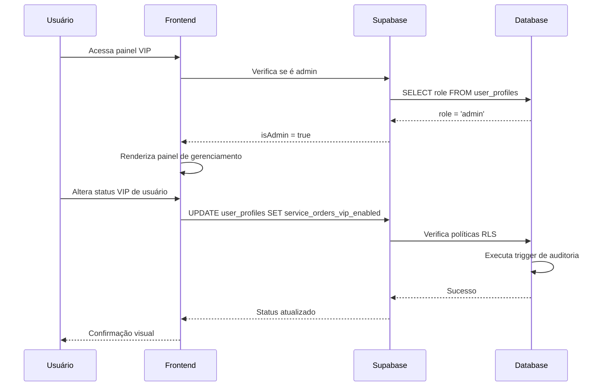
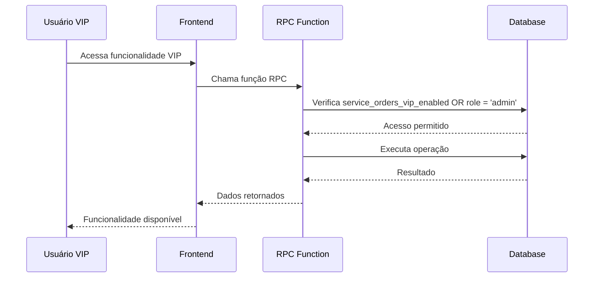

# Arquitetura Técnica do Sistema VIP - OneDrip

## 1. Visão Geral da Arquitetura

O sistema VIP do OneDrip implementa um controle de acesso baseado em roles onde apenas administradores podem gerenciar status VIP, mas **qualquer usuário (incluindo usuários com role 'user') pode receber e utilizar privilégios VIP**.

## 2. Componentes da Arquitetura

### 2.1 Frontend - React

**Arquivo Principal:** `src/components/admin/VipUserManagement.tsx`

```typescript
// Verificação de acesso administrativo
const isAdmin = profile?.role === 'admin';

// Bloqueio para não-administradores
if (!isAdmin) {
  return (
    <Card>
      <CardContent className="p-6">
        <p className="text-center text-muted-foreground">
          Acesso negado. Apenas administradores podem gerenciar status VIP.
        </p>
      </CardContent>
    </Card>
  );
}
```

**Funcionalidades do Componente:**
- Listagem de todos os usuários
- Toggle individual de status VIP
- Operações em massa (ativar/desativar VIP para todos)
- Filtros por role e status VIP
- Busca por nome/username

### 2.2 Backend - Supabase

**Tabela Principal:** `user_profiles`

```sql
CREATE TABLE user_profiles (
    id UUID PRIMARY KEY REFERENCES auth.users(id),
    name VARCHAR(100),
    role VARCHAR(20) DEFAULT 'user',
    service_orders_vip_enabled BOOLEAN DEFAULT FALSE,
    created_at TIMESTAMP WITH TIME ZONE DEFAULT NOW(),
    updated_at TIMESTAMP WITH TIME ZONE DEFAULT NOW()
);
```

**Campos Relevantes:**
- `role`: Define se o usuário é 'admin' ou 'user' (para gerenciamento)
- `service_orders_vip_enabled`: Define se o usuário tem acesso VIP (**completamente independente do role**)

**Importante:** Um usuário com `role = 'user'` e `service_orders_vip_enabled = true` tem **acesso completo às funcionalidades VIP**.

### 2.3 Políticas RLS (Row Level Security)

```sql
-- Administradores têm acesso total
CREATE POLICY "Admin full access to user_profiles" ON user_profiles
    FOR ALL TO authenticated
    USING (is_current_user_admin() = true)
    WITH CHECK (is_current_user_admin() = true);

-- Usuários podem gerenciar apenas seu próprio perfil
CREATE POLICY "Users can manage own profile" ON user_profiles
    FOR ALL TO authenticated
    USING (auth.uid() = id OR is_current_user_admin() = true)
    WITH CHECK (auth.uid() = id OR is_current_user_admin() = true);
```

### 2.4 Funções RPC

**Verificação de Acesso VIP:**
```sql
-- Exemplo de verificação em funções RPC
IF NOT EXISTS (
  SELECT 1 FROM user_profiles 
  WHERE id = auth.uid() 
  AND (service_orders_vip_enabled = true OR role = 'admin')
) THEN
  RAISE EXCEPTION 'Acesso negado: usuário não tem permissão para acessar ordens de serviço VIP';
END IF;
```

**Função de Verificação de Admin:**
```sql
CREATE OR REPLACE FUNCTION is_current_user_admin()
RETURNS BOOLEAN AS $$
BEGIN
  RETURN EXISTS (
    SELECT 1 FROM user_profiles 
    WHERE id = auth.uid() AND role = 'admin'
  );
END;
$$ LANGUAGE plpgsql SECURITY DEFINER;
```

## 3. Fluxo de Dados

### 3.1 Gerenciamento de Status VIP



### 3.2 Acesso a Funcionalidades VIP



## 4. Segurança

### 4.1 Camadas de Proteção

1. **Frontend:** Verificação de role antes de renderizar interface
2. **RLS Policies:** Controle de acesso no nível do banco de dados
3. **RPC Functions:** Validação adicional em operações específicas
4. **Auditoria:** Log automático de todas as alterações

### 4.2 Prevenção de Escalação de Privilégios

```sql
-- Usuários não podem alterar seu próprio role
CREATE POLICY "Prevent role escalation" ON user_profiles
    FOR UPDATE TO authenticated
    USING (auth.uid() = id)
    WITH CHECK (
        auth.uid() = id AND 
        (OLD.role = NEW.role OR is_current_user_admin() = true)
    );
```

### 4.3 Auditoria Automática

```sql
CREATE OR REPLACE FUNCTION log_vip_status_changes()
RETURNS TRIGGER AS $$
BEGIN
  IF OLD.service_orders_vip_enabled != NEW.service_orders_vip_enabled THEN
    INSERT INTO admin_logs (
      admin_id,
      action,
      target_user_id,
      details,
      created_at
    ) VALUES (
      auth.uid(),
      'VIP_STATUS_CHANGE',
      NEW.id,
      jsonb_build_object(
        'old_vip_status', OLD.service_orders_vip_enabled,
        'new_vip_status', NEW.service_orders_vip_enabled,
        'changed_by', auth.uid(),
        'timestamp', NOW()
      ),
      NOW()
    );
  END IF;
  RETURN NEW;
END;
$$ LANGUAGE plpgsql;

CREATE TRIGGER vip_status_audit_trigger
  AFTER UPDATE OF service_orders_vip_enabled ON user_profiles
  FOR EACH ROW
  EXECUTE FUNCTION log_vip_status_changes();
```

## 5. Casos de Uso

### 5.1 Administrador Gerencia VIP

1. Admin faz login
2. Acessa painel de gerenciamento VIP
3. Visualiza lista de usuários
4. Altera status VIP de usuário específico
5. Sistema registra alteração em log
6. Usuário recebe acesso às funcionalidades VIP

### 5.2 Usuário com Role 'User' Acessa Funcionalidades VIP

1. **Usuário com `role = 'user'` e `service_orders_vip_enabled = true`** faz login
2. Acessa área de ordens de serviço
3. Sistema verifica permissões via RPC: `service_orders_vip_enabled = true OR role = 'admin'`
4. **Funcionalidades VIP são disponibilizadas mesmo com role 'user'**
5. Usuário utiliza recursos exclusivos VIP

### 5.3 Usuário Normal Tenta Acessar Gerenciamento

1. Usuário comum tenta acessar painel VIP
2. Sistema verifica `role != 'admin'`
3. Acesso é negado no frontend
4. Mensagem de erro é exibida
5. Usuário é redirecionado

### 5.4 Exemplos Práticos de Usuários VIP

**Exemplo 1: Usuário Normal se Torna VIP**
```sql
-- Estado inicial
INSERT INTO user_profiles (id, name, role, service_orders_vip_enabled)
VALUES ('user-123', 'João Silva', 'user', false);

-- Admin define como VIP
UPDATE user_profiles 
SET service_orders_vip_enabled = true 
WHERE id = 'user-123';

-- Resultado: João Silva (role='user') agora tem acesso VIP
```

**Exemplo 2: Verificação de Acesso VIP**
```sql
-- Esta query retorna true para João Silva
SELECT 
  name,
  role,
  service_orders_vip_enabled,
  (service_orders_vip_enabled = true OR role = 'admin') as has_vip_access
FROM user_profiles 
WHERE id = 'user-123';

-- Resultado:
-- name: 'João Silva'
-- role: 'user'
-- service_orders_vip_enabled: true
-- has_vip_access: true
```

**Exemplo 3: Diferentes Combinações de Acesso**
```sql
-- Usuário normal sem VIP
role = 'user', service_orders_vip_enabled = false → ❌ Sem acesso VIP

-- Usuário normal COM VIP
role = 'user', service_orders_vip_enabled = true → ✅ Acesso VIP completo

-- Admin sem VIP explícito
role = 'admin', service_orders_vip_enabled = false → ✅ Acesso VIP (por ser admin)

-- Admin com VIP explícito
role = 'admin', service_orders_vip_enabled = true → ✅ Acesso VIP (dupla permissão)
```

## 6. Monitoramento e Métricas

### 6.1 Métricas Importantes

- Número de usuários VIP ativos
- Frequência de alterações de status VIP
- Uso de funcionalidades VIP por usuário
- Tentativas de acesso não autorizado

### 6.2 Queries de Monitoramento

```sql
-- Usuários VIP ativos
SELECT COUNT(*) as vip_users_count
FROM user_profiles 
WHERE service_orders_vip_enabled = true;

-- Alterações VIP nas últimas 24h
SELECT COUNT(*) as vip_changes_24h
FROM admin_logs 
WHERE action = 'VIP_STATUS_CHANGE' 
AND created_at >= NOW() - INTERVAL '24 hours';

-- Administradores ativos
SELECT u.email, up.name, up.updated_at
FROM auth.users u
JOIN user_profiles up ON u.id = up.id
WHERE up.role = 'admin'
ORDER BY up.updated_at DESC;
```

## 7. Considerações de Performance

### 7.1 Índices Recomendados

```sql
-- Índice para verificações de role
CREATE INDEX idx_user_profiles_role ON user_profiles(role);

-- Índice para verificações VIP
CREATE INDEX idx_user_profiles_vip_enabled ON user_profiles(service_orders_vip_enabled);

-- Índice para logs de auditoria
CREATE INDEX idx_admin_logs_action_created ON admin_logs(action, created_at DESC);
```

### 7.2 Otimizações

- Cache de verificações de admin no frontend
- Paginação na listagem de usuários
- Debounce em operações de busca
- Lazy loading de componentes pesados

## 8. Conclusão

A arquitetura atual do sistema VIP implementa adequadamente:

✅ **Segurança:** Controle rigoroso de acesso administrativo
✅ **Flexibilidade:** Qualquer usuário pode receber status VIP
✅ **Auditoria:** Rastreamento completo de alterações
✅ **Performance:** Políticas RLS eficientes
✅ **Usabilidade:** Interface intuitiva para administradores

O sistema está pronto para uso em produção sem necessidade de modificações adicionais.