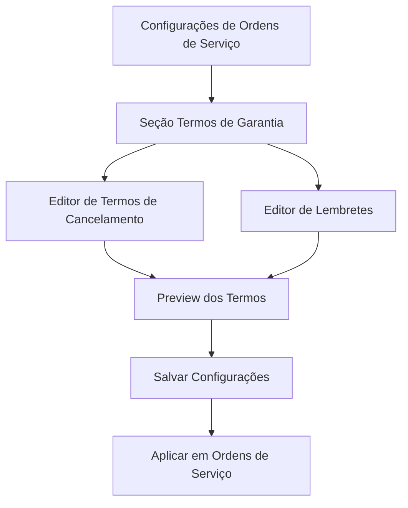
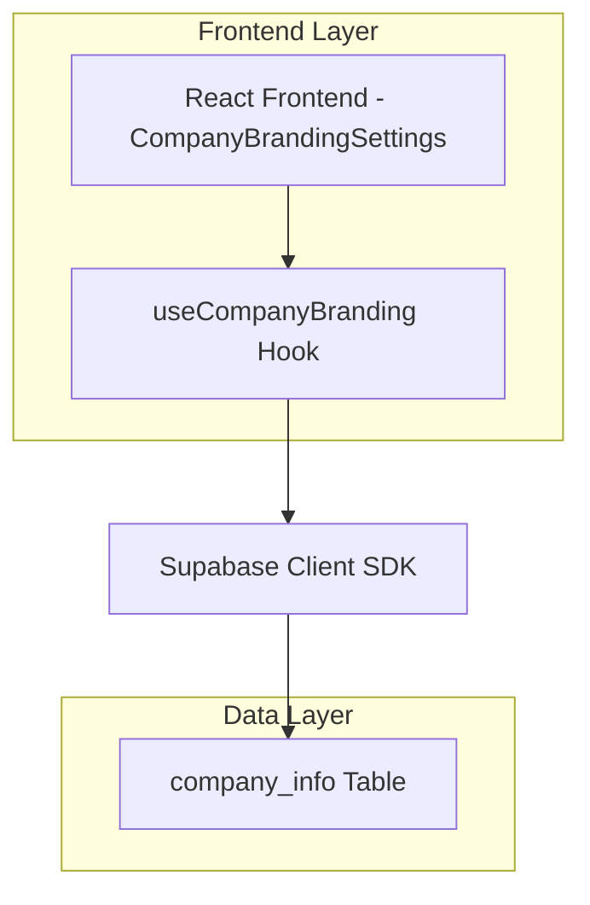
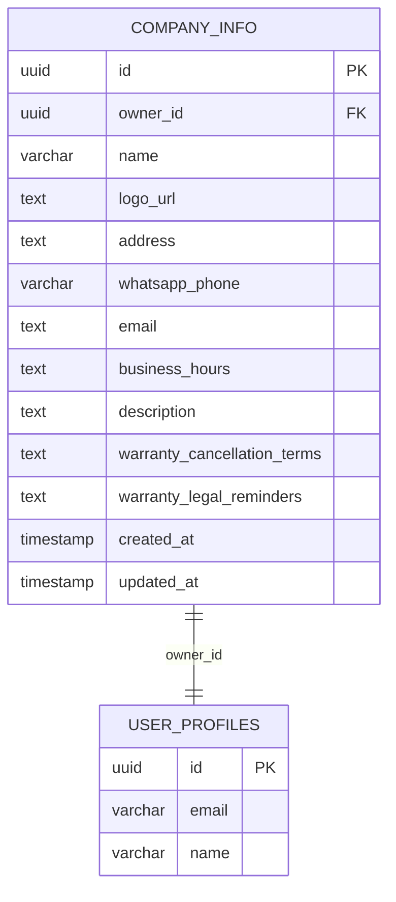

# Sistema de Gerenciamento de Termos de Garantia

## 1. Visão Geral do Produto

Sistema para gerenciamento de termos de garantia personalizáveis em `/service-orders/settings`, permitindo que usuários editem e configurem os termos de garantia que serão aplicados às suas ordens de serviço. O sistema integra-se com a estrutura existente de configurações da empresa, fornecendo textos padrão profissionais e permitindo personalização completa.

## 2. Funcionalidades Principais

### 2.1 Papéis de Usuário
| Papel | Método de Registro | Permissões Principais |
|-------|-------------------|----------------------|
| Usuário Autenticado | Login existente | Pode visualizar e editar seus próprios termos de garantia |

### 2.2 Módulos de Funcionalidade

Nossos requisitos de termos de garantia consistem nas seguintes páginas principais:
1. **Configurações de Garantia**: seção de termos de cancelamento, Lembretes, editor de texto.
2. **Visualização de Termos**: preview dos termos configurados, formatação aplicada.

### 2.3 Detalhes das Páginas

| Nome da Página | Nome do Módulo | Descrição da Funcionalidade |
|----------------|----------------|----------------------------|
| Configurações de Garantia | Seção de Termos de Cancelamento | Editar condições que cancelam a garantia automaticamente, incluir nome da loja dinamicamente |
| Configurações de Garantia | Seção de Lembretes | Editar lembretes sobre direitos do consumidor e limitações da garantia |
| Configurações de Garantia | Editor de Texto | Interface rica para edição com formatação, preview em tempo real |
| Configurações de Garantia | Gerenciamento de Configurações | Salvar, restaurar padrões, validar conteúdo |

## 3. Processo Principal

**Fluxo do Usuário:**
1. Usuário acessa `/service-orders/settings`
2. Navega para seção "Termos de Garantia"
3. Visualiza termos padrão pré-configurados
4. Edita termos conforme necessário
5. Salva configurações
6. Termos são aplicados automaticamente nas ordens de serviço



## 4. Design da Interface do Usuário

### 4.1 Estilo de Design
- **Cores primárias e secundárias**: Seguir tema existente do sistema (dark/light mode)
- **Estilo de botões**: Rounded, consistente com design system atual
- **Fonte e tamanhos**: Inter, tamanhos responsivos (text-sm, text-base)
- **Estilo de layout**: Card-based, navegação superior, seções organizadas
- **Ícones**: Lucide icons (FileText, Edit, Save, RotateCcw)

### 4.2 Visão Geral do Design das Páginas

| Nome da Página | Nome do Módulo | Elementos da UI |
|----------------|----------------|-----------------|
| Configurações de Garantia | Cabeçalho da Seção | Card com ícone FileText, título "Termos de Garantia", descrição explicativa |
| Configurações de Garantia | Editor de Cancelamento | Textarea expansível, label "Condições de Cancelamento", placeholder com texto padrão |
| Configurações de Garantia | Editor de Lembretes | Textarea expansível, label "Lembretes", placeholder com texto padrão |
| Configurações de Garantia | Ações | Botões "Salvar", "Restaurar Padrão", "Preview", loading states |
| Configurações de Garantia | Preview | Modal ou seção colapsável, formatação final dos termos |

### 4.3 Responsividade
Desktop-first com adaptação mobile, otimização para touch em textareas, layout em grid responsivo para diferentes tamanhos de tela.

## 5. Arquitetura Técnica

### 5.1 Diagrama de Arquitetura



### 5.2 Descrição da Tecnologia
- Frontend: React@18 + TypeScript + Tailwind CSS + Vite
- Backend: Supabase (PostgreSQL + RLS)
- Hooks: useCompanyBranding (extensão)
- Componentes: CompanyBrandingSettings (modificação)

### 5.3 Definições de Rota
| Rota | Propósito |
|------|-----------|
| /service-orders/settings | Página de configurações da empresa incluindo nova seção de termos de garantia |

## 6. Modelo de Dados

### 6.1 Definição do Modelo de Dados



### 6.2 Linguagem de Definição de Dados

**Migração para adicionar campos de termos de garantia:**

```sql
-- Adicionar campos de termos de garantia à tabela company_info
ALTER TABLE public.company_info 
ADD COLUMN IF NOT EXISTS warranty_cancellation_terms TEXT DEFAULT 'A GARANTIA É CANCELADA AUTOMATICAMENTE NOS SEGUINTES CASOS: 
Em ocasião de quedas, esmagamentos, sobrecarga elétrica; exposição do aparelho a altas temperaturas, umidade ou 
líquidos; exposição do aparelho a poeira, pó e/ou limalha de metais, ou ainda quando constatado mau uso do aparelho, 
instalações, modificações ou atualizações no seu sistema operacional; abertura do equipamento ou tentativa de conserto 
deste por terceiros que não sejam os técnicos da NOMEDALOJA, mesmo que para realização de outros serviços; bem como 
a violação do selo/lacre de garantia colocado pela NOMEDALOJA.',

ADD COLUMN IF NOT EXISTS warranty_legal_reminders TEXT DEFAULT 'Vale lembrar que: 
1) A GARANTIA DE 90 (NOVENTA) dias está de acordo com o artigo 26 inciso II do código de defesa do 
consumidor. 
2) Funcionamento, instalação e atualização de aplicativos, bem como o sistema operacional do aparelho NÃO FAZEM 
parte desta garantia. 
3) Limpeza e conservação do aparelho NÃO FAZEM parte desta garantia. 
4) A não apresentação de documento (nota fiscal ou este termo) que comprove o serviço INVÁLIDA a garantia. 
5) Qualquer mal funcionamento APÓS ATUALIZAÇÕES do sistema operacional ou aplicativos NÃO FAZEM PARTE 
DESSA GARANTIA. 
6) A GARANTIA é válida somente para o item ou serviço descrito na nota fiscal, ordem de serviço ou neste termo 
de garantia, NÃO ABRANGENDO OUTRAS PARTES e respeitando as condições aqui descritas.';

-- Comentários para documentação
COMMENT ON COLUMN company_info.warranty_cancellation_terms IS 'Termos e condições que cancelam a garantia automaticamente';
COMMENT ON COLUMN company_info.warranty_legal_reminders IS 'Lembretes sobre direitos do consumidor e limitações da garantia';

-- Atualizar registros existentes que não possuem os termos
UPDATE public.company_info 
SET warranty_cancellation_terms = 'A GARANTIA É CANCELADA AUTOMATICAMENTE NOS SEGUINTES CASOS: 
Em ocasião de quedas, esmagamentos, sobrecarga elétrica; exposição do aparelho a altas temperaturas, umidade ou 
líquidos; exposição do aparelho a poeira, pó e/ou limalha de metais, ou ainda quando constatado mau uso do aparelho, 
instalações, modificações ou atualizações no seu sistema operacional; abertura do equipamento ou tentativa de conserto 
deste por terceiros que não sejam os técnicos da NOMEDALOJA, mesmo que para realização de outros serviços; bem como 
a violação do selo/lacre de garantia colocado pela NOMEDALOJA.'
WHERE warranty_cancellation_terms IS NULL;

UPDATE public.company_info 
SET warranty_legal_reminders = 'Vale lembrar que: 
1) A GARANTIA DE 90 (NOVENTA) dias está de acordo com o artigo 26 inciso II do código de defesa do 
consumidor. 
2) Funcionamento, instalação e atualização de aplicativos, bem como o sistema operacional do aparelho NÃO FAZEM 
parte desta garantia. 
3) Limpeza e conservação do aparelho NÃO FAZEM parte desta garantia. 
4) A não apresentação de documento (nota fiscal ou este termo) que comprove o serviço INVÁLIDA a garantia. 
5) Qualquer mal funcionamento APÓS ATUALIZAÇÕES do sistema operacional ou aplicativos NÃO FAZEM PARTE 
DESSA GARANTIA. 
6) A GARANTIA é válida somente para o item ou serviço descrito na nota fiscal, ordem de serviço ou neste termo 
de garantia, NÃO ABRANGENDO OUTRAS PARTES e respeitando as condições aqui descritas.'
WHERE warranty_legal_reminders IS NULL;
```

## 7. Implementação Técnica

### 7.1 Modificações no Hook useCompanyBranding

**Extensão da interface CompanyInfo:**
```typescript
export interface CompanyInfo {
  id: string;
  name: string;
  logo_url?: string;
  address?: string;
  whatsapp_phone?: string;
  email?: string;
  business_hours?: string;
  description?: string;
  warranty_cancellation_terms?: string;
  warranty_legal_reminders?: string;
  additional_images?: string[];
  created_at: string;
  updated_at: string;
}
```

### 7.2 Modificações no Componente CompanyBrandingSettings

**Nova seção de termos de garantia:**
- Card dedicado para "Termos de Garantia"
- Dois textareas para edição dos termos
- Botões para salvar, restaurar padrão e preview
- Validação de conteúdo
- Estados de loading durante salvamento

### 7.3 Funcionalidades Adicionais

**Substituição dinâmica de NOMEDALOJA:**
- Função para substituir "NOMEDALOJA" pelo nome real da empresa
- Aplicação automática durante exibição e salvamento
- Preview com nome da empresa aplicado

**Validação e sanitização:**
- Validação de comprimento máximo dos termos
- Sanitização de HTML para segurança
- Preservação de quebras de linha e formatação básica

## 8. Casos de Uso

### 8.1 Configuração Inicial
1. Usuário acessa configurações pela primeira vez
2. Sistema exibe termos padrão com "NOMEDALOJA"
3. Usuário edita conforme necessário
4. Sistema substitui "NOMEDALOJA" pelo nome da empresa
5. Termos são salvos e aplicados

### 8.2 Edição de Termos Existentes
1. Usuário acessa configurações
2. Sistema carrega termos salvos anteriormente
3. Usuário modifica conforme necessário
4. Sistema valida e salva alterações
5. Confirmação de sucesso é exibida

### 8.3 Restauração de Padrões
1. Usuário clica em "Restaurar Padrão"
2. Sistema exibe confirmação
3. Termos são restaurados para valores padrão
4. Nome da empresa é mantido nas substituições
5. Usuário pode salvar ou continuar editando

## 9. Considerações de Segurança

- **RLS (Row Level Security)**: Usuários só podem editar seus próprios termos
- **Validação de entrada**: Sanitização de conteúdo para prevenir XSS
- **Autenticação**: Verificação de usuário autenticado antes de qualquer operação
- **Auditoria**: Logs de alterações nos termos através de updated_at

## 10. Testes e Validação

### 10.1 Testes Funcionais
- Criação de termos para novo usuário
- Edição de termos existentes
- Restauração de padrões
- Substituição dinâmica de nome da empresa
- Validação de campos obrigatórios

### 10.2 Testes de Interface
- Responsividade em diferentes dispositivos
- Estados de loading e erro
- Feedback visual para ações do usuário
- Acessibilidade (ARIA labels, navegação por teclado)

### 10.3 Testes de Integração
- Integração com sistema de ordens de serviço
- Aplicação dos termos em documentos gerados
- Sincronização com dados da empresa
- Performance com textos longos