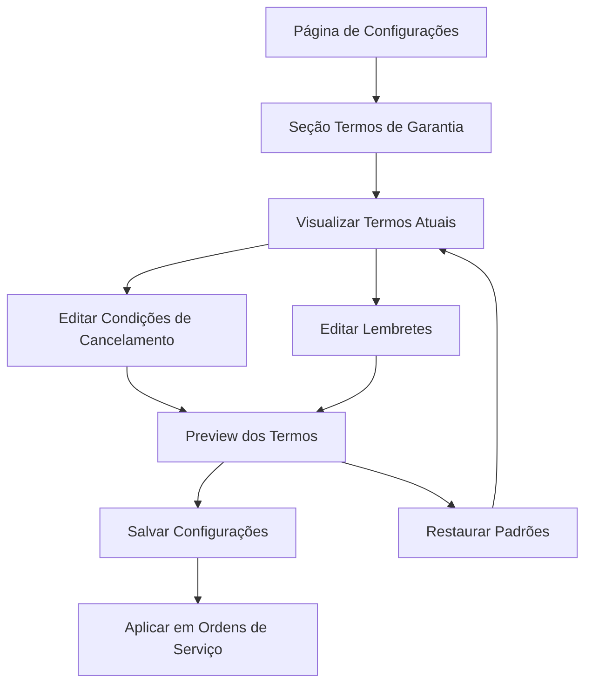

# Requisitos de Produto - Sistema de Termos de Garantia

## 1. Visão Geral do Produto

Sistema integrado de gerenciamento de termos de garantia que permite aos usuários personalizar e configurar os termos legais aplicados às suas ordens de serviço. A funcionalidade será adicionada à seção `/service-orders/settings` existente, proporcionando uma experiência fluida e profissional para configuração de garantias.

- O sistema resolve o problema de padronização de termos de garantia para assistências técnicas
- Usuários poderão personalizar termos legais mantendo conformidade com legislação brasileira
- Aumenta a profissionalização do atendimento e reduz disputas relacionadas à garantia

## 2. Funcionalidades Principais

### 2.1 Papéis de Usuário
| Papel | Método de Registro | Permissões Principais |
|-------|-------------------|----------------------|
| Usuário Autenticado | Login existente no sistema | Pode visualizar, editar e gerenciar seus próprios termos de garantia |

### 2.2 Módulo de Funcionalidades

Nossos requisitos de termos de garantia consistem nas seguintes páginas principais:
1. **Configurações de Termos de Garantia**: editor de condições de cancelamento, editor de lembretes, preview dos termos.

### 2.3 Detalhes das Páginas

| Nome da Página | Nome do Módulo | Descrição da Funcionalidade |
|----------------|----------------|----------------------------|
| Configurações de Termos de Garantia | Editor de Condições de Cancelamento | Editar texto das condições que cancelam garantia automaticamente. Substituição automática de "NOMEDALOJA" pelo nome da empresa. Validação de conteúdo e formatação. |
| Configurações de Termos de Garantia | Editor de Lembretes | Editar lembretes sobre direitos do consumidor e limitações. Manter conformidade com CDC. Formatação numerada automática. |
| Configurações de Termos de Garantia | Preview dos Termos | Visualizar termos formatados como aparecerão nas ordens de serviço. Aplicar substituições dinâmicas. Exportar para PDF. |
| Configurações de Termos de Garantia | Gerenciamento de Configurações | Salvar alterações, restaurar padrões, validar conteúdo, histórico de alterações. |

## 3. Processo Principal

**Fluxo Principal do Usuário:**
O usuário acessa as configurações de ordens de serviço, navega para a nova seção "Termos de Garantia", edita os termos conforme sua necessidade, visualiza o preview e salva as configurações que serão aplicadas automaticamente em todas as futuras ordens de serviço.

## 4. Design da Interface do Usuário

### 4.1 Estilo de Design
- **Cores primárias e secundárias**: Azul primário (#3B82F6), cinza secundário (#6B7280)
- **Estilo de botões**: Rounded (border-radius: 8px), sombra sutil
- **Fonte e tamanhos**: Inter 14px para labels, 16px para conteúdo, 18px para títulos
- **Estilo de layout**: Card-based com espaçamento generoso, navegação breadcrumb
- **Ícones**: FileText para termos, Edit para edição, Save para salvar, RotateCcw para restaurar

### 4.2 Visão Geral do Design das Páginas

| Nome da Página | Nome do Módulo | Elementos da UI |
|----------------|----------------|-----------------|
| Configurações de Termos | Cabeçalho da Seção | Card com ícone FileText azul, título "Termos de Garantia", descrição "Configure os termos legais aplicados às suas ordens de serviço" |
| Configurações de Termos | Status dos Termos | Cards de status mostrando se termos estão configurados, última atualização, número de caracteres |
| Configurações de Termos | Editor de Cancelamento | Label "Condições de Cancelamento", textarea expansível (min 4 linhas), contador de caracteres, botão "Restaurar Padrão" |
| Configurações de Termos | Editor de Lembretes | Label "Lembretes", textarea expansível (min 6 linhas), formatação automática de numeração |
| Configurações de Termos | Ações Principais | Botão "Salvar Termos" (primário), "Preview" (secundário), "Restaurar Tudo" (outline), estados de loading |
| Configurações de Termos | Modal de Preview | Modal fullscreen com termos formatados, botão "Exportar PDF", "Fechar", scroll suave |

### 4.3 Responsividade
Desktop-first com adaptação mobile completa. Em mobile, textareas ocupam largura total, botões empilhados verticalmente, modal de preview ocupa tela inteira com navegação otimizada para touch.

## 5. Especificações Técnicas Detalhadas

### 5.1 Campos de Dados
- **warranty_cancellation_terms**: TEXT, até 2000 caracteres
- **warranty_legal_reminders**: TEXT, até 2000 caracteres
- Validação de conteúdo obrigatório
- Sanitização automática de HTML malicioso

### 5.2 Funcionalidades Avançadas
- **Substituição Dinâmica**: "NOMEDALOJA" → nome real da empresa
- **Formatação Automática**: Preservar quebras de linha e numeração
- **Histórico de Alterações**: Tracking de mudanças com timestamp
- **Exportação**: Gerar PDF dos termos para impressão

### 5.3 Validações e Regras de Negócio
- Termos não podem estar vazios
- Máximo 2000 caracteres por seção
- Substituição obrigatória de "NOMEDALOJA"
- Backup automático antes de alterações
- Confirmação para restaurar padrões

## 6. Experiência do Usuário

### 6.1 Jornada do Usuário - Primeira Configuração
1. **Descoberta**: Usuário acessa configurações e vê nova seção "Termos de Garantia"
2. **Exploração**: Visualiza termos padrão pré-configurados com texto profissional
3. **Personalização**: Edita termos conforme necessidades específicas do negócio
4. **Validação**: Usa preview para verificar formatação e substituições
5. **Confirmação**: Salva configurações com feedback visual de sucesso

### 6.2 Jornada do Usuário - Edição de Termos Existentes
1. **Acesso Rápido**: Navega diretamente para seção conhecida
2. **Contexto**: Visualiza termos atuais e data da última modificação
3. **Edição Eficiente**: Modifica apenas seções necessárias
4. **Comparação**: Usa preview para comparar com versão anterior
5. **Aplicação**: Salva e confirma aplicação em futuras ordens

### 6.3 Estados da Interface
- **Loading**: Skeleton loading durante carregamento inicial
- **Editando**: Indicadores visuais de campos modificados
- **Salvando**: Loading spinner em botão de salvar
- **Sucesso**: Toast notification com confirmação
- **Erro**: Mensagens de erro contextuais e ações de recuperação

## 7. Critérios de Aceitação

### 7.1 Funcionalidades Obrigatórias
- ✅ Usuário pode editar termos de cancelamento de garantia
- ✅ Usuário pode editar Lembretes sobre garantia
- ✅ Sistema substitui "NOMEDALOJA" automaticamente
- ✅ Preview mostra termos formatados corretamente
- ✅ Termos são salvos e aplicados em ordens de serviço
- ✅ Função restaurar padrões funciona corretamente

### 7.2 Qualidade da Experiência
- ✅ Interface responsiva em todos os dispositivos
- ✅ Feedback visual para todas as ações do usuário
- ✅ Validação em tempo real de campos obrigatórios
- ✅ Performance adequada com textos longos
- ✅ Acessibilidade conforme WCAG 2.1

### 7.3 Integração com Sistema
- ✅ Integração perfeita com configurações existentes
- ✅ Dados persistem corretamente no banco
- ✅ RLS funciona adequadamente
- ✅ Não quebra funcionalidades existentes
- ✅ Migração de dados sem perda de informações

## 8. Métricas de Sucesso

### 8.1 Métricas de Adoção
- 80% dos usuários ativos configuram termos personalizados
- 95% dos usuários mantêm configurações após primeira edição
- Redução de 60% em disputas relacionadas à garantia

### 8.2 Métricas de Usabilidade
- Tempo médio de configuração inicial < 5 minutos
- Taxa de abandono na configuração < 10%
- Satisfação do usuário > 4.5/5 em pesquisas

### 8.3 Métricas Técnicas
- Tempo de carregamento da página < 2 segundos
- Taxa de erro em salvamento < 1%
- Disponibilidade do sistema > 99.5%

## 9. Roadmap de Implementação

### 9.1 Fase 1 - Fundação (Sprint 1)
- Migração do banco de dados
- Extensão do hook useCompanyBranding
- Interface básica de edição

### 9.2 Fase 2 - Funcionalidades Core (Sprint 2)
- Preview dos termos
- Substituição dinâmica de nome
- Validações e sanitização

### 9.3 Fase 3 - Polimento (Sprint 3)
- Restaurar padrões
- Estados de loading e erro
- Testes e otimizações

### 9.4 Fase 4 - Melhorias (Sprint 4)
- Exportação para PDF
- Histórico de alterações
- Métricas e analytics

## 10. Considerações Legais

### 10.1 Conformidade com CDC
- Termos padrão seguem Código de Defesa do Consumidor
- Garantia mínima de 90 dias conforme Art. 26
- Linguagem clara e acessível ao consumidor

### 10.2 Proteção de Dados
- Dados de termos são privados por usuário
- Não compartilhamento entre empresas
- Backup seguro das configurações

### 10.3 Responsabilidade Legal
- Sistema fornece templates, usuário responsável por adequação
- Recomendação de revisão jurídica para casos específicos
- Disclaimer sobre responsabilidade legal