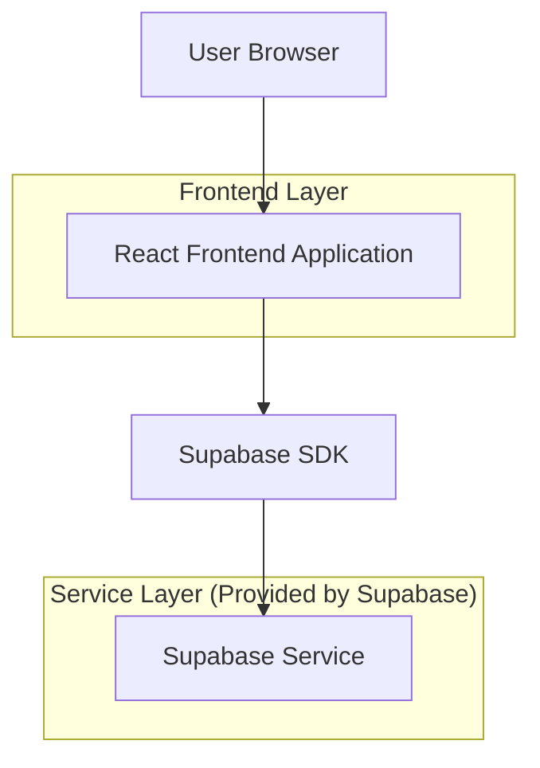
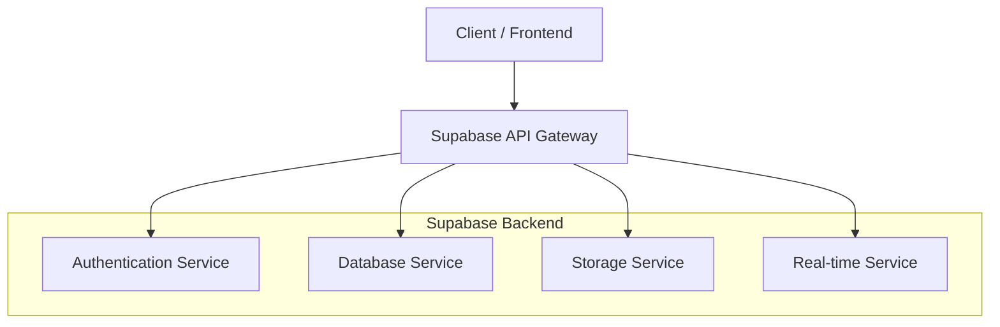
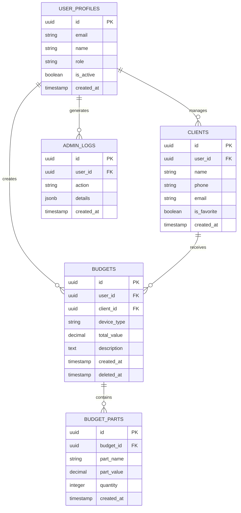

# Arquitetura Técnica do OneDrip

## 1. Design da Arquitetura



## 2. Descrição das Tecnologias
- Frontend: React@18 + tailwindcss@3 + vite + TypeScript
- Backend: Supabase (PostgreSQL + Auth + Storage + Real-time)
- Autenticação: Supabase Auth
- Banco de Dados: PostgreSQL (via Supabase)

## 3. Definições de Rotas

| Rota | Propósito |
|------|-----------|
| / | Página inicial, redirecionamento para dashboard ou login |
| /auth | Página de autenticação, login e registro de usuários |
| /dashboard | Dashboard principal, visão geral dos orçamentos e estatísticas |
| /budgets | Gestão de orçamentos, listagem e CRUD completo |
| /clients | Gestão de clientes, cadastro e histórico |
| /admin | Painel administrativo, logs e configurações do sistema |
| /profile | Perfil do usuário, configurações pessoais |
| /help | Central de ajuda e documentação |

## 4. Definições de API

### 4.1 Core API

Autenticação de usuários
```
POST /auth/v1/token
```

Request:
| Nome do Parâmetro | Tipo do Parâmetro | Obrigatório | Descrição |
|-------------------|-------------------|-------------|-----------|
| email | string | true | Email do usuário |
| password | string | true | Senha do usuário |

Response:
| Nome do Parâmetro | Tipo do Parâmetro | Descrição |
|-------------------|-------------------|-----------|
| access_token | string | Token de acesso JWT |
| user | object | Dados do usuário autenticado |

Exemplo:
```json
{
  "email": "usuario@exemplo.com",
  "password": "senha123"
}
```

Gestão de Orçamentos
```
GET /rest/v1/budgets
POST /rest/v1/budgets
PUT /rest/v1/budgets
DELETE /rest/v1/budgets
```

Gestão de Clientes
```
GET /rest/v1/clients
POST /rest/v1/clients
PUT /rest/v1/clients
DELETE /rest/v1/clients
```

## 5. Arquitetura do Servidor



## 6. Modelo de Dados

### 6.1 Definição do Modelo de Dados



### 6.2 Linguagem de Definição de Dados

Tabela de Usuários (user_profiles)
```sql
-- criar tabela
CREATE TABLE user_profiles (
    id UUID PRIMARY KEY DEFAULT gen_random_uuid(),
    email VARCHAR(255) UNIQUE NOT NULL,
    name VARCHAR(100) NOT NULL,
    role VARCHAR(20) DEFAULT 'user' CHECK (role IN ('user', 'admin')),
    is_active BOOLEAN DEFAULT true,
    created_at TIMESTAMP WITH TIME ZONE DEFAULT NOW(),
    updated_at TIMESTAMP WITH TIME ZONE DEFAULT NOW()
);

-- criar índices
CREATE INDEX idx_user_profiles_email ON user_profiles(email);
CREATE INDEX idx_user_profiles_role ON user_profiles(role);
CREATE INDEX idx_user_profiles_active ON user_profiles(is_active);

-- políticas RLS
ALTER TABLE user_profiles ENABLE ROW LEVEL SECURITY;
CREATE POLICY "Users can view own profile" ON user_profiles FOR SELECT USING (auth.uid() = id);
CREATE POLICY "Users can update own profile" ON user_profiles FOR UPDATE USING (auth.uid() = id);

-- dados iniciais
INSERT INTO user_profiles (email, name, role) VALUES 
('admin@onedrip.com', 'Administrador', 'admin');
```

Tabela de Orçamentos (budgets)
```sql
-- criar tabela
CREATE TABLE budgets (
    id UUID PRIMARY KEY DEFAULT gen_random_uuid(),
    user_id UUID NOT NULL REFERENCES user_profiles(id),
    client_id UUID REFERENCES clients(id),
    device_type VARCHAR(50),
    total_value DECIMAL(10,2) DEFAULT 0,
    description TEXT,
    created_at TIMESTAMP WITH TIME ZONE DEFAULT NOW(),
    updated_at TIMESTAMP WITH TIME ZONE DEFAULT NOW(),
    deleted_at TIMESTAMP WITH TIME ZONE
);

-- criar índices
CREATE INDEX idx_budgets_user_id ON budgets(user_id);
CREATE INDEX idx_budgets_client_id ON budgets(client_id);
CREATE INDEX idx_budgets_deleted_at ON budgets(deleted_at);
CREATE INDEX idx_budgets_created_at ON budgets(created_at DESC);

-- políticas RLS
ALTER TABLE budgets ENABLE ROW LEVEL SECURITY;
CREATE POLICY "Users can manage own budgets" ON budgets FOR ALL USING (auth.uid() = user_id);
```

Tabela de Clientes (clients)
```sql
-- criar tabela
CREATE TABLE clients (
    id UUID PRIMARY KEY DEFAULT gen_random_uuid(),
    user_id UUID NOT NULL REFERENCES user_profiles(id),
    name VARCHAR(100) NOT NULL,
    phone VARCHAR(20),
    email VARCHAR(255),
    is_favorite BOOLEAN DEFAULT false,
    is_default BOOLEAN DEFAULT false,
    created_at TIMESTAMP WITH TIME ZONE DEFAULT NOW(),
    updated_at TIMESTAMP WITH TIME ZONE DEFAULT NOW()
);

-- criar índices
CREATE INDEX idx_clients_user_id ON clients(user_id);
CREATE INDEX idx_clients_name ON clients(name);
CREATE INDEX idx_clients_favorite ON clients(is_favorite);

-- políticas RLS
ALTER TABLE clients ENABLE ROW LEVEL SECURITY;
CREATE POLICY "Users can manage own clients" ON clients FOR ALL USING (auth.uid() = user_id);
```